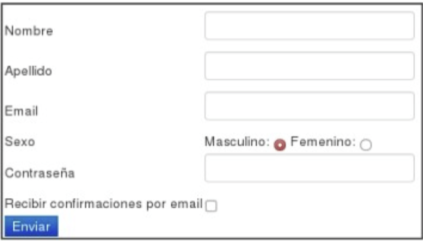

# Práctica 2 - Capa de Aplicación HTTP

Requerimientos Para realizar esta práctica deberá descargar la máquina virtual provista por la cátedra. Puede ver la URL de descarga en el sitio de la cátedra en https://catedras.info.unlp.edu.ar/. Una vez descargado el archivo, haciendo doble click en el mismo debería abrirse un cuadro de diálogo que permita configurar algunos parámetros del sistema. Se pueden aceptar los valores por defecto haciendo simplemente click en Importar.

Se recomienda hacer un snapshot de la VM antes de empezar a usarla, para poder volver atrás en caso de que algo deje de funcionar. Los datos de acceso a la máquina virtual son:

**Credenciales de acceso:**

- Usuario: `redes`
- Contraseña: `redes`
- Privilegios de administrador: `sudo`

> **Importante:** El dominio `redes.unlp.edu.ar` solo existe dentro de la VM provista por la cátedra, no es válido en Internet. Todos los ejercicios que utilicen dicho dominio solo podrán ser resueltos dentro de la VM.

# Introducción

## 1. ¿Cuál es la función de la capa de aplicación?

La capa de aplicación es la capa más alta del modelo TCP/IP. Su función principal es proporcionar los servicios de red directamente a las aplicaciones del usuario final o a otras aplicaciones del sistema.

Esta capa define protocolos que permiten la comunicación entre programas situados en distintos dispositivos:

- **HTTP/HTTPS**: Para navegación web
- **SMTP/POP3/IMAP**: Para correo electrónico
- **FTP/SFTP**: Para transferencia de archivos
- **DNS**: Para resolución de nombres de dominio

Es importante destacar que el usuario no interactúa directamente con la capa de aplicación, sino a través de programas (como navegadores, clientes de correo o gestores de archivos) que utilizan estos protocolos para intercambiar datos con otras aplicaciones a través de la red.

## 2. Si dos procesos deben comunicarse:

### a. ¿Cómo podrían hacerlo si están en diferentes máquinas?

Cuando dos procesos se encuentran en máquinas diferentes, la comunicación entre ellos se realiza a través de una red de computadoras. Para ello, cada proceso utiliza un socket (un punto de comunicación entre dos procesos que permite el envío y la recepción de datos, ya sea en la misma máquina o a través de una red), que actúa como interfaz entre la aplicación y la red. La comunicación se establece mediante protocolos de la capa de aplicación (como HTTP, SMTP, FTP, etc.), que definen cómo deben intercambiarse los mensajes.

### b. Y si están en la misma máquina, ¿qué alternativas existen?

Cuando dos procesos están en la misma máquina, existen múltiples mecanismos de comunicación interproceso (IPC - Inter Process Communication):

1. Pipes (tuberías):

- Pipes anónimos: Permiten comunicación unidireccional entre procesos padre e hijo
- Named pipes (FIFO): Permiten comunicación bidireccional entre procesos no relacionados mediante un archivo especial en el sistema de archivos

2. Sockets locales:

- Unix domain sockets: Sockets que usan el sistema de archivos local en lugar de la red, más eficientes que los sockets de red para comunicación local
- Loopback sockets: Uso de la interfaz de loopback (127.0.0.1) para comunicación TCP/UDP local

3. Memoria compartida:

- Shared memory: Los procesos comparten un segmento de memoria común donde pueden leer y escribir datos directamente
- Requiere mecanismos de sincronización (semáforos, mutex) para evitar condiciones de carrera

4. Colas de mensajes:

- Message queues: Sistema de colas donde los procesos pueden enviar y recibir mensajes de forma asíncrona
- Proporcionan comunicación FIFO (First In, First Out) entre procesos

5. Señales:

- Signals: Mecanismo simple para notificar eventos entre procesos (como terminación, alarmas, etc.)
- Limitado en cantidad de información que puede transmitir

6. Archivos:

- File-based communication: Los procesos escriben y leen datos desde archivos comunes
- Método simple pero menos eficiente para intercambio frecuente de datos

7. Semáforos:

- Semaphores: Principalmente usados para sincronización, pero también pueden transmitir información simple entre procesos.

La elección del mecanismo depende de factores como velocidad requerida, cantidad de datos, necesidad de sincronización y complejidad de implementación. La memoria compartida suele ser la más rápida, mientras que los pipes y sockets son más simples de implementar.

## 3. Explique brevemente cómo es el modelo Cliente/Servidor. Dé un ejemplo de un sistema Cliente/Servidor en la “vida cotidiana” y un ejemplo de un sistema informático que siga el modelo Cliente/Servidor. ¿Conoce algún otro modelo de comunicación?

El modelo Cliente/Servidor es un paradigma de comunicación donde existen dos tipos de entidades con roles claramente diferenciados:

Cliente:

- Inicia la comunicación solicitando servicios o recursos
- Generalmente tiene una dirección IP dinámica
- Se conecta de forma intermitente a la red
- No proporciona servicios a otros dispositivos

Servidor:

- Responde a las solicitudes de los clientes proporcionando servicios o recursos
- Tiene una dirección IP fija y conocida
- Está disponible permanentemente (alta disponibilidad)
- Puede atender múltiples clientes simultáneamente

Ejemplo de la vida cotidiana: Un restaurante funciona como modelo cliente/servidor, donde los clientes (comensales) solicitan servicios (comida) al servidor (camarero/cocina), que responde proporcionando el servicio solicitado.

Ejemplo de sistema informático: Navegación web: Un navegador web (cliente) solicita páginas web a un servidor web (servidor) mediante peticiones HTTP. El servidor responde enviando el contenido HTML, CSS, imágenes, etc.

Otros modelos de comunicación:

1. Peer-to-Peer (P2P): Todos los nodos actúan simultáneamente como clientes y servidores. Ejemplo: BitTorrent, donde cada usuario descarga y comparte archivos.

2. Modelo híbrido: Combina aspectos de cliente/servidor y P2P. Ejemplo: Skype, que usa servidores centrales para autenticación pero comunicación directa P2P para las llamadas.

3. Modelo distribuido: Los servicios se distribuyen entre múltiples servidores sin un punto central de control.

## 4. Describa la funcionalidad de la entidad genérica “Agente de usuario” o “User agent”.

El User Agent (Agente de usuario) es una aplicación de software que actúa como intermediario entre el usuario final y los servicios de red. Su funcionalidad principal es:

Funciones generales:

- Interfaz de usuario: Proporciona una interfaz gráfica o de línea de comandos para que los usuarios interactúen con servicios de red
- Interpretación de protocolos: Implementa los protocolos de la capa de aplicación necesarios para comunicarse con los servidores
- Gestión de solicitudes: Envía peticiones a los servidores en nombre del usuario
- Procesamiento de respuestas: Recibe, interpreta y presenta las respuestas del servidor al usuario
- Gestión de estado: Mantiene información sobre la sesión del usuario (cookies, autenticación, etc.)

Ejemplos específicos:

1. Navegador web (HTTP User Agent):

- Interpreta y renderiza HTML, CSS, JavaScript
- Gestiona cookies y autenticación
- Realiza peticiones HTTP/HTTPS
- Ejemplos: Chrome, Firefox, Safari

2. Cliente de correo (Email User Agent):

- Gestiona protocolos SMTP, POP3, IMAP
- Compone, envía y recibe mensajes de correo
- Ejemplos: Outlook, Thunderbird, Apple Mail

3. Cliente FTP:

- Implementa el protocolo FTP para transferencia de archivos
- Proporciona interfaz para navegar directorios remotos
- Ejemplos: FileZilla, WinSCP

4. Cliente de línea de comandos:

- curl: Realiza peticiones HTTP, FTP, etc. desde terminal
- wget: Descarga recursos de servidores web

Identificación del User Agent: Los servidores pueden identificar qué tipo de agente de usuario está realizando la petición a través de la cabecera "User-Agent" en HTTP, lo que permite personalizar las respuestas según el tipo de cliente.

## 5. ¿Qué son y en qué se diferencian HTML y HTTP?

HTML (HyperText Markup Language) y HTTP (HyperText Transfer Protocol) son dos tecnologías fundamentales de la web que cumplen funciones completamente diferentes:

HTML (HyperText Markup Language):

- Definición: Es un lenguaje de marcado que define la estructura y el contenido de las páginas web
- Función: Describe cómo se debe presentar la información en el navegador mediante etiquetas (tags)
- Naturaleza: Es un lenguaje de marcado, no un protocolo de comunicación
- Propósito: Define el formato y la estructura del contenido (texto, imágenes, enlaces, formularios, etc.)
- Ubicación: Se ejecuta y procesa en el lado del cliente (navegador)
- Ejemplo:
    ```html
    <html>
    	<body>
    		<h1>Título</h1>
    		<p>Párrafo</p>
    	</body>
    </html>
    ```

HTTP (HyperText Transfer Protocol):

- Definición: Es un protocolo de la capa de aplicación que define cómo se comunican los clientes y servidores web
- Función: Especifica las reglas para el intercambio de mensajes entre navegadores y servidores web
- Naturaleza: Es un protocolo de comunicación
- Propósito: Define cómo solicitar y transferir recursos (páginas HTML, imágenes, archivos, etc.) a través de la red
- Ubicación: Opera en la comunicación entre cliente y servidor
- Ejemplo:
    ```bash
    GET /index.html HTTP/1.1
    ```

Principales diferencias:

1. Propósito:

- HTML: Define QUÉ se muestra y CÓMO se estructura el contenido
- HTTP: Define CÓMO se transfiere el contenido entre cliente y servidor

2. Naturaleza:

- HTML: Lenguaje de marcado estático
- HTTP: Protocolo de comunicación dinámico

3. Ámbito:

- HTML: Formato del documento/contenido
- HTTP: Mecanismo de transporte/comunicación

4. Procesamiento:

- HTML: Se procesa en el navegador para renderizar la página
- HTTP: Se procesa en la comunicación de red para transferir datos

Relación entre ambos: HTTP se utiliza para transferir documentos HTML desde el servidor al cliente. Cuando un navegador solicita una página web, usa HTTP para pedirla al servidor, y el servidor responde enviando el documento HTML correspondiente a través del mismo protocolo HTTP. El navegador luego interpreta el HTML para mostrar la página al usuario.

## 6. HTTP tiene definido un formato de mensaje para los requerimientos y las respuestas. (Ayuda: apartado “Formato de mensaje HTTP”, Kurose).

### a. ¿Qué información de la capa de aplicación nos indica si un mensaje es de requerimiento o de respuesta para HTTP? ¿Cómo está compuesta dicha información? ¿Para qué sirven las cabeceras?

La información que indica si un mensaje HTTP es de requerimiento o respuesta se encuentra en la primera línea del mensaje, llamada línea de inicio (start line):

Mensaje de requerimiento:

- Primera línea: Línea de solicitud (request line)
- Formato: MÉTODO RECURSO VERSIÓN
- Ejemplo:
    ```bash
    GET /index.html HTTP/1.1
    ```
- Componentes:
    - MÉTODO: Indica la acción a realizar (GET, POST, PUT, DELETE, HEAD, etc.)
    - RECURSO: Ruta del recurso solicitado (URL path)
    - VERSIÓN: Versión del protocolo HTTP utilizada

Mensaje de respuesta:

- Primera línea: Línea de estado (status line)
- Formato: VERSIÓN CÓDIGO_ESTADO FRASE_RAZÓN
- Ejemplo:
    ```bash
    HTTP/1.1 200 OK
    ```
- Componentes:
    - VERSIÓN: Versión del protocolo HTTP
    - CÓDIGO_ESTADO: Número de tres dígitos que indica el resultado (200, 404, 500, etc.)
    - FRASE_RAZÓN: Descripción textual del código de estado

Función de las cabeceras (headers): Las cabeceras proporcionan metadatos adicionales sobre el mensaje y controlan aspectos de la comunicación:

- Información del cliente/servidor: User-Agent, Server
- Control de caché: Cache-Control, Expires, Last-Modified
- Tipo de contenido: Content-Type, Content-Length, Content-Encoding
- Autenticación: Authorization, WWW-Authenticate
- Control de conexión: Connection, Keep-Alive
- Cookies: Set-Cookie, Cookie
- Negociación de contenido: Accept, Accept-Language, Accept-Encoding

### b. ¿Cuál es su formato? (Ayuda: https://developer.mozilla.org/es/docs/Web/HTTP/Headers)

El formato general de un mensaje HTTP es:

Estructura del mensaje:

1. Línea de inicio (request line o status line)
2. Cabeceras HTTP (cero o más líneas)
3. Línea vacía (CRLF)
4. Cuerpo del mensaje (opcional)

Formato de las cabeceras:

- Sintaxis: Nombre-Cabecera: Valor
- Ejemplo: Content-Type: text/html; charset=UTF-8
- Reglas:
    - Nombre es case-insensitive (no distingue mayúsculas)
    - Separado por dos puntos (:)
    - Puede haber espacios después de los dos puntos
    - Una cabecera por línea
    - Línea vacía marca el fin de las cabeceras

**Ejemplo de mensaje de requerimiento:**

```bash
GET /index.html HTTP/1.1
Host: www.ejemplo.com
User-Agent: Mozilla/5.0 (Windows NT 10.0; Win64; x64)
Accept: text/html,application/xhtml+xml
Accept-Language: es-ES,es;q=0.9
Connection: keep-alive

[cuerpo del mensaje]
```

**Ejemplo de mensaje de respuesta:**

```bash
HTTP/1.1 200 OK
Server: Apache/2.4.41
Content-Type: text/html; charset=UTF-8
Content-Length: 1234
Last-Modified: Wed, 21 Oct 2023 07:28:00 GMT
Connection: keep-alive

<html><body>...</body></html>
```

### c. Suponga que desea enviar un requerimiento con la versión de HTTP 1.1 desde curl/7.74.0 a un sitio de ejemplo como www.misitio.com para obtener el recurso /index.html. En base a lo indicado, ¿qué información debería enviarse mediante encabezados? Indique cómo quedaría el requerimiento.

Para un requerimiento HTTP/1.1 es necesario incluir información específica:

Cabeceras obligatorias para HTTP/1.1:

- Host: Especifica el nombre del servidor (obligatorio en HTTP/1.1)

Cabeceras recomendadas:

- User-Agent: Identifica el cliente que realiza la petición
- Accept: Indica los tipos de contenido que el cliente puede procesar
- Connection: Especifica el tipo de conexión

**El requerimiento completo quedaría:**

```bash
GET /index.html HTTP/1.1
Host: www.misitio.com
User-Agent: curl/7.74.0
Accept: */*
Connection: keep-alive

```

Explicación de cada cabecera:

- Host: www.misitio.com - Identifica el servidor de destino (obligatorio en HTTP/1.1)
- User-Agent: curl/7.74.0 - Identifica el cliente y su versión
- Accept: _/_ - Indica que acepta cualquier tipo de contenido
- Connection: keep-alive - Solicita mantener la conexión abierta para futuras peticiones

> **Nota importante:** La cabecera `Host` es fundamental en HTTP/1.1 porque permite el hosting virtual, donde un mismo servidor puede alojar múltiples sitios web con diferentes nombres de dominio.

## 7. Utilizando la VM, abra una terminal e investigue sobre el comando curl. Analice para qué sirven los siguientes parámetros (-I, -H, -X, -s).

El comando curl es una herramienta de línea de comandos para transferir datos desde o hacia servidores utilizando varios protocolos (HTTP, HTTPS, FTP, etc.). Los parámetros solicitados tienen las siguientes funciones:

-I (--head):

- Función: Realiza una petición HTTP HEAD en lugar de GET
- Comportamiento: Solicita solo las cabeceras del recurso, sin descargar el cuerpo del mensaje
- Uso: Útil para verificar si un recurso existe, obtener metadatos (tamaño, fecha de modificación, tipo de contenido) sin descargar el contenido completo
- Ejemplo:
    ```bash
    curl -I www.ejemplo.com
    ```
- Ventaja: Ahorra ancho de banda y tiempo al no descargar el contenido completo

-H (--header):

- Función: Permite agregar cabeceras HTTP personalizadas al requerimiento
- Formato: -H "Nombre-Cabecera: Valor"
- Uso: Enviar cabeceras específicas como autenticación, tipo de contenido, cookies, etc.
- Ejemplos:
    ```bash
    curl -H "User-Agent: MiApp/1.0" www.ejemplo.com
    curl -H "Authorization: Bearer token123" www.api.com
    curl -H "Content-Type: application/json" www.ejemplo.com
    ```
- Múltiples cabeceras: Se puede usar varias veces en el mismo comando

-X (--request):

- Función: Especifica el método HTTP a utilizar en la petición
- Métodos comunes: GET (por defecto), POST, PUT, DELETE, PATCH, HEAD, OPTIONS
- Uso: Cambiar el método por defecto (GET) por otro según la necesidad
- Ejemplos:
    ```bash
    curl -X POST www.ejemplo.com
    curl -X DELETE www.api.com/recurso/123
    curl -X PUT www.ejemplo.com/actualizar
    ```
- Importante: Algunos métodos requieren datos adicionales (POST, PUT)

-s (--silent):

- Función: Modo silencioso, suprime la barra de progreso y mensajes de error
- Comportamiento: No muestra estadísticas de descarga, porcentajes, velocidad, etc.
- Uso: Útil en scripts o cuando solo se necesita la salida del comando sin información adicional
- Ejemplo:
    ```bash
    curl -s www.ejemplo.com
    ```
- Combinación: Frecuentemente se usa con otros parámetros como curl -s -I para obtener solo las cabeceras sin ruido

**Combinaciones útiles:**

```bash
# Obtiene cabeceras sin mostrar progreso
curl -I -s www.ejemplo.com

# Envía POST con tipo JSON en modo silencioso
curl -X POST -H "Content-Type: application/json" -s www.ejemplo.com

# Petición autenticada solo para obtener cabeceras
curl -H "Authorization: Bearer token" -X GET -I www.ejemplo.com
```

## 8. Ejecute el comando curl sin ningún parámetro adicional y acceda a www.redes.unlp.edu.ar. Luego responda:

```bash
curl www.redes.unlp.edu.ar
```

Nos da esta salida:

```html
<!DOCTYPE html>
<html lang="en">

<head>
    <meta charset="utf-8">
    <title>.::.Redes y Comunicaciones.::.Facultad de Inform&aacute;tica.::.UNLP.::.</title>
    <meta name="viewport" content="width=device-width, initial-scale=1.0">
    <meta name="description" content="">
    <meta name="author" content="">

    <!-- Le styles -->
    <link href="./bootstrap/css/bootstrap.css" rel="stylesheet">
    <link href="./css/style.css" rel="stylesheet">
    <link href="./bootstrap/css/bootstrap-responsive.css" rel="stylesheet">

    <!-- HTML5 shim, for IE6-8 support of HTML5 elements -->
    <!--[if lt IE 9]>
      <script src="./bootstrap/js/html5shiv.js"></script>
    <![endif]-->
</head>

<body>
    <div id="wrap">
        <div class="navbar navbar-inverse navbar-fixed-top">
            <div class="navbar-inner">
                <div class="container">
                    <a class="brand" href="./index.html"><i class="icon-home icon-white"></i></a>
                    <a class="brand" href="https://catedras.info.unlp.edu.ar" target="_blank">Redes y Comunicaciones</a>
                    <a class="brand" href="http://www.info.unlp.edu.ar" target="_blank">Facultad de
                        Inform&aacute;tica</a>
                    <a class="brand" href="http://www.unlp.edu.ar" target="_blank">UNLP</a>
                </div>
            </div>
        </div>

        <div class="container">

            <!-- Main hero unit for a primary marketing message or call to action -->
            <div class="hero-unit">
                <h2>Bienvenidos a Redes y Comunicaciones!</h2>
                <p>Este CD es parte de los enunciados pr&aacute;cticos de la materia Redes y Comunicaciones de la
                    carrera de Licenciatura en Inform&aacute;tica de la UNLP para la cursada del presente a&ntilde;o y
                    servir&aacute; como herramienta para la realizaci&oacute;n de los trabajos pr&aacute;cticos.</p>
            </div>

            <div class="row">
                <div class="span12">
                    <h3>Acerca de la VM</h3>
                    <p>Esta m&aacute;quina virtual est&aacute; basada en Debian GNU/Linux y fue creada por la
                        c&aacute;tedra de Redes y Comunicaciones de la carrera de Licenciatura en Inform&aacute;tica de
                        la UNLP para incluir las herramientas y configuraciones que se utilizar&aacute;n a lo largo de
                        la cursada.</p>
                    <p>Se ha configurado al usuario <em><strong>root</strong></em> y al usuario
                        <em><strong>redes</strong></em> con la misma contrase&ntilde;a: <strong>redes</strong>.
                    </p>
                </div>
            </div>
            <div class="row">
                <div class="span12">
                    <h3>Ejercicios Pr&aacute;cticos</h3>
                    <p>Todo el material se va a encontrar publicado en el sitio de la c&aacute;tedra en <a
                            href="https://catedras.info.unlp.edu.ar/"
                            target="_blank">https://catedras.info.unlp.edu.ar/</a>.</p>
                </div>
            </div>
            <div class="row">

                <div class="span2">
                    <h4>Introducci&oacute;n</h4>
                    <p>
                    <ul>
                        <li>Nociones b&aacute;sicas</li>
                    </ul>
                    </p>
                </div>
                <div class="span3">
                    <h4>Capa de Aplicaci&oacute;n</h4>
                    <p>
                    <ul>
                        <li><a href="http/protocolos.html">Protocolos HTTP</a></li>
                        <li><a href="http/metodos.html">M&eacute;todos HTTP</a></li>
                    </ul>
                    </p>
                </div>
                <div class="span3">
                    <h4>Capa de Transporte</h4>
                    <p>
                    <ul>
                        <li>TCP</li>
                        <li>UDP</li>
                    </ul>
                    </p>
                </div>
                <div class="span2">
                    <h4>Capa de Red</h4>
                    <p>
                    <ul>
                        <li>IP</li>
                        <li>
                            Algoritmos de ruteo:<br />
                            Topolog&iacute;as CORE:
                            <ul>
                                <li><a href="./core/1-ruteo-estatico.xml" target="_blank">Est&aacute;tico</a></li>
                                <li><a href="./core/2-ruteo-RIP.xml" target="_blank">RIP</a></li>
                                <li><a href="./core/3-ruteo-OSPF.xml" target="_blank">OSPF</a></li>
                            </ul>
                        </li>
                        <li>ICMP</li>
                    </ul>
                    </p>
                </div>
                <div class="span2">
                    <h4>Capa de Enlace</h4>
                    <p>
                    <ul>
                        <li>ARP</li>
                        <li>
                            Switch - Hub
                        </li>
                    </ul>
                    </p>
                </div>
            </div>

            <div class="row">
                <hr>
                <p>Desarrollado originalmente por Christian Rodriguez y Paula Venosa en el año 2007, modificado en 2013
                    por el grupo de desarrollo de Lihuen GNU/Linux y en 2016 y 2020 por Leandro Di Tommaso.</p>
                <br />
            </div>
        </div>

    </div>

    <div id="footer">
        <div class="container">
            <p class="muted credit">Redes y Comunicaciones</p>
        </div>
    </div>
</body>

</html>
```

### a. ¿Cuántos requerimientos realizó y qué recibió? Pruebe redirigiendo la salida (>) del comando curl a un archivo con extensión html y abrirlo con un navegador.

**Requerimientos realizados:** curl realizó **un único requerimiento HTTP GET** al servidor www.redes.unlp.edu.ar.

**Lo que recibió:** El documento HTML completo de la página principal (index.html), que contiene:

- Estructura HTML con DOCTYPE, head y body
- Metadatos (charset, viewport, description, author)
- Enlaces a recursos externos (CSS y JavaScript)
- Contenido de la página (texto, enlaces, estructura)

**Prueba con redirección:**

```bash
curl www.redes.unlp.edu.ar > pagina.html
```

Al abrir `pagina.html` en un navegador, se ve el contenido textual pero **sin estilos CSS ni imágenes**, ya que el navegador intentará cargar los recursos externos referenciados en el HTML pero no los encontrará localmente.

### b. ¿Cómo funcionan los atributos href de los tags link e img en html?

**Atributo `href` en tags `<link>`:**

- Se usa para referenciar recursos externos como hojas de estilo CSS
- Especifica la URL del recurso que debe cargarse
- Ejemplo del HTML analizado:
    ```html
    <link href="./bootstrap/css/bootstrap.css" rel="stylesheet" /> <link href="./css/style.css" rel="stylesheet" />
    ```
- El navegador realiza peticiones HTTP GET adicionales para obtener estos archivos CSS

**Atributo `src` en tags `` (no href):**

- Las imágenes usan el atributo `src`, no `href`
- Especifica la URL de la imagen que debe mostrarse
- El navegador carga automáticamente la imagen cuando procesa el tag

**Funcionamiento:**

- Son referencias relativas o absolutas a recursos
- El navegador las interpreta y realiza peticiones HTTP adicionales automáticamente
- curl solo descarga el HTML inicial, no sigue estas referencias

### c. Para visualizar la página completa con imágenes como en un navegador, ¿alcanza con realizar un único requerimiento?

**No, no alcanza con un único requerimiento.**

Para visualizar la página completa como en un navegador, se necesitan **múltiples requerimientos HTTP**:

1. **Requerimiento inicial:** GET del HTML principal
2. **Requerimientos adicionales** para cada recurso referenciado:
    - `./bootstrap/css/bootstrap.css`
    - `./css/style.css`
    - `./bootstrap/css/bootstrap-responsive.css`
    - `./bootstrap/js/html5shiv.js` (condicional para IE)
    - Cualquier imagen que pueda estar referenciada

**Razón:** curl solo realiza el requerimiento del recurso especificado explícitamente. Los navegadores automáticamente analizan el HTML recibido y realizan peticiones adicionales para todos los recursos referenciados.

### d. ¿Cuántos requerimientos serían necesarios para obtener una página que tiene dos CSS, dos Javascript y tres imágenes? Diferencie cómo funcionaría un navegador respecto al comando curl ejecutado previamente.

**Total de requerimientos necesarios: 8**

1. 1 requerimiento para el HTML principal
2. 2 requerimientos para los archivos CSS
3. 2 requerimientos para los archivos JavaScript
4. 3 requerimientos para las imágenes

**Funcionamiento del navegador:**

- Realiza automáticamente todos los 8 requerimientos
- **Procesamiento secuencial:** Primero descarga el HTML, lo analiza, identifica recursos y los solicita
- **Carga paralela:** Puede realizar múltiples requerimientos simultáneamente para optimizar velocidad
- **Renderizado progresivo:** Va mostrando contenido mientras carga recursos
- **Gestión de caché:** Evita descargar recursos ya almacenados localmente

**Funcionamiento de curl (comando previo):**

- Realiza **solo 1 requerimiento** (el HTML principal)
- **No analiza** el contenido HTML recibido
- **No sigue** las referencias a otros recursos automáticamente
- **Salida cruda:** Devuelve solo el HTML sin procesar
- Para obtener todos los recursos, sería necesario ejecutar curl manualmente para cada uno:

```bash
curl www.redes.unlp.edu.ar                    # HTML
curl www.redes.unlp.edu.ar/css/estilo1.css    # CSS 1
curl www.redes.unlp.edu.ar/css/estilo2.css    # CSS 2
curl www.redes.unlp.edu.ar/js/script1.js      # JS 1
curl www.redes.unlp.edu.ar/js/script2.js      # JS 2
curl www.redes.unlp.edu.ar/img/imagen1.jpg    # Imagen 1
curl www.redes.unlp.edu.ar/img/imagen2.jpg    # Imagen 2
curl www.redes.unlp.edu.ar/img/imagen3.jpg    # Imagen 3
```

## 9. Ejecute a continuación los siguientes comandos:

```bash
curl -v -s www.redes.unlp.edu.ar > /dev/null
```

```bash
curl -I -v -s www.redes.unlp.edu.ar
```

El comando `curl -v -s www.redes.unlp.edu.ar > /dev/null` nos da esta salida:

```bash
*   Trying 172.28.0.50:80...
* Connected to www.redes.unlp.edu.ar (172.28.0.50) port 80 (#0)
> GET / HTTP/1.1
> Host: www.redes.unlp.edu.ar
> User-Agent: curl/7.74.0
> Accept: */*
>
* Mark bundle as not supporting multiuse
< HTTP/1.1 200 OK
< Date: Sat, 15 Nov 2025 14:47:31 GMT
< Server: Apache/2.4.56 (Unix)
< Last-Modified: Sun, 19 Mar 2023 19:04:46 GMT
< ETag: "1322-5f7457bd64f80"
< Accept-Ranges: bytes
< Content-Length: 4898
< Content-Type: text/html
<
{ [4898 bytes data]
* Connection #0 to host www.redes.unlp.edu.ar left intact
```

El comando `curl -I -v -s www.redes.unlp.edu.ar` nos da esta salida:

```bash
*   Trying 172.28.0.50:80...
* Connected to www.redes.unlp.edu.ar (172.28.0.50) port 80 (#0)
> HEAD / HTTP/1.1
> Host: www.redes.unlp.edu.ar
> User-Agent: curl/7.74.0
> Accept: */*
>
* Mark bundle as not supporting multiuse
< HTTP/1.1 200 OK
HTTP/1.1 200 OK
< Date: Sat, 15 Nov 2025 14:48:15 GMT
Date: Sat, 15 Nov 2025 14:48:15 GMT
< Server: Apache/2.4.56 (Unix)
Server: Apache/2.4.56 (Unix)
< Last-Modified: Sun, 19 Mar 2023 19:04:46 GMT
Last-Modified: Sun, 19 Mar 2023 19:04:46 GMT
< ETag: "1322-5f7457bd64f80"
ETag: "1322-5f7457bd64f80"
< Accept-Ranges: bytes
Accept-Ranges: bytes
< Content-Length: 4898
Content-Length: 4898
< Content-Type: text/html
Content-Type: text/html

<
* Connection #0 to host www.redes.unlp.edu.ar left intact
```

### a. ¿Qué diferencias nota entre cada uno?

**Primer comando:** `curl -v -s www.redes.unlp.edu.ar > /dev/null`

- **Método HTTP:** GET
- **Contenido:** Descarga el contenido completo del recurso (4898 bytes)
- **Salida:** El contenido HTML se redirige a `/dev/null` (se descarta)
- **Información visible:** Solo muestra los detalles de conexión y cabeceras debido al parámetro `-v`
- **Datos transferidos:** `{ [4898 bytes data]`

**Segundo comando:** `curl -I -v -s www.redes.unlp.edu.ar`

- **Método HTTP:** HEAD
- **Contenido:** Solo solicita las cabeceras, no descarga el cuerpo del recurso
- **Salida:** Muestra las cabeceras tanto en formato verbose (`<`) como en formato normal
- **Información visible:** Cabeceras duplicadas (una por `-v` y otra por `-I`)
- **Datos transferidos:** No hay transferencia del cuerpo del mensaje

**Principales diferencias:**

1. **Método HTTP:** GET vs HEAD
2. **Transferencia de datos:** Completa vs solo cabeceras
3. **Ancho de banda:** 4898 bytes vs ~300 bytes
4. **Propósito:** Obtener contenido vs verificar metadatos

### b. ¿Qué ocurre si en el primer comando se quita la redirección a /dev/null? ¿Por qué no es necesaria en el segundo comando?

**Al quitar `> /dev/null` del primer comando:**

```bash
curl -v -s www.redes.unlp.edu.ar
```

- **Resultado:** Se mostraría todo el contenido HTML completo (4898 bytes) mezclado con la información verbose
- **Problema:** La salida sería muy larga y confusa, combinando información de depuración con el contenido real
- **Legibilidad:** Difícil de analizar porque se mezclan metadatos con contenido HTML

**Por qué no es necesaria en el segundo comando:**

- **Método HEAD:** Solo retorna cabeceras, no hay cuerpo del mensaje que ocultar
- **Salida limpia:** La información mostrada es únicamente metadatos (cabeceras HTTP)
- **Tamaño:** La respuesta es pequeña y relevante para el análisis
- **Propósito:** El comando `-I` está diseñado específicamente para mostrar solo cabeceras

> **Razón técnica:** El parámetro `-I` (HEAD) inherentemente evita la descarga del cuerpo, mientras que GET sin redirección mostraría tanto las cabeceras (por `-v`) como todo el contenido HTML.

### c. ¿Cuántas cabeceras viajaron en el requerimiento? ¿Y en la respuesta?

**Análisis del tráfico HTTP:**

**Cabeceras del requerimiento (REQUEST):** **3 cabeceras**

```bash
> GET / HTTP/1.1
> Host: www.redes.unlp.edu.ar
> User-Agent: curl/7.74.0
> Accept: */*
```

1. `Host: www.redes.unlp.edu.ar`
2. `User-Agent: curl/7.74.0`
3. `Accept: */*`

**Cabeceras de la respuesta (RESPONSE):** **7 cabeceras**

```bash
< HTTP/1.1 200 OK
< Date: Sat, 15 Nov 2025 14:47:31 GMT
< Server: Apache/2.4.56 (Unix)
< Last-Modified: Sun, 19 Mar 2023 19:04:46 GMT
< ETag: "1322-5f7457bd64f80"
< Accept-Ranges: bytes
< Content-Length: 4898
< Content-Type: text/html
```

1. `Date: Sat, 15 Nov 2025 14:47:31 GMT`
2. `Server: Apache/2.4.56 (Unix)`
3. `Last-Modified: Sun, 19 Mar 2023 19:04:46 GMT`
4. `ETag: "1322-5f7457bd64f80"`
5. `Accept-Ranges: bytes`
6. `Content-Length: 4898`
7. `Content-Type: text/html`

**Resumen:**

- **Requerimiento:** 3 cabeceras enviadas por el cliente
- **Respuesta:** 7 cabeceras enviadas por el servidor
- **Total:** 10 cabeceras intercambiadas en la comunicación

> **Nota:** La línea de estado `HTTP/1.1 200 OK` no cuenta como cabecera, es la status line de la respuesta.

## 10. ¿Qué indica la cabecera Date?

La cabecera `Date` indica **la fecha y hora en que el mensaje HTTP fue generado por el servidor**.

**Características:**

- Formato: `Day, DD Mon YYYY HH:MM:SS GMT` (siempre en GMT/UTC)
- Ejemplo: `Date: Sat, 15 Nov 2025 14:47:31 GMT`
- Es obligatoria en las respuestas HTTP según el estándar RFC 7231

**Usos principales:**

- Control de caché y validación temporal
- Logs y auditoría del servidor
- Base para peticiones condicionales con `If-Modified-Since`

## 11. En HTTP/1.0, ¿cómo sabe el cliente que ya recibió todo el objeto solicitado de manera completa? ¿Y en HTTP/1.1?

**HTTP/1.0:** El cliente sabe que recibió todo el objeto cuando **el servidor cierra la conexión TCP**.

- No existe la cabecera `Content-Length` de forma estándar
- El fin de la conexión indica el fin de la transmisión
- Una conexión = un objeto

**HTTP/1.1:** El cliente tiene múltiples mecanismos para detectar el fin:

1. **Cabecera `Content-Length`:** Especifica el tamaño exacto del contenido en bytes
2. **Transfer-Encoding: chunked:** Los datos se envían en fragmentos, terminando con un chunk de tamaño 0
3. **Cierre de conexión:** Como último recurso, similar a HTTP/1.0

**Diferencia principal:** HTTP/1.1 permite conexiones persistentes (keep-alive) gracias a `Content-Length` y chunked encoding, mientras que HTTP/1.0 requiere cerrar la conexión para indicar el fin.

## 12. Investigue los distintos tipos de códigos de retorno de un servidor web y su significado. Considere que los mismos se clasifican en categorías (2XX, 3XX, 4XX, 5XX).

Los códigos de estado HTTP indican el resultado de una petición y se clasifican en 5 categorías:

**1XX - Informacionales (poco usados):**

- Respuestas provisionales, la petición se está procesando

**2XX - Éxito:**

- **200 OK:** Petición exitosa, el servidor devuelve el recurso solicitado
- **201 Created:** Recurso creado exitosamente (común en POST/PUT)
- **204 No Content:** Petición exitosa pero sin contenido que devolver

**3XX - Redirección:**

- **301 Moved Permanently:** El recurso se movió permanentemente a otra URL
- **302 Found:** Redirección temporal a otra URL
- **304 Not Modified:** El recurso no fue modificado (usado con caché)

**4XX - Error del cliente:**

- **400 Bad Request:** Sintaxis de la petición incorrecta
- **401 Unauthorized:** Se requiere autenticación
- **403 Forbidden:** El servidor entiende la petición pero la rechaza
- **404 Not Found:** El recurso solicitado no existe
- **405 Method Not Allowed:** Método HTTP no permitido para ese recurso

**5XX - Error del servidor:**

- **500 Internal Server Error:** Error interno del servidor
- **502 Bad Gateway:** Error en el servidor proxy/gateway
- **503 Service Unavailable:** Servidor temporalmente no disponible

**Significado general:** El primer dígito indica la categoría, los otros dos especifican el tipo exacto de respuesta.

## 13. Utilizando curl, realice un requerimiento con el método HEAD al sitio www.redes.unlp.edu.ar e indique:

```bash
curl -I www.redes.unlp.edu.ar
```

### a. ¿Qué información brinda la primera línea de la respuesta?

La primera línea de la respuesta es la **línea de estado (status line)**: `HTTP/1.1 200 OK`

**Información que proporciona:**

- **HTTP/1.1:** Versión del protocolo HTTP utilizada por el servidor
- **200:** Código de estado numérico que indica éxito
- **OK:** Frase descriptiva del código de estado

### b. ¿Cuántos encabezados muestra la respuesta?

La respuesta muestra **7 encabezados:**

1. `Date: Sat, 15 Nov 2025 14:47:31 GMT`
2. `Server: Apache/2.4.56 (Unix)`
3. `Last-Modified: Sun, 19 Mar 2023 19:04:46 GMT`
4. `ETag: "1322-5f7457bd64f80"`
5. `Accept-Ranges: bytes`
6. `Content-Length: 4898`
7. `Content-Type: text/html`

### c. ¿Qué servidor web está sirviendo la página?

El servidor web es **Apache/2.4.56 (Unix)**, según indica la cabecera `Server`.

### d. ¿El acceso a la página solicitada fue exitoso o no?

**Sí, fue exitoso**. El código de estado `200 OK` indica que la petición se procesó correctamente y el recurso está disponible.

### e. ¿Cuándo fue la última vez que se modificó la página?

La página fue modificada por última vez el **domingo, 19 de marzo de 2023 a las 19:04:46 GMT**, según la cabecera `Last-Modified: Sun, 19 Mar 2023 19:04:46 GMT`.

#### f. Solicite la página nuevamente con curl usando GET, pero esta vez indique que quiere obtenerla sólo si la misma fue modificada en una fecha posterior a la que efectivamente fue modificada. ¿Cómo lo hace? ¿Qué resultado obtuvo? ¿Puede explicar para qué sirve?

**Comando:**

```bash
curl -H "If-Modified-Since: Sun, 19 Mar 2023 19:04:46 GMT" www.redes.unlp.edu.ar
```

**Resultado obtenido:** El servidor respondería con `304 Not Modified` y no enviaría el contenido.

**Explicación:**

- **Para qué sirve:** Es un mecanismo de **validación condicional** que optimiza el tráfico de red
- **Funcionamiento:** El cliente especifica una fecha y el servidor solo envía el recurso si fue modificado después de esa fecha
- **Beneficios:**
    - Ahorra ancho de banda al evitar transferencias innecesarias
    - Reduce la carga del servidor
    - Acelera la navegación web mediante caché inteligente
- **Uso típico:** Los navegadores usan esto automáticamente para gestionar su caché local

## 14. Utilizando curl, acceda al sitio www.redes.unlp.edu.ar/restringido/index.php y siga las instrucciones y las pistas que vaya recibiendo hasta obtener la respuesta final. Será de utilidad para resolver este ejercicio poder analizar tanto el contenido de cada página como los encabezados.

Al hacer `curl www.redes.unlp.edu.ar/restringido/index.php` obtenemos la sigueinte respuesta:

```html
<h1>Acceso restringido</h1>

<p>Para acceder al contenido es necesario autenticarse. Para obtener los datos de acceso seguir las instrucciones detalladas en www.redes.unlp.edu.ar/obtener-usuario.php</p>
```

Luego hacemos `curl www.redes.unlp.edu.ar/obtener-usuario.php` para seguir los pasos para obtener el usuario y nos da la siguiente respuesta:

```html
<p>Para obtener el usuario y la contraseña haga un requerimiento a esta página seteando el encabezado 'Usuario-Redes' con el valor 'obtener'</p>
```

Entonces hacemos la peticion `curl -H "Usuario-Redes: obtener" www.redes.unlp.edu.ar/obtener-usuario.php` y obtenemos la siguiente respuesta:

```html
<p>Bien hecho! Los datos para ingresar son: Usuario: redes Contraseña: RYC Ahora vuelva a acceder a la página inicial con los datos anteriores. PISTA: Investigue el uso del encabezado Authorization para el método Basic. El comando base64 puede ser de ayuda!</p>
```

Hacemos lo siguiente `echo -n "redes:RYC" | base64` para codificar la contraseña en base64, lo que nos da como resultado:

```bash
cmVkZXM6UllD
```

Entonces hacemos: `curl -v -H "Authorization: Basic cmVkZXM6UllD" www.redes.unlp.edu.ar/restringido/index.php` y obtenemos como respuesta:

```bash
*   Trying 172.28.0.50:80...
* Connected to www.redes.unlp.edu.ar (172.28.0.50) port 80 (#0)
> GET /restringido/index.php HTTP/1.1
> Host: www.redes.unlp.edu.ar
> User-Agent: curl/7.74.0
> Accept: */*
> Authorization: Basic cmVkZXM6UllD
>
* Mark bundle as not supporting multiuse
< HTTP/1.1 302 Found
< Date: Mon, 17 Nov 2025 12:43:14 GMT
< Server: Apache/2.4.56 (Unix)
< X-Powered-By: PHP/7.4.33
< Location: http://www.redes.unlp.edu.ar/restringido/the-end.php
< Content-Length: 230
< Content-Type: text/html; charset=UTF-8
<
<h1>Excelente!</h1>

<p>Para terminar el ejercicio deberás agregar en la entrega los datos que se muestran en la siguiente página.</p>
<p>ACLARACIÓN: la URL de la siguiente página está contenida en esta misma respuesta.</p>

* Connection #0 to host www.redes.unlp.edu.ar left intact
```

Por último, como nos indica el cuerpo de la respuesta anterior, hacemos una petición a la url del header **Location** haciendo `curl -v -H "Authorization: Basic cmVkZXM6UllD" www.redes.unlp.edu.ar/restringido/the-end.php` y obtenemos:

```bash
curl -v -H "Authorization: Basic cmVkZXM6UllD" www.redes.unlp.edu.ar/restringido/the-end.php
*   Trying 172.28.0.50:80...
* Connected to www.redes.unlp.edu.ar (172.28.0.50) port 80 (#0)
> GET /restringido/the-end.php HTTP/1.1
> Host: www.redes.unlp.edu.ar
> User-Agent: curl/7.74.0
> Accept: */*
> Authorization: Basic cmVkZXM6UllD
>
* Mark bundle as not supporting multiuse
< HTTP/1.1 200 OK
< Date: Mon, 17 Nov 2025 12:44:24 GMT
< Server: Apache/2.4.56 (Unix)
< X-Powered-By: PHP/7.4.33
< Content-Length: 159
< Content-Type: text/html; charset=UTF-8
<
¡Felicitaciones, llegaste al final del ejercicio!

Fecha: 2025-11-17 12:44:24
* Connection #0 to host www.redes.unlp.edu.ar left intact
```

Notas: El método de autenticación "Basic" en HTTP es una forma simple de autenticar a los usuarios utilizando credenciales (nombre de usuario y contraseña). Se utiliza en combinación con HTTPS para mayor seguridad. El motivo por el cual las credenciales se codifican en base64 es principalmente para evitar problemas con caracteres especiales que podrían afectar la comunicación HTTP. Base64 es una forma de representar datos binarios en una cadena de caracteres ASCII, lo que lo hace seguro para transmitir a través de HTTP. El encabezado "Location" en HTTP se utiliza para redirigir al cliente a una ubicación diferente. Cuando un servidor envía una respuesta con un encabezado "Location", está indicando al cliente que realice una nueva solicitud a la URL especificada en ese encabezado.

## 15. Utilizando la VM, realice las siguientes pruebas:

### a. Ejecute el comando `curl www.redes.unlp.edu.ar/extras/prueba-http-1-0.txt` y copie la salida completa (incluyendo los dos saltos de línea del final).

```bash
GET /http/HTTP-1.1/ HTTP/1.0
User-Agent: curl/7.38.0
Host: www.redes.unlp.edu.ar
Accept: */*


```

### b. Desde la consola ejecute el comando `telnet www.redes.unlp.edu.ar 80` y luego pegue el contenido que tiene almacenado en el portapapeles. ¿Qué ocurre luego de hacerlo?

Inicialmente sin que el comando finalice nos aparece lo siguiente:

```html
Trying 172.28.0.50... Connected to www.redes.unlp.edu.ar. Escape character is '^]'.
```

Luego al pegar el contenido del portapapeles (resultado del comando del punto 15.a) vemos que se cierra la conexión y nos aparece lo siguiente:

```bash
Trying 172.28.0.50...
Connected to www.redes.unlp.edu.ar.
Escape character is '^]'.
GET /http/HTTP-1.1/ HTTP/1.0
User-Agent: curl/7.38.0
Host: www.redes.unlp.edu.ar
Accept: */*


HTTP/1.1 200 OK
Date: Tue, 18 Nov 2025 00:25:08 GMT
Server: Apache/2.4.56 (Unix)
Last-Modified: Sun, 19 Mar 2023 19:04:46 GMT
ETag: "760-5f7457bd64f80"
Accept-Ranges: bytes
Content-Length: 1888
Connection: close
Content-Type: text/html

<!DOCTYPE html>
<html lang="en">
  <head>
    <meta charset="utf-8">
    <title>Protocolo HTTP: versiones</title>
    <meta name="viewport" content="width=device-width, initial-scale=1.0">
    <meta name="description" content="">
    <meta name="author" content="">

    <!-- Le styles -->
    <link href="../../bootstrap/css/bootstrap.css" rel="stylesheet">
    <link href="../../css/style.css" rel="stylesheet">
    <link href="../../bootstrap/css/bootstrap-responsive.css" rel="stylesheet">

    <!-- HTML5 shim, for IE6-8 support of HTML5 elements -->
    <!--[if lt IE 9]>
      <script src="./bootstrap/js/html5shiv.js"></script>
    <![endif]-->
  </head>

  <body>


    <div id="wrap">

    <div class="navbar navbar-inverse navbar-fixed-top">
      <div class="navbar-inner">
        <div class="container">
          <a class="brand" href="../../index.html"><i class="icon-home icon-white"></i></a>
          <a class="brand" href="https://catedras.info.unlp.edu.ar" target="_blank">Redes y Comunicaciones</a>
          <a class="brand" href="http://www.info.unlp.edu.ar" target="_blank">Facultad de Inform&aacute;tica</a>
          <a class="brand" href="http://www.unlp.edu.ar" target="_blank">UNLP</a>
        </div>
      </div>
    </div>

    <div class="container">
    <h1>Ejemplo del protocolo HTTP 1.1</h1>
    <p>
        Esta p&aacute;gina se visualiza utilizando HTTP 1.1. Utilizando el capturador de paquetes analice cuantos flujos utiliza el navegador para visualizar la p&aacute;gina con sus im&aacute;genes en contraposici&oacute;n con el protocolo HTTP/1.0.
    </p>
    </p>
    <h2>Imagen de ejemplo</h2>
    
    </div>


    </div>
    <div id="footer">
      <div class="container">
        <p class="muted credit">Redes y Comunicaciones</p>
      </div>
    </div>
  </body>
</html>
Connection closed by foreign host.
```

### c. Repita el proceso anterior, pero copiando la salida del recurso `/extras/prueba-http-1-1.txt`. Verifique que debería poder pegar varias veces el mismo contenido sin tener que ejecutar el comando telnet nuevamente.

Al ejecutar `curl www.redes.unlp.edu.ar/extras/prueba-http-1-1.txt` obtenemos lo siguiente:

```bash
GET /http/HTTP-1.1/ HTTP/1.1
User-Agent: curl/7.38.0
Host: www.redes.unlp.edu.ar
Accept: */*


```

Y al ejecutar `telnet www.redes.unlp.edu.ar 80` y pegar lo obtenido en el comando anterior vemos que:

1. La conexión queda abierta, dado que podemos seguir escribiendo.
2. Luego de unos segundos si podemos observar que se cierra la conexión.
3. Nos queda lo siguiente:

```bash
Trying 172.28.0.50...
Connected to www.redes.unlp.edu.ar.
Escape character is '^]'.
GET /http/HTTP-1.1/ HTTP/1.1
User-Agent: curl/7.38.0
Host: www.redes.unlp.edu.ar
Accept: */*


HTTP/1.1 200 OK
Date: Tue, 18 Nov 2025 00:31:33 GMT
Server: Apache/2.4.56 (Unix)
Last-Modified: Sun, 19 Mar 2023 19:04:46 GMT
ETag: "760-5f7457bd64f80"
Accept-Ranges: bytes
Content-Length: 1888
Content-Type: text/html

<!DOCTYPE html>
<html lang="en">
  <head>
    <meta charset="utf-8">
    <title>Protocolo HTTP: versiones</title>
    <meta name="viewport" content="width=device-width, initial-scale=1.0">
    <meta name="description" content="">
    <meta name="author" content="">

    <!-- Le styles -->
    <link href="../../bootstrap/css/bootstrap.css" rel="stylesheet">
    <link href="../../css/style.css" rel="stylesheet">
    <link href="../../bootstrap/css/bootstrap-responsive.css" rel="stylesheet">

    <!-- HTML5 shim, for IE6-8 support of HTML5 elements -->
    <!--[if lt IE 9]>
      <script src="./bootstrap/js/html5shiv.js"></script>
    <![endif]-->
  </head>

  <body>


    <div id="wrap">

    <div class="navbar navbar-inverse navbar-fixed-top">
      <div class="navbar-inner">
        <div class="container">
          <a class="brand" href="../../index.html"><i class="icon-home icon-white"></i></a>
          <a class="brand" href="https://catedras.info.unlp.edu.ar" target="_blank">Redes y Comunicaciones</a>
          <a class="brand" href="http://www.info.unlp.edu.ar" target="_blank">Facultad de Inform&aacute;tica</a>
          <a class="brand" href="http://www.unlp.edu.ar" target="_blank">UNLP</a>
        </div>
      </div>
    </div>

    <div class="container">
    <h1>Ejemplo del protocolo HTTP 1.1</h1>
    <p>
        Esta p&aacute;gina se visualiza utilizando HTTP 1.1. Utilizando el capturador de paquetes analice cuantos flujos utiliza el navegador para visualizar la p&aacute;gina con sus im&aacute;genes en contraposici&oacute;n con el protocolo HTTP/1.0.
    </p>
    </p>
    <h2>Imagen de ejemplo</h2>
    
    </div>


    </div>
    <div id="footer">
      <div class="container">
        <p class="muted credit">Redes y Comunicaciones</p>
      </div>
    </div>
  </body>
</html>
Connection closed by foreign host.
```

Análisis comparativo HTTP/1.0 vs HTTP/1.1:

Diferencias clave observadas:

HTTP/1.0 (punto b):

- Conexiones no persistentes por defecto
- Cada petición requiere una nueva conexión TCP
- El servidor envía la respuesta y cierra inmediatamente la conexión
- En la respuesta aparece: Connection: close
- Menos eficiente debido al overhead de establecer múltiples conexiones

HTTP/1.1 (punto c):

- Conexiones persistentes por defecto (Connection: keep-alive implícito)
- El servidor mantiene la conexión abierta para posibles peticiones adicionales
- NO aparece Connection: close en los headers
- Se cierra después de un timeout si no hay más peticiones
- Más eficiente al reutilizar la misma conexión para múltiples recursos

Comparación de aspectos clave:

Conexiones:

- HTTP/1.0: No persistentes
- HTTP/1.1: Persistentes por defecto

Comportamiento:

- HTTP/1.0: Cierre inmediato tras respuesta
- HTTP/1.1: Mantiene conexión abierta

Eficiencia:

- HTTP/1.0: Menor debido al overhead de conexiones
- HTTP/1.1: Mayor al reutilizar conexiones

Recursos múltiples:

- HTTP/1.0: Una conexión por recurso
- HTTP/1.1: Múltiples recursos por conexión

Impacto en rendimiento web:

- HTTP/1.1 permite cargar múltiples recursos (imágenes, CSS, JS) en la misma conexión
- Reducción significativa de latencia al evitar el establecimiento de nuevas conexiones TCP
- Menor carga del servidor por reducción del overhead de conexiones

## 16. En base a lo obtenido en el ejercicio anterior, responda:

### a. ¿Qué está haciendo al ejecutar el comando telnet?

El comando telnet establece una conexión TCP directa al puerto 80 del servidor www.redes.unlp.edu.ar. Al ejecutar este comando, se simula manualmente el comportamiento de un cliente HTTP permitiendo:

- Establecer una conexión TCP con el servidor web.
- Enviar peticiones HTTP directamente escribiendo o pegando el texto del protocolo.
- Observar las respuestas del servidor en tiempo real.
- Analizar el comportamiento de las conexiones según la versión de HTTP utilizada.

Telnet actúa como cliente TCP básico que permite interactuar directamente con el protocolo HTTP sin las abstracciones de herramientas como curl o navegadores web.

### b. ¿Qué método HTTP utilizó? ¿Qué recurso solicitó?

En ambos casos del ejercicio 15 se utilizó:

Método HTTP: GET Recurso solicitado: /http/HTTP-1.1/

La diferencia entre los dos archivos de prueba fue únicamente la versión del protocolo HTTP especificada en la línea de solicitud:

- Punto b: HTTP/1.0
- Punto c: HTTP/1.1

### c. ¿Qué diferencias notó entre los dos casos? ¿Puede explicar por qué?

Las principales diferencias observadas fueron:

Manejo de conexiones:

- HTTP/1.0: La conexión se cerró inmediatamente después de enviar la respuesta completa. Apareció la cabecera "Connection: close" indicando el cierre explícito.
- HTTP/1.1: La conexión se mantuvo abierta durante un tiempo antes de cerrarse por timeout. No apareció la cabecera "Connection: close".

Explicación del comportamiento:

- HTTP/1.0 utiliza conexiones no persistentes por defecto, donde cada petición requiere establecer una nueva conexión TCP que se cierra tras completar la respuesta.
- HTTP/1.1 implementa conexiones persistentes por defecto (keep-alive implícito), manteniendo la conexión abierta para posibles peticiones adicionales, lo que mejora significativamente la eficiencia.

### d. ¿Cuál de los dos casos le parece más eficiente? Piense en el ejercicio donde analizó la cantidad de requerimientos necesarios para obtener una página con estilos, javascripts e imágenes. El caso elegido, ¿puede traer asociado algún problema?

HTTP/1.1 es considerablemente más eficiente por las siguientes razones:

Ventajas de HTTP/1.1:

- Reutilización de conexiones TCP para múltiples recursos.
- Eliminación del overhead de establecimiento de conexión para cada recurso.
- Reducción significativa de latencia al evitar múltiples handshakes TCP.
- Menor carga en el servidor al mantener menos conexiones simultaneas.

Contexto práctico: Para una página web con 2 CSS, 2 JavaScript y 3 imágenes (8 recursos totales):

- HTTP/1.0: Requiere 8 conexiones TCP separadas, cada una con su overhead de establecimiento y cierre.
- HTTP/1.1: Utiliza una sola conexión TCP reutilizada para todos los recursos.

Posibles problemas asociados con HTTP/1.1:

- Head-of-line blocking: Las peticiones deben procesarse secuencialmente en una conexión.
- Límite en el número de conexiones paralelas por dominio en los navegadores.
- Recursos que demoran mucho pueden bloquear el pipeline de peticiones.
- Conexiones mantenidas abiertas consumen memoria del servidor durante períodos de inactividad.

A pesar de estos inconvenientes, HTTP/1.1 representa una mejora sustancial en eficiencia comparado con HTTP/1.0.

## 17. En el siguiente ejercicio veremos la diferencia entre los métodos POST y GET. Para ello, será necesario utilizar la VM y la herramienta Wireshark. Antes de iniciar considere:

Capture los paquetes utilizando la interfaz con IP 172.28.0.1. (Menú “Capture ->Options”. Luego seleccione la interfaz correspondiente y presione Start).

- Para que el analizador de red sólo nos muestre los mensajes del protocolo http introduciremos la cadena ‘http’ (sin las comillas) en la ventana de especificación de filtros de visualización (display-filter). Si no hiciéramos esto veríamos todo el tráfico que es capaz de capturar nuestra placa de red. De los paquetes que son capturados, aquel que esté seleccionado será mostrado en forma detallada en la sección que está justo debajo. Como sólo estamos interesados en http ocultaremos toda la información que no es relevante para esta práctica (Información de trama, Ethernet, IP y TCP). Desplegar la información correspondiente al protocolo HTTP bajo la leyenda “Hypertext Transfer Protocol”.
- Para borrar la cache del navegador, deberá ir al menú “Herramientas->Borrar historial reciente”. Alternativamente puede utilizar Ctrl+F5 en el navegador para forzar la petición HTTP evitando el uso de caché del navegador.
- En caso de querer ver de forma simplificada el contenido de una comunicación http, utilice el botón derecho sobre un paquete HTTP perteneciente al flujo capturado y seleccione la opción Follow TCP Stream.

### a. Abra un navegador e ingrese a la URL: www.redes.unlp.edu.ar e ingrese al link en la sección “Capa de Aplicación” llamado “Métodos HTTP”. En lapágina mostrada se visualizan dos nuevos links llamados: Método GET y Método POST. Ambos muestran un formulario como el siguiente:



### b. Analice el código HTML

### c. Utilizando el analizador de paquetes Wireshark capture los paquetes enviados y recibidos al presionar el botón Enviar.

Envío por GET:

```bash
GET /http/metodos-lectura-valores.php?form_nombre=Redes&form_apellido=Comunicaciones&form_mail=redesycomunicaciones%40unlp.com&form_sexo=sexo_masc&form_pass=redes&form_confirma_mail=on HTTP/1.1
Host: www.redes.unlp.edu.ar
User-Agent: Mozilla/5.0 (X11; Linux x86_64; rv:91.0) Gecko/20100101 Firefox/91.0
Accept: text/html,application/xhtml+xml,application/xml;q=0.9,image/webp,*/*;q=0.8
Accept-Language: en-US,en;q=0.5
Accept-Encoding: gzip, deflate
Connection: keep-alive
Referer: http://www.redes.unlp.edu.ar/http/metodo-get.html
Upgrade-Insecure-Requests: 1
```

Respuesta del GET:

```bash
HTTP/1.1 200 OK
Date: Wed, 19 Nov 2025 00:30:18 GMT
Server: Apache/2.4.56 (Unix)
X-Powered-By: PHP/7.4.33
Content-Length: 2652
Keep-Alive: timeout=5, max=100
Connection: Keep-Alive
Content-Type: text/html; charset=UTF-8

<!DOCTYPE html>
<html lang="en">
  <head>
    <meta charset="utf-8">
    <title>M&eacute;todos HTTP: Lectura de valores desde REQUEST</title>
    <meta name="viewport" content="width=device-width, initial-scale=1.0">
    <meta name="description" content="">
    <meta name="author" content="">

    <!-- Le styles -->
    <link href="../bootstrap/css/bootstrap.css" rel="stylesheet">
    <link href="../css/style.css" rel="stylesheet">
    <link href="../bootstrap/css/bootstrap-responsive.css" rel="stylesheet">

    <!-- HTML5 shim, for IE6-8 support of HTML5 elements -->
    <!--[if lt IE 9]>
      <script src="./bootstrap/js/html5shiv.js"></script>
    <![endif]-->
  </head>

  <body>

    <div id="wrap">

    <div class="navbar navbar-inverse navbar-fixed-top">
      <div class="navbar-inner">
        <div class="container">
          <a class="brand" href="../index.html"><i class="icon-home icon-white"></i></a>
          <a class="brand" href="https://catedras.info.unlp.edu.ar" target="_blank">Redes y Comunicaciones</a>
          <a class="brand" href="http://www.info.unlp.edu.ar" target="_blank">Facultad de Inform&aacute;tica</a>
          <a class="brand" href="http://www.unlp.edu.ar" target="_blank">UNLP</a>
        </div>
      </div>
    </div>

    <div class="container">

<h1>M&eacute;todos HTTP: Lectura de valores desde REQUEST</h1>
        <p>
    &Eacute;sta p&aacute;gina es el resultado de leer los valores recibidos en un mensaje HTTP. Desde el punto de vista del programador, puede obligarse la lectura seg&uacute;n el m&eacute;todo sea <em>GET, POST u ambos</em>. En este caso, utilizamos el &uacute;ltimo caso, es decir que este mismo c&oacute;digo sirve para leer valores enviados utilizando GET o POST indistintamente.
    <h2> Los valores recibidos son </h2>
    <table border="0" width="80">
                <tr>
            <td nowrap>Nombre:</td><td>Redes </td>
        </tr>
                <tr>
            <td nowrap>Apellido:</td><td>Comunicaciones </td>
        </tr>
                <tr>
            <td nowrap>Email:</td><td>redesycomunicaciones@unlp.com </td>
        </tr>
                <tr>
            <td nowrap>Sexo:</td><td>Masculino </td>
        </tr>
                <tr>
            <td nowrap>Contrase&ntilde;a:</td><td>redes </td>
        </tr>
                <tr>
            <td nowrap>Recibir confirmaciones por email:</td><td>Si </td>
        </tr>
            </table>
    </p>
    </div>

    </div>

    <div id="footer">
      <div class="container">
        <p class="muted credit">Redes y Comunicaciones</p>
      </div>
    </div>
  </body>
</html>
```

Envío por POST:

```bash
POST /http/metodos-lectura-valores.php HTTP/1.1
Host: www.redes.unlp.edu.ar
User-Agent: Mozilla/5.0 (X11; Linux x86_64; rv:91.0) Gecko/20100101 Firefox/91.0
Accept: text/html,application/xhtml+xml,application/xml;q=0.9,image/webp,*/*;q=0.8
Accept-Language: en-US,en;q=0.5
Accept-Encoding: gzip, deflate
Content-Type: application/x-www-form-urlencoded
Content-Length: 146
Origin: http://www.redes.unlp.edu.ar
Connection: keep-alive
Referer: http://www.redes.unlp.edu.ar/http/metodo-post.html
Upgrade-Insecure-Requests: 1

form_nombre=Redes&form_apellido=Comunicaciones&form_mail=redesycomunicaciones%40unlp.com&form_sexo=sexo_masc&form_pass=redes&form_confirma_mail=on
```

Respuesta del POST:

```bash
HTTP/1.1 200 OK
Date: Wed, 19 Nov 2025 00:34:33 GMT
Server: Apache/2.4.56 (Unix)
X-Powered-By: PHP/7.4.33
Content-Length: 2652
Keep-Alive: timeout=5, max=100
Connection: Keep-Alive
Content-Type: text/html; charset=UTF-8

<!DOCTYPE html>
<html lang="en">
  <head>
    <meta charset="utf-8">
    <title>M&eacute;todos HTTP: Lectura de valores desde REQUEST</title>
    <meta name="viewport" content="width=device-width, initial-scale=1.0">
    <meta name="description" content="">
    <meta name="author" content="">

    <!-- Le styles -->
    <link href="../bootstrap/css/bootstrap.css" rel="stylesheet">
    <link href="../css/style.css" rel="stylesheet">
    <link href="../bootstrap/css/bootstrap-responsive.css" rel="stylesheet">

    <!-- HTML5 shim, for IE6-8 support of HTML5 elements -->
    <!--[if lt IE 9]>
      <script src="./bootstrap/js/html5shiv.js"></script>
    <![endif]-->
  </head>

  <body>

    <div id="wrap">

    <div class="navbar navbar-inverse navbar-fixed-top">
      <div class="navbar-inner">
        <div class="container">
          <a class="brand" href="../index.html"><i class="icon-home icon-white"></i></a>
          <a class="brand" href="https://catedras.info.unlp.edu.ar" target="_blank">Redes y Comunicaciones</a>
          <a class="brand" href="http://www.info.unlp.edu.ar" target="_blank">Facultad de Inform&aacute;tica</a>
          <a class="brand" href="http://www.unlp.edu.ar" target="_blank">UNLP</a>
        </div>
      </div>
    </div>

    <div class="container">

<h1>M&eacute;todos HTTP: Lectura de valores desde REQUEST</h1>
        <p>
    &Eacute;sta p&aacute;gina es el resultado de leer los valores recibidos en un mensaje HTTP. Desde el punto de vista del programador, puede obligarse la lectura seg&uacute;n el m&eacute;todo sea <em>GET, POST u ambos</em>. En este caso, utilizamos el &uacute;ltimo caso, es decir que este mismo c&oacute;digo sirve para leer valores enviados utilizando GET o POST indistintamente.
    <h2> Los valores recibidos son </h2>
    <table border="0" width="80">
                <tr>
            <td nowrap>Nombre:</td><td>Redes </td>
        </tr>
                <tr>
            <td nowrap>Apellido:</td><td>Comunicaciones </td>
        </tr>
                <tr>
            <td nowrap>Email:</td><td>redesycomunicaciones@unlp.com </td>
        </tr>
                <tr>
            <td nowrap>Sexo:</td><td>Masculino </td>
        </tr>
                <tr>
            <td nowrap>Contrase&ntilde;a:</td><td>redes </td>
        </tr>
                <tr>
            <td nowrap>Recibir confirmaciones por email:</td><td>Si </td>
        </tr>
            </table>
    </p>
    </div>

    </div>

    <div id="footer">
      <div class="container">
        <p class="muted credit">Redes y Comunicaciones</p>
      </div>
    </div>
  </body>
</html>
```

### d. ¿Qué diferencias detectó en los mensajes enviados por el cliente?

Las principales diferencias entre los mensajes GET y POST son:

Método GET:

- Los datos del formulario se envían en la URL como parámetros de consulta (query string)
- La línea de solicitud incluye todos los parámetros: GET /http/metodos-lectura-valores.php?form_nombre=Redes&form_apellido=Comunicaciones...
- No incluye cabecera Content-Type
- No incluye cabecera Content-Length
- No tiene cuerpo del mensaje (body)
- Los datos son visibles en la URL del navegador

Método POST:

- Los datos del formulario se envían en el cuerpo del mensaje HTTP
- La línea de solicitud es limpia: POST /http/metodos-lectura-valores.php HTTP/1.1
- Incluye cabecera Content-Type: application/x-www-form-urlencoded
- Incluye cabecera Content-Length: 146 (indica el tamaño del cuerpo)
- Tiene cuerpo del mensaje con los datos del formulario
- Los datos no son visibles en la URL del navegador

Diferencias en las cabeceras:

- POST incluye Origin: http://www.redes.unlp.edu.ar (indica el origen de la petición)
- POST incluye Content-Type y Content-Length que GET no necesita
- Ambos incluyen Referer pero apuntan a páginas diferentes (metodo-get.html vs metodo-post.html)

EXTRA - Explicación de las cabeceras específicas:

Content-Type: application/x-www-form-urlencoded

- Indica el tipo de contenido que se envía en el cuerpo del mensaje POST
- Especifica que los datos están codificados como pares clave-valor separados por ampersand
- Formato estándar para formularios HTML enviados por POST
- Permite al servidor interpretar correctamente los datos recibidos

Content-Length: 146

- Especifica la longitud exacta en bytes del cuerpo del mensaje
- Fundamental en HTTP/1.1 para determinar dónde termina el cuerpo del mensaje
- Permite al servidor leer exactamente la cantidad correcta de datos
- En este caso indica que el formulario serializado ocupa 146 bytes

Origin: http://www.redes.unlp.edu.ar

- Indica el dominio de origen desde donde se inició la petición
- Mecanismo de seguridad para prevenir ataques de tipo CSRF (Cross-Site Request Forgery)
- Permite al servidor validar que la petición proviene de un origen autorizado
- Solo aparece en peticiones POST, PUT, DELETE y otras que modifican estado

Referer: http://www.redes.unlp.edu.ar/http/metodo-post.html

- Especifica la URL de la página desde donde se originó la petición
- Útil para análisis de tráfico web y estadísticas de navegación
- Permite al servidor conocer el contexto de navegación del usuario
- En GET apunta a metodo-get.html, en POST a metodo-post.html

### e. ¿Observó alguna diferencia en el browser si se utiliza un mensaje u otro?

Las diferencias observables en el navegador son:

Diferencias en la URL:

- GET: La barra de direcciones muestra todos los datos del formulario como parámetros en la URL: www.redes.unlp.edu.ar/http/metodos-lectura-valores.php?form_nombre=Redes&form_apellido=Comunicaciones&form_mail=redesycomunicaciones%40unlp.com&form_sexo=sexo_masc&form_pass=redes&form_confirma_mail=on
- POST: La barra de direcciones solo muestra la URL limpia: www.redes.unlp.edu.ar/http/metodos-lectura-valores.php

Comportamiento del navegador:

- GET: Los datos quedan en el historial del navegador y pueden ser marcados como favoritos
- POST: Los datos no aparecen en el historial, mayor privacidad
- GET: Si se actualiza la página (F5), se reenvía automáticamente sin advertencia
- POST: Si se actualiza la página, el navegador pregunta si reenviar los datos del formulario

Seguridad y privacidad:

- GET: Los datos sensibles (como contraseñas) son visibles en la URL, logs del servidor y historial
- POST: Los datos sensibles van en el cuerpo del mensaje, no visibles en la URL

Contenido de la respuesta:

- Ambos métodos recibieron exactamente la misma respuesta HTML (2652 bytes)
- El servidor procesó los datos de manera idéntica independientemente del método utilizado
- La página resultante muestra los mismos valores enviados en ambos casos

## 18. Investigue cuál es el principal uso que se le da a las cabeceras Set-Cookie y Cookie en HTTP y qué relación tienen con el funcionamiento del protocolo HTTP.

Concepto:

Las cabeceras Set-Cookie y Cookie constituyen el mecanismo fundamental para implementar gestión de estado en HTTP. Estas cabeceras permiten que un protocolo inherentemente sin estado (stateless) pueda mantener información persistente sobre los clientes a través de múltiples peticiones.

Fundamento:

HTTP opera como protocolo stateless por diseño, donde cada petición se procesa de forma independiente sin memoria de interacciones previas. Esta característica simplifica la implementación de servidores web pero genera la necesidad de un mecanismo que permita mantener contexto entre peticiones relacionadas. Las cookies resuelven esta limitación proporcionando almacenamiento del lado del cliente que se transmite automáticamente en cada comunicación.

Funcionamiento:

Cabecera Set-Cookie del servidor al cliente: El servidor incluye esta cabecera en respuestas HTTP para establecer o modificar cookies en el navegador del cliente. Su estructura es Set-Cookie: nombre=valor seguido de atributos opcionales como Domain para especificar el dominio válido, Path para definir la ruta de aplicación, Expires o Max-Age para controlar la duración, Secure para restringir a conexiones HTTPS, HttpOnly para prevenir acceso desde JavaScript, y SameSite para protección contra ataques CSRF.

Cabecera Cookie del cliente al servidor: El navegador envía automáticamente esta cabecera en peticiones subsiguientes que coincidan con los criterios de dominio y ruta de las cookies almacenadas. El formato es Cookie: nombre1=valor1; nombre2=valor2 incluyendo todas las cookies aplicables para esa petición específica.

Ejemplos:

Gestión de sesiones: Un sistema de e-commerce utiliza cookies para mantener el estado de autenticación del usuario mediante un session ID único. Cuando el usuario inicia sesión, el servidor responde con Set-Cookie: sessionid=abc123; HttpOnly; Secure. En peticiones posteriores, el navegador incluye Cookie: sessionid=abc123 permitiendo al servidor identificar la sesión activa.

Personalización de experiencia: Un sitio web multiidioma establece Set-Cookie: idioma=es; Path=/; Max-Age=31536000 para recordar la preferencia del usuario. El navegador envía Cookie: idioma=es en cada petición, permitiendo al servidor servir contenido en español automáticamente.

Carrito de compras: Una tienda online mantiene Set-Cookie: carrito=item1,item2,item3; Path=/tienda para preservar productos seleccionados entre sesiones, facilitando la experiencia de compra continua.

Contexto de capas:

Las cookies operan en la capa de aplicación del modelo TCP/IP, específicamente como extensión del protocolo HTTP. Se integran de forma transparente en el intercambio de cabeceras HTTP sin requerir modificaciones al protocolo base ni a las capas inferiores. Esta implementación permite que el mecanismo funcione consistentemente a través de diferentes versiones de HTTP (1.0, 1.1, 2.0) y sobre cualquier implementación de las capas de transporte, red y enlace subyacentes.

## 19. ¿Cuál es la diferencia entre un protocolo binario y uno basado en texto? ¿De qué tipo de protocolo se trata HTTP/1.0, HTTP/1.1 y HTTP/2?

Concepto:

Los protocolos de comunicación se clasifican según su formato de representación de datos en protocolos basados en texto y protocolos binarios. Esta distinción fundamental afecta aspectos como legibilidad, eficiencia, debugging y procesamiento de los mensajes intercambiados entre cliente y servidor.

Fundamento:

La elección entre formato texto y binario responde a diferentes prioridades de diseño. Los protocolos texto priorizan simplicidad, interoperabilidad y facilidad de depuración, mientras que los protocolos binarios optimizan eficiencia, velocidad de procesamiento y uso de ancho de banda. Esta evolución refleja la maduración de la web desde entornos simples hacia aplicaciones de alta performance que demandan optimización de recursos.

Funcionamiento:

Protocolos basados en texto: Transmiten mensajes como secuencias de caracteres ASCII o UTF-8 legibles por humanos. Cada elemento del protocolo (métodos, headers, status codes) se representa mediante cadenas de texto separadas por delimitadores específicos como CRLF (Carriage Return Line Feed). La estructura es autodescriptiva: "GET /index.html HTTP/1.1" comunica claramente la acción solicitada. El parsing requiere procesamiento de cadenas y conversión de tipos de datos.

Protocolos binarios: Codifican mensajes en estructuras de datos binarias compactas utilizando frames con campos de longitud fija o variable. Los elementos del protocolo se representan mediante valores numéricos y estructuras predefinidas. Un frame binario puede contener type (1 byte), flags (1 byte), stream identifier (4 bytes) y payload de longitud variable. El parsing es directo mediante operaciones bitwise sin conversión de cadenas.

Ejemplos:

Clasificación de versiones HTTP:

HTTP/1.0 como protocolo texto: Implementa comunicación completamente textual donde cada petición incluye elementos como "GET /recurso HTTP/1.0" seguido de headers legibles "Host: servidor.com" y separación clara mediante líneas vacías entre headers y body. Una herramienta simple como telnet permite interactuar directamente con el servidor enviando comandos en texto plano.

HTTP/1.1 como protocolo texto: Mantiene la filosofía textual de HTTP/1.0 incorporando nuevas capacidades como persistent connections y chunked encoding, pero preservando la representación en caracteres legibles. La compatibilidad hacia atrás con HTTP/1.0 es natural debido al formato compartido. El análisis de tráfico mediante herramientas básicas sigue siendo straightforward.

HTTP/2 como protocolo binario: Introduce una transformación fundamental utilizando frames binarios que encapsulan la semántica de HTTP/1.1 en estructuras optimizadas. Un message HTTP/1.1 se descompone en múltiples frames: HEADERS frame para metadatos, DATA frame para payload, con multiplexado de streams sobre una conexión única. La compresión HPACK reduce significativamente el overhead de headers repetitivos.

Contexto de capas:

Estos protocolos operan en la capa de aplicación proporcionando diferentes trade-offs entre simplicidad de implementación y eficiencia de transmisión. La evolución HTTP/1.1 a HTTP/2 representa el caso típico donde las demandas de performance web moderna justifican la mayor complejidad de un protocolo binario. Las capas inferiores (TCP, IP) permanecen inalteradas, demostrando la modularidad del stack TCP/IP que permite evolución independiente de cada capa según sus requerimientos específicos.

## 20. Responder las siguientes preguntas:

#### a. ¿Qué función cumple la cabecera Host en HTTP 1.1? ¿Existía en HTTP 1.0? ¿Qué sucede en HTTP/2? (Ayuda: https://undertow.io/blog/2015/04/27/An-in-depth-overview-of-HTTP2.html para HTTP/2)

Concepto:

La cabecera Host en HTTP/1.1 identifica el nombre del servidor de destino al cual se dirige la petición HTTP. Esta cabecera permite que un mismo servidor web con una única dirección IP pueda alojar múltiples sitios web, práctica conocida como virtual hosting.

Fundamento:

El desarrollo de la web creó la necesidad de alojar múltiples dominios en un servidor físico compartido debido a limitaciones de direcciones IP disponibles y consideraciones económicas. Sin la cabecera Host, un servidor web solo podría determinar el recurso solicitado mediante la URL path, imposibilitando distinguir entre diferentes dominios que comparten la misma IP.

Funcionamiento en HTTP/1.1:

La cabecera Host es obligatoria en HTTP/1.1 y debe incluir el nombre del servidor, opcionalmente seguido del número de puerto si difiere del puerto estándar (80 para HTTP y 443 para HTTPS). Ejemplo: Host: www.ejemplo.com o Host: servidor.com:8080. El servidor web utiliza esta información para:

1. Identificar el sitio web correspondiente entre múltiples virtual hosts
2. Servir el contenido apropiado según el dominio solicitado
3. Aplicar configuraciones específicas del dominio (SSL certificates, redirects, etc.)
4. Generar URLs absolutas correctas en respuestas

Existencia en HTTP/1.0:

La cabecera Host NO existía en HTTP/1.0. Esta versión del protocolo identificaba recursos únicamente mediante la URL path, asumiendo que cada servidor web correspondía a un dominio específico. La ausencia de Host limitaba severamente el virtual hosting, requiriendo direcciones IP dedicadas para cada dominio.

Comportamiento en HTTP/2:

HTTP/2 mantiene la semántica de la cabecera Host pero la implementa de forma diferente debido a su naturaleza binaria. En lugar de transmitirse como texto plano, la información del host se codifica en pseudo-headers específicos:

- :authority pseudo-header reemplaza funcionalmente a Host
- :scheme indica el esquema de la URL (http o https)
- :method especifica el método HTTP
- :path contiene la ruta y query string

La cabecera :authority es obligatoria en HTTP/2 y cumple la misma función que Host en HTTP/1.1, permitiendo virtual hosting sobre conexiones multiplexadas. La compresión HPACK optimiza la transmisión de estos pseudo-headers frecuentemente repetidos.

#### b. En HTTP/1.1, ¿es correcto el siguiente requerimiento?

```bash
GET /index.php HTTP/1.1
User-Agent: curl/7.54.0
```

No, el requerimiento es incorrecto según la especificación HTTP/1.1.

Problemas:

1. Cabecera Host ausente: HTTP/1.1 requiere obligatoriamente la cabecera Host. Su omisión viola RFC 2616 y debe resultar en error 400 Bad Request del servidor.

2. Terminación incompleta: Falta la línea vacía que separa headers del body del mensaje.

Formato correcto:

```bash
GET /index.php HTTP/1.1
Host: www.ejemplo.com
User-Agent: curl/7.54.0

```

El requerimiento válido requiere:

- Request line terminada con CRLF
- Cabecera Host obligatoria
- Cabeceras adicionales en líneas separadas
- Línea vacía final para indicar fin de headers

#### c. ¿Cómo quedaría en HTTP/2 el siguiente pedido realizado en HTTP/1.1 si se está usando https?

```bash
GET /index.php HTTP/1.1 Host: www.info.unlp.edu.ar
```

Conversión a HTTP/2:

En HTTP/2, la petición se transforma en frames binarios con pseudo-headers que reemplazan la request line y headers tradicionales:

Pseudo-headers requeridos:

```bash
:method: GET
:scheme: https
:path: /index.php
:authority: www.info.unlp.edu.ar
```

Funcionamiento de la conversión:

El método GET se codifica en el pseudo-header :method. El esquema https se especifica en :scheme (obligatorio para distinguir http/https). La ruta /index.php se mantiene en :path. La cabecera Host se convierte en :authority con el mismo valor.

Representación binaria:

Estos pseudo-headers se codifican en un HEADERS frame usando compresión HPACK. El frame incluye:

- Frame type: HEADERS (0x1)
- Flags: END_HEADERS (0x4)
- Stream ID: número impar asignado por el cliente
- Payload: pseudo-headers comprimidos con HPACK

Ventajas de HTTP/2:

La conversión elimina redundancia textual mediante compresión HPACK, permite multiplexado de múltiples peticiones simultáneas sobre una conexión, y habilita server push para recursos relacionados. El servidor puede responder con múltiples streams paralelos sin head-of-line blocking característico de HTTP/1.1.

## Ejercicio de Parcial

```bash
curl -X ?? www.redes.unlp.edu.ar/??
> HEAD /metodos/ HTTP/??
> Host: www.redes.unlp.edu.ar
> User-Agent: curl/7.54.0

```

```bash
< HTTP/?? 200 OK
< Server: nginx/1.4.6 (Ubuntu)
< Date: Wed, 31 Jan 2018 22:22:22 GMT
< Last-Modified: Sat, 20 Jan 2018 13:02:41 GMT
< Content-Type: text/html; charset=UTF-8
< Connection: close

```

#### a. ¿Qué versión de HTTP podría estar utilizando el servidor?

HTTP/1.1. Se identifica por la cabecera "Connection: close" que indica manejo explícito de conexiones, característica de HTTP/1.1. Además, HTTP/1.0 habría cerrado automáticamente sin esta cabecera.

#### b. ¿Qué método está utilizando? Dicho método, ¿retorna el recurso completo solicitado?

Método HEAD. No retorna el recurso completo, solo headers de respuesta. HEAD solicita los mismos headers que GET pero sin el body del mensaje, útil para verificar metadatos sin descargar contenido.

#### c. ¿Cuál es el recurso solicitado?

/metodos/ (directorio metodos en la raíz del servidor).

#### d. ¿El método funcionó correctamente?

Sí, funcionó correctamente. El status code 200 OK indica éxito y el servidor respondió con los headers apropiados incluyendo Last-Modified, Content-Type y otros metadatos del recurso.

#### e. Si la solicitud hubiera llevado un encabezado que diga:

`If-Modified-Since: Sat, 20 Jan 2018 13:02:41 GMT`

#### ¿Cuál habría sido la respuesta del servidor web? ¿Qué habría hecho el navegador en este caso?

El servidor habría respondido con "304 Not Modified" porque la fecha If-Modified-Since coincide exactamente con Last-Modified del recurso. El navegador habría usado la versión en caché local sin descargar el recurso nuevamente, optimizando ancho de banda y tiempo de respuesta.
