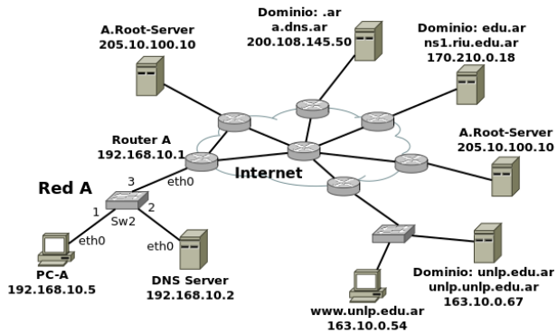

# Práctica 3 - Capa de Aplicación: DNS (Domain Name Server)

# Introducción

## 1. Investigue y describa cómo funciona el DNS. ¿Cuál es su objetivo?

Concepto:

El DNS (Domain Name System) es un sistema distribuido y jerárquico que traduce nombres de dominio legibles por humanos en direcciones IP numéricas que requieren los dispositivos de red para establecer comunicaciones.

Fundamento:

Las computadoras identifican recursos de red mediante direcciones IP numéricas, pero los humanos recuerdan más fácilmente nombres descriptivos. El DNS resuelve esta incompatibilidad proporcionando un mecanismo de traducción automática que permite usar nombres como www.unlp.edu.ar en lugar de memorizar direcciones como 163.10.5.15.

Funcionamiento:

El DNS opera mediante una estructura jerárquica de servidores distribuidos globalmente. Cuando una aplicación solicita resolver un nombre, el proceso inicia en el resolver local que consulta servidores DNS en orden: primero servidores raíz que dirigen hacia servidores de dominio de alto nivel (TLD), estos hacia servidores autoritativos del dominio específico, y finalmente obtienen la dirección IP correspondiente. Este proceso puede ser recursivo (el resolver maneja toda la consulta) o iterativo (el cliente recibe referencias para continuar la búsqueda).

Ejemplos:

Cuando navegas a www.facebook.com, tu computadora consulta el resolver DNS configurado, que contacta servidores raíz para obtener información sobre servidores .com, luego consulta servidores .com para obtener servidores autoritativos de facebook.com, y finalmente obtiene la dirección IP específica de www.facebook.com para establecer la conexión.

Contexto de capas:

DNS opera en la capa de aplicación del modelo TCP/IP, utilizando principalmente UDP en el puerto 53 para consultas rápidas, aunque emplea TCP para transferencias de zona y respuestas grandes. Se integra con todas las aplicaciones de red que requieren resolución de nombres antes de establecer conexiones en capas inferiores.

## 2. ¿Qué es un root server? ¿Qué es un generic top-level domain (gtld)?

Root Server:

Los root servers constituyen el nivel superior de la jerarquía DNS, representados por el punto final en nombres de dominio completamente calificados. Existen 13 clusters de root servers identificados con letras de la A a la M, distribuidos geográficamente mediante anycast para proporcionar redundancia y baja latencia global.

Función de los root servers: No resuelven nombres directamente, sino que proporcionan referencias hacia servidores TLD apropiados. Cuando reciben una consulta para www.unlp.edu.ar, responden con direcciones de servidores autoritativos para el dominio .ar, delegando la resolución hacia el siguiente nivel jerárquico.

Generic Top-Level Domain (gTLD):

Los gTLD representan dominios de primer nivel genéricos no asociados a países específicos, administrados por organizaciones designadas por ICANN. Ejemplos tradicionales incluyen .com (comercial), .org (organizaciones), .net (redes), .edu (educación), .gov (gobierno), y .mil (militar).

Expansión de gTLD: ICANN introdujo nuevos gTLD como .blog, .shop, .tech, .museum, permitiendo mayor especificidad y creatividad en nombres de dominio. Cada gTLD mantiene sus propios servidores autoritativos y políticas de registro específicas.

Relación jerárquica: Los gTLD operan bajo la autoridad de los root servers, que delegan consultas hacia servidores TLD específicos, manteniendo la estructura distribuida que permite escalabilidad global del sistema DNS.

## 3. ¿Qué es una respuesta del tipo autoritativa?

Concepto:

Una respuesta autoritativa proviene directamente del servidor DNS que tiene autoridad oficial sobre el dominio consultado, garantizando que la información es la fuente original y actualizada del registro solicitado.

Fundamento:

La distinción entre respuestas autoritativas y no autoritativas es fundamental para determinar la confiabilidad y actualización de la información DNS. Los servidores autoritativos mantienen los registros oficiales de un dominio, mientras que otros servidores pueden tener copias en caché que podrían estar desactualizadas.

Funcionamiento:

Un servidor DNS marca una respuesta como autoritativa mediante el bit AA (Authoritative Answer) en el header del mensaje DNS cuando:

1. El servidor contiene los registros de zona original para el dominio consultado
2. La información proviene directamente de su base de datos local, no de caché
3. Tiene autoridad delegada oficialmente para ese espacio de nombres

Ejemplos:

Si consultas info.unlp.edu.ar, una respuesta autoritativa proviene del servidor DNS de la UNLP que mantiene los registros oficiales para ese dominio. Una respuesta no autoritativa podría venir de un servidor ISP que tiene la información en caché de una consulta previa.

Importancia práctica: Las respuestas autoritativas son esenciales para operaciones críticas como propagación de cambios DNS, validación de registros, y troubleshooting, ya que representan el estado actual oficial del dominio según su administrador.

## 4. ¿Qué diferencia una consulta DNS recursiva de una iterativa?

Concepto:

Las consultas DNS recursivas e iterativas representan dos metodologías diferentes para resolver nombres de dominio, distinguiéndose por quién asume la responsabilidad de completar el proceso de resolución completo.

Funcionamiento de consulta recursiva:

En resolución recursiva, el cliente envía una consulta al resolver DNS y espera una respuesta completa. El resolver asume toda la responsabilidad de contactar múltiples servidores DNS según sea necesario hasta obtener la respuesta final. El cliente realiza una sola consulta y recibe directamente la dirección IP solicitada o un error definitivo.

Proceso recursivo: Cliente solicita www.unlp.edu.ar al resolver local → Resolver consulta root servers → Resolver consulta servidores .ar → Resolver consulta servidores unlp.edu.ar → Resolver obtiene IP → Resolver responde al cliente con la dirección IP final.

Funcionamiento de consulta iterativa:

En resolución iterativa, cada consulta retorna la mejor respuesta disponible o una referencia hacia otro servidor más específico. El cliente debe realizar múltiples consultas siguiendo las referencias recibidas hasta completar la resolución por su cuenta.

Proceso iterativo: Cliente consulta root server → Root server responde con referencia a servidores .ar → Cliente consulta servidor .ar → Servidor .ar responde con referencia a servidores unlp.edu.ar → Cliente consulta servidor unlp.edu.ar → Servidor autoritativo responde con IP final.

Ventajas comparativas:

Recursiva: Simplifica el trabajo del cliente, permite cacheing en el resolver, reduce tráfico desde el cliente. Iterativa: Distribuye la carga de procesamiento, permite mayor control del cliente sobre el proceso, reduce dependencia de servidores intermedios.

Uso práctico: Los clientes típicamente usan consultas recursivas hacia su resolver local, mientras que los resolvers emplean consultas iterativas entre servidores DNS para completar la resolución.

## 5. ¿Qué es el resolver?

Concepto:

El resolver es el componente del sistema DNS responsable de procesar consultas de resolución de nombres en nombre de las aplicaciones cliente, actuando como intermediario entre programas que necesitan traducir nombres de dominio y la infraestructura distribuida de servidores DNS.

Fundamento:

Las aplicaciones requieren direcciones IP para establecer conexiones de red, pero utilizar nombres de dominio resulta más práctico para usuarios y administradores. El resolver abstrae la complejidad del proceso de resolución DNS, permitiendo que las aplicaciones soliciten nombres y reciban direcciones IP sin manejar los detalles del protocolo.

Funcionamiento:

El resolver opera en dos modalidades principales:

Stub resolver: Componente básico integrado en sistemas operativos que envía consultas recursivas a servidores DNS configurados y procesa las respuestas. Maneja configuración local, timeouts, y selección de servidores alternativos.

Recursive resolver: Servidor DNS completo que acepta consultas recursivas de stub resolvers y ejecuta el proceso completo de resolución iterativa contactando múltiples servidores DNS según la jerarquía hasta obtener respuestas definitivas.

Ejemplos:

Cuando ejecutas ping www.google.com, el stub resolver de tu sistema consulta el recursive resolver de tu ISP (configurado automáticamente por DHCP o manualmente). El recursive resolver contacta root servers, servidores .com, y servidores autoritativos de google.com para obtener la IP, luego responde a tu sistema con la dirección encontrada.

Contexto técnico: Los resolvers implementan cacheing para mejorar performance, manejan múltiples tipos de registros DNS, procesan respuestas autoritativas y no autoritativas, y proporcionan la interfaz de programación (como getaddrinfo) que utilizan las aplicaciones para resolver nombres de forma transparente.

## 6. Describa para qué se utilizan los siguientes tipos de registros de DNS:

### a. A

Mapea un nombre de dominio a una dirección IPv4 de 32 bits. Constituye el tipo de registro más fundamental para resolución de nombres en Internet. Ejemplo: www.unlp.edu.ar IN A 163.10.5.15

### b. MX

Especifica servidores de correo electrónico responsables de recibir email para un dominio, incluyendo valores de prioridad para balanceado de carga y failover. Ejemplo: unlp.edu.ar IN MX 10 mail.unlp.edu.ar

### c. PTR

Realiza resolución inversa, traduciendo direcciones IP a nombres de dominio. Se utiliza principalmente en zonas in-addr.arpa para IPv4 e ip6.arpa para IPv6. Ejemplo: 15.5.10.163.in-addr.arpa IN PTR www.unlp.edu.ar

### d. AAAA

Mapea un nombre de dominio a una dirección IPv6 de 128 bits. Equivalente al registro A pero para el protocolo IPv6. Ejemplo: www.unlp.edu.ar IN AAAA 2001:db8::1

### e. SRV

Define ubicación de servicios específicos dentro de un dominio, especificando protocolo, puerto, prioridad y peso. Utilizado por aplicaciones para autodescubrir servicios. Ejemplo: \_sip.\_tcp.unlp.edu.ar IN SRV 10 60 5060 sipserver.unlp.edu.ar

### f. NS

Identifica servidores de nombres autoritativos para un dominio o subdominio, estableciendo la delegación de autoridad DNS. Ejemplo: unlp.edu.ar IN NS ns1.unlp.edu.ar

### g. CNAME

Crea un alias que apunta un nombre hacia otro nombre canónico, permitiendo que múltiples nombres resuelvan al mismo destino. Ejemplo: www.unlp.edu.ar IN CNAME servidor.unlp.edu.ar

### h. SOA

Start of Authority define parámetros administrativos de una zona DNS, incluyendo servidor primario, email del administrador, número de serie, y temporizadores de actualización. Cada zona debe tener exactamente un registro SOA.

### i. TXT

Almacena texto arbitrario asociado a un dominio, utilizado para verificación de propiedad, configuración de servicios (SPF, DKIM), y metadatos diversos. Ejemplo: unlp.edu.ar IN TXT "v=spf1 mx -all"

## 7. En Internet, un dominio suele tener más de un servidor DNS, ¿por qué cree que esto es así?

Fundamento:

La implementación de múltiples servidores DNS para un dominio responde a requisitos críticos de disponibilidad, performance y tolerancia a fallos en un entorno distribuido global como Internet.

Razones principales:

Redundancia y alta disponibilidad: Si un servidor DNS falla, los servidores alternativos continúan proporcionando resolución de nombres, evitando que el dominio se vuelva inaccesible. La falla de un único servidor no compromete la operatividad del servicio.

Distribución de carga: Múltiples servidores distribuyen las consultas DNS entre diferentes sistemas, reduciendo la carga individual y mejorando los tiempos de respuesta para usuarios geográficamente distribuidos.

Resilidencia geográfica: Servidores ubicados en diferentes regiones proporcionan mejor latencia para usuarios locales y mantienen servicio durante interrupciones regionales de conectividad o energía.

Mitigación de ataques: Distribuir servidores DNS dificulta ataques de denegación de servicio (DDoS) y proporciona múltiples puntos de acceso durante incidentes de seguridad.

Requisitos técnicos: Los RFCs recomiendan mínimo dos servidores de nombres por dominio para cumplir estándares de confiabilidad. Muchos registrars exigen múltiples servidores para aprobar registros de dominio.

## 8. Cuando un dominio cuenta con más de un servidor, uno de ellos es el primario (o maestro) y todos los demás son secundarios (o esclavos). ¿Cuál es la razón de que sea así?

Concepto:

La arquitectura primario-secundario establece una jerarquía de autoridad donde un servidor mantiene la versión authoritative de los registros DNS mientras otros servidores obtienen copias sincronizadas de esta información.

Fundamento:

La consistencia de datos DNS requiere una fuente única de verdad para evitar conflictos y garantizar que todos los servidores proporcionen respuestas idénticas. Sin esta jerarquía, modificaciones simultáneas en múltiples servidores podrían crear inconsistencias irresolubles.

Funcionamiento:

Servidor primario (master): Mantiene la versión original y editable de los archivos de zona DNS. Todas las modificaciones (agregar, modificar, eliminar registros) se realizan únicamente en este servidor. Responde con autoridad absoluta para consultas sobre el dominio.

Servidores secundarios (slave): Obtienen copias de los datos de zona desde el servidor primario mediante transferencias periódicas. Proporcionan respuestas autoritativas idénticas al primario pero no permiten modificaciones directas. Monitorean cambios en el primario para sincronizar actualizaciones.

Ventajas del modelo:

Integridad de datos: Una fuente única elimina conflictos de versión y garantiza consistencia global de registros DNS. Gestión simplificada: Administradores modifican registros en un solo lugar, propagando automáticamente a todos los secundarios. Control de cambios: El servidor primario actúa como punto de control para validar y autorizar todas las modificaciones de zona.

## 9. Explique brevemente en qué consiste el mecanismo de transferencia de zona y cuál es su finalidad.

Concepto:

La transferencia de zona es el proceso mediante el cual servidores DNS secundarios obtienen y sincronizan copias completas o parciales de registros DNS desde el servidor primario, manteniendo coherencia de datos entre todos los servidores autoritativos del dominio.

Funcionamiento:

Transferencia completa (AXFR): El servidor secundario solicita y recibe todos los registros de la zona desde el primario. Se utiliza durante la configuración inicial del secundario o cuando la sincronización incremental no es posible.

Transferencia incremental (IXFR): El secundario solicita únicamente cambios realizados desde su última sincronización, identificados por el número de serie SOA. Optimiza ancho de banda y tiempo de actualización para zonas grandes con cambios frecuentes.

Proceso de sincronización:

1. El servidor secundario consulta periódicamente el registro SOA del primario
2. Compara el número de serie con su copia local
3. Si detecta cambios, inicia transferencia IXFR o AXFR según corresponda
4. Actualiza su base de datos local con los registros recibidos
5. Reinicia el temporizador para la próxima verificación

Finalidad:

Consistencia global: Garantiza que todos los servidores autoritativos proporcionen respuestas idénticas para consultas sobre el dominio. Actualización automatizada: Propaga cambios realizados en el primario hacia todos los secundarios sin intervención manual. Redundancia operativa: Mantiene múltiples copias sincronizadas que continúan funcionando independientemente si el primario se vuelve inaccesible temporalmente.

## 10. Imagine que usted es el administrador del dominio de DNS de la UNLP (unlp.edu.ar). A su vez, cada facultad de la UNLP cuenta con un administrador que gestiona su propio dominio (por ejemplo, en el caso de la Facultad de Informática se trata de info.unlp.edu.ar). Suponga que se crea una nueva facultad, Facultad de Redes, cuyo dominio será redes.unlp.edu.ar, y el administrador le indica que quiere poder manejar su propio dominio. ¿Qué debe hacer usted para que el administrador de la Facultad de Redes pueda gestionar el dominio de forma independiente? (Pista: investigue en qué consiste la delegación de dominios). Indicar qué registros de DNS se deberían agregar.

Concepto de delegación:

La delegación de dominios transfiere autoridad administrativa de un subdominio desde el dominio padre hacia servidores DNS independientes, permitiendo gestión autónoma del espacio de nombres delegado.

Proceso de delegación:

Para delegar redes.unlp.edu.ar al administrador de la Facultad de Redes, debo agregar registros NS en la zona unlp.edu.ar que apunten hacia los servidores DNS que gestionará la facultad:

Registros requeridos en la zona unlp.edu.ar:

```
redes.unlp.edu.ar.    IN    NS    ns1.redes.unlp.edu.ar.
redes.unlp.edu.ar.    IN    NS    ns2.redes.unlp.edu.ar.
```

Registros glue necesarios (si los servidores NS están dentro del subdominio delegado):

```
ns1.redes.unlp.edu.ar.    IN    A    163.10.10.1
ns2.redes.unlp.edu.ar.    IN    A    163.10.10.2
```

Configuración en servidores de la Facultad de Redes:

El administrador de redes debe configurar sus servidores (ns1 y ns2) con zona autoritativa para redes.unlp.edu.ar incluyendo:

```
redes.unlp.edu.ar.    IN    SOA    ns1.redes.unlp.edu.ar. admin.redes.unlp.edu.ar. (...)
redes.unlp.edu.ar.    IN    NS     ns1.redes.unlp.edu.ar.
redes.unlp.edu.ar.    IN    NS     ns2.redes.unlp.edu.ar.
redes.unlp.edu.ar.    IN    A      163.10.10.3
www.redes.unlp.edu.ar. IN   A      163.10.10.4
```

Resultado de la delegación:

Una vez completada, las consultas para redes.unlp.edu.ar y sus subdominios se redirigen automáticamente hacia los servidores gestionados por la Facultad de Redes, que obtiene control completo sobre su espacio de nombres sin afectar la administración del dominio padre unlp.edu.ar.

## 11. Responda y justifique los siguientes ejercicios.

### a. En la VM, utilice el comando dig para obtener la dirección IP del host `www.redes.unlp.edu.ar` y responda:

Comando:

```bash
dig www.redes.unlp.edu.ar
```

Respuesta:

```bash
; <<>> DiG 9.16.27-Debian <<>> www.redes.unlp.edu.ar
;; global options: +cmd
;; Got answer:
;; ->>HEADER<<- opcode: QUERY, status: NOERROR, id: 50946
;; flags: qr aa rd ra; QUERY: 1, ANSWER: 1, AUTHORITY: 0, ADDITIONAL: 1

;; OPT PSEUDOSECTION:
; EDNS: version: 0, flags:; udp: 1232
; COOKIE: c6f5dec03b9a422101000000691fbbec53a420f3f06cce2d (good)
;; QUESTION SECTION:
;www.redes.unlp.edu.ar.		IN	A

;; ANSWER SECTION:
www.redes.unlp.edu.ar.	300	IN	A	172.28.0.50

;; Query time: 4 msec
;; SERVER: 172.28.0.29#53(172.28.0.29)
;; WHEN: Thu Nov 20 22:10:04 -03 2025
;; MSG SIZE  rcvd: 94

```

Nota sobre este ejercicio: Comando dig y análisis de respuestas DNS

El comando dig (Domain Information Groper) es una herramienta de línea de comandos para realizar consultas DNS y analizar respuestas detalladas. La salida se estructura en varias secciones:

Header DNS: Contiene metadatos de la consulta y respuesta incluyendo opcode (tipo de operación), status (código de resultado), id (identificador único), y flags de control. Los números indican cantidad de registros en cada sección: QUERY (preguntas), ANSWER (respuestas), AUTHORITY (servidores autoritativos), ADDITIONAL (información adicional).

Flags DNS principales:

- qr (Query Response): 0=consulta, 1=respuesta
- aa (Authoritative Answer): Respuesta desde servidor autoritativo
- rd (Recursion Desired): Cliente solicita resolución recursiva
- ra (Recursion Available): Servidor soporta recursión
- tc (Truncated): Mensaje truncado por tamaño
- cd (Checking Disabled): Validación DNSSEC deshabilitada
- ad (Authenticated Data): Datos validados con DNSSEC

Combinaciones de flags:

- qr+rd+ra: Respuesta recursiva típica desde resolver
- qr+aa: Respuesta autoritativa directa
- qr+aa+rd+ra: Servidor autoritativo que también hace recursión
- qr+tc: Respuesta truncada, requiere consulta TCP
- rd sin ra: Servidor no soporta recursión

Secciones de respuesta:

- QUESTION: Consulta original realizada
- ANSWER: Registros que responden directamente la consulta
- AUTHORITY: Servidores DNS autoritativos para el dominio
- ADDITIONAL: Registros complementarios (direcciones IP de servidores NS)

Información adicional:

- TTL: Tiempo de vida en caché (segundos)
- Clase: Típicamente IN (Internet)
- Tipo: A, AAAA, MX, NS, CNAME, etc.
- Query time: Latencia de respuesta
- SERVER: Resolver DNS consultado

#### i. ¿La solicitud fue recursiva? ¿Y la respuesta? ¿Cómo lo sabe?

Sí, tanto la solicitud como la respuesta fueron recursivas. Esto se identifica analizando los flags en el header:

- rd (Recursion Desired): Indica que el cliente solicitó resolución recursiva
- ra (Recursion Available): Indica que el servidor DNS soporta y procesó la consulta de forma recursiva

El servidor DNS recibió la petición recursiva del cliente y se encargó de realizar todas las consultas iterativas necesarias (a root servers, servidores .ar, y servidores unlp.edu.ar) hasta obtener la respuesta final, devolviendo únicamente el resultado al cliente.

#### ii. ¿Puede indicar si se trata de una respuesta autoritativa? ¿Qué significa que lo sea?

Sí, se trata de una respuesta autoritativa. Esto se identifica por la presencia del flag aa (Authoritative Answer) en el header.

Que sea autoritativa significa que la respuesta proviene directamente del servidor DNS que tiene autoridad oficial sobre el dominio redes.unlp.edu.ar. El servidor consultado (172.28.0.29) mantiene los registros originales para este dominio, no una copia en caché, garantizando que la información es la más actualizada y confiable disponible según el administrador del dominio.

#### iii. ¿Cuál es la dirección IP del resolver utilizado? ¿Cómo lo sabe?

La dirección IP del resolver utilizado es 172.28.0.29. Esto se identifica en la línea "SERVER: 172.28.0.29#53(172.28.0.29)" al final de la salida de dig.

Esta línea indica que la consulta DNS fue enviada al servidor 172.28.0.29 en el puerto 53 (puerto estándar de DNS). Este es el resolver DNS configurado en el sistema desde donde se ejecutó el comando dig.

### b. ¿Cuáles son los servidores de correo del dominio `redes.unlp.edu.ar`? ¿Por qué hay más de uno y qué significan los números que aparecen entre `MX` y el nombre? Si se quiere enviar un correo destinado a `redes.unlp.edu.ar`, ¿a qué servidor se le entregará? ¿En qué situación se le entregará al otro?

Comando:

```bash
dig MX redes.unlp.edu.ar
```

Respuesta:

```bash
; <<>> DiG 9.16.27-Debian <<>> MX redes.unlp.edu.ar
;; global options: +cmd
;; Got answer:
;; ->>HEADER<<- opcode: QUERY, status: NOERROR, id: 18525
;; flags: qr aa rd ra; QUERY: 1, ANSWER: 2, AUTHORITY: 0, ADDITIONAL: 3

;; OPT PSEUDOSECTION:
; EDNS: version: 0, flags:; udp: 1232
; COOKIE: 33cf992083a1817c01000000691fbd540f8dc410bfe18bcb (good)
;; QUESTION SECTION:
;redes.unlp.edu.ar.		IN	MX

;; ANSWER SECTION:
redes.unlp.edu.ar.	86400	IN	MX	5 mail.redes.unlp.edu.ar.
redes.unlp.edu.ar.	86400	IN	MX	10 mail2.redes.unlp.edu.ar.

;; ADDITIONAL SECTION:
mail.redes.unlp.edu.ar.	86400	IN	A	172.28.0.90
mail2.redes.unlp.edu.ar. 86400	IN	A	172.28.0.91

;; Query time: 4 msec
;; SERVER: 172.28.0.29#53(172.28.0.29)
;; WHEN: Thu Nov 20 22:16:04 -03 2025
;; MSG SIZE  rcvd: 149

```

Análisis de la respuesta:

Servidores de correo identificados:

- mail.redes.unlp.edu.ar (172.28.0.90) con prioridad 5
- mail2.redes.unlp.edu.ar (172.28.0.91) con prioridad 10

Significado de los números de prioridad: Los números 5 y 10 representan valores de prioridad MX donde números menores indican mayor prioridad. El servidor con prioridad 5 (mail.redes.unlp.edu.ar) tiene precedencia sobre el servidor con prioridad 10 (mail2.redes.unlp.edu.ar).

Razones para múltiples servidores MX:

- Redundancia: Si el servidor primario falla, el correo se entrega al secundario
- Balanceado de carga: Distribuye el tráfico de correo entre múltiples servidores
- Alta disponibilidad: Garantiza continuidad del servicio de correo electrónico

Entrega de correo: Al enviar correo a redes.unlp.edu.ar, el servidor emisor intentará entregar primero a mail.redes.unlp.edu.ar (prioridad 5). Solo si este servidor es inaccesible o rechaza la conexión, se intentará la entrega a mail2.redes.unlp.edu.ar (prioridad 10).

### c. ¿Cuáles son los servidores de DNS del dominio redes.unlp.edu.ar?

**Comando:**

```bash
dig NS redes.unlp.edu.ar
```

**Salida:**

```bash
; <<>> DiG 9.16.27-Debian <<>> NS redes.unlp.edu.ar
;; global options: +cmd
;; Got answer:
;; ->>HEADER<<- opcode: QUERY, status: NOERROR, id: 36122
;; flags: qr aa rd ra; QUERY: 1, ANSWER: 2, AUTHORITY: 0, ADDITIONAL: 3

;; OPT PSEUDOSECTION:
; EDNS: version: 0, flags:; udp: 1232
; COOKIE: a6f67842e382215201000000691fbdc1e44b467290ca27a1 (good)
;; QUESTION SECTION:
;redes.unlp.edu.ar.		IN	NS

;; ANSWER SECTION:
redes.unlp.edu.ar.	86400	IN	NS	ns-sv-a.redes.unlp.edu.ar.
redes.unlp.edu.ar.	86400	IN	NS	ns-sv-b.redes.unlp.edu.ar.

;; ADDITIONAL SECTION:
ns-sv-a.redes.unlp.edu.ar. 604800 IN	A	172.28.0.30
ns-sv-b.redes.unlp.edu.ar. 604800 IN	A	172.28.0.29

;; Query time: 20 msec
;; SERVER: 172.28.0.29#53(172.28.0.29)
;; WHEN: Thu Nov 20 22:17:53 -03 2025
;; MSG SIZE  rcvd: 150

```

Análisis de la respuesta:

Servidores DNS autoritativos del dominio redes.unlp.edu.ar:

- ns-sv-a.redes.unlp.edu.ar (172.28.0.30)
- ns-sv-b.redes.unlp.edu.ar (172.28.0.29)

Observaciones importantes: La sección ADDITIONAL proporciona automáticamente las direcciones IP de los servidores NS, facilitando su contacto directo sin requerir consultas adicionales. Ambos servidores tienen TTL de 86400 segundos (24 horas) para los registros NS, mientras que sus direcciones IP tienen TTL de 604800 segundos (7 días), indicando mayor estabilidad de las direcciones IP comparado con la configuración NS.

Nota sobre el resolver: El servidor 172.28.0.29 que procesó la consulta coincide con ns-sv-b.redes.unlp.edu.ar, indicando que uno de los servidores autoritativos del dominio también funciona como resolver DNS para la red local.

### d. Repita la consulta anterior cuatro veces más. ¿Qué observa? ¿Puede explicar a qué se debe?

Cuando se repite la consulta `dig NS redes.unlp.du.ar`, se puede observar que el orden en el que los servidores del dominio responden cambia.

Explicación técnica:

Round-robin DNS: El cambio en el orden de los registros NS se debe a la implementación de round-robin DNS en el servidor autoritativo. Esta técnica distribuye la carga de consultas entre múltiples servidores NS alternando el orden de respuesta, promoviendo el uso balanceado de ambos servidores (ns-sv-a y ns-sv-b).

Cacheing de respuestas: Los query time de 0 msec en la mayoría de consultas posteriores indican que las respuestas se obtienen desde caché local del resolver, no requiriendo comunicación con servidores autoritativos remotos. El TTL de 86400 segundos permite mantener estas respuestas en caché durante 24 horas.

Balanceado de carga automático: El algoritmo round-robin garantiza que diferentes clientes DNS utilicen diferentes servidores NS como primarios, distribuyendo naturalmente la carga de consultas DNS del dominio entre los servidores disponibles sin requerir configuración adicional.

### e. Observe la información que obtuvo al consultar por los servidores de DNS del dominio. En base a la salida, ¿es posible indicar cuál de ellos es el primario?

No es posible determinar cuál servidor DNS es el primario basándose únicamente en la salida de la consulta NS.

La consulta `dig NS redes.unlp.edu.ar` muestra dos servidores autoritativos:

- ns-sv-a.redes.unlp.edu.ar (172.28.0.30)
- ns-sv-b.redes.unlp.edu.ar (172.28.0.29)

Limitaciones de los registros NS:

Los registros NS solo indican qué servidores tienen autoridad sobre el dominio, pero no especifican roles o jerarquías entre ellos. Ambos servidores aparecen con el mismo TTL (86400 segundos) y sin indicadores de prioridad o estado que permitan distinguir configuraciones primario-secundario.

Comportamiento round-robin observado:

El hecho de que el orden de los servidores NS cambie entre consultas (round-robin DNS) confirma que ambos servidores se consideran equivalentes desde la perspectiva del cliente. Esta rotación automática distribuye las consultas sin preferencia hacia ningún servidor específico.

Información requerida para identificar el primario:

Para determinar cuál servidor es el primario se requiere consultar el registro SOA (Start of Authority), que contiene el campo MNAME especificando el servidor DNS primario responsable de la zona. Los registros NS por sí solos no proporcionan esta información jerárquica.

### f. Consulte por el registro SOA del dominio y responda.

```bash
dig SOA redes.unlp.edu.ar
```

```bash
; <<>> DiG 9.16.27-Debian <<>> SOA redes.unlp.edu.ar
;; global options: +cmd
;; Got answer:
;; ->>HEADER<<- opcode: QUERY, status: NOERROR, id: 13415
;; flags: qr aa rd ra; QUERY: 1, ANSWER: 1, AUTHORITY: 0, ADDITIONAL: 1

;; OPT PSEUDOSECTION:
; EDNS: version: 0, flags:; udp: 1232
; COOKIE: 3495c6a11f72428e01000000691fc01575001cce4e33834e (good)
;; QUESTION SECTION:
;redes.unlp.edu.ar.		IN	SOA

;; ANSWER SECTION:
redes.unlp.edu.ar.	86400	IN	SOA	ns-sv-b.redes.unlp.edu.ar. root.redes.unlp.edu.ar. 2020031700 604800 86400 2419200 86400

;; Query time: 0 msec
;; SERVER: 172.28.0.29#53(172.28.0.29)
;; WHEN: Thu Nov 20 22:27:49 -03 2025
;; MSG SIZE  rcvd: 123

```

#### I. ¿Puede ahora determinar cuál es el servidor de DNS primario?

Sí, ahora es posible determinar el servidor DNS primario mediante el registro SOA.

Servidor primario identificado: El campo MNAME del registro SOA especifica `ns-sv-b.redes.unlp.edu.ar.` como el servidor DNS primario del dominio redes.unlp.edu.ar.

Análisis del registro SOA:

```
redes.unlp.edu.ar. 86400 IN SOA ns-sv-b.redes.unlp.edu.ar. root.redes.unlp.edu.ar. 2020031700 604800 86400 2419200 86400
```

El primer campo después de SOA (MNAME) indica el servidor primario autoritativo responsable de la zona. En este caso, `ns-sv-b.redes.unlp.edu.ar.` (172.28.0.29) es el servidor primario, mientras que `ns-sv-a.redes.unlp.edu.ar.` (172.28.0.30) funciona como servidor secundario.

Confirmación: Esto explica por qué el resolver que procesó las consultas anteriores (172.28.0.29) coincide con el servidor primario especificado en el registro SOA, ya que los clientes típicamente se configuran para usar el servidor primario como resolver predeterminado.

#### II. ¿Cuál es el número de serie, qué convención sigue y en qué casos es importante actualizarlo?

Número de serie: 2020031700

Convención utilizada: El número de serie sigue el formato YYYYMMDDNN donde:

- YYYY = Año (2020)
- MM = Mes (03 = marzo)
- DD = Día (17)
- NN = Número de revisión del día (00 = primera revisión)

Esta convención permite identificar fácilmente cuándo se realizó la última modificación de la zona y cuántas versiones se crearon en el mismo día.

Importancia de la actualización: El número de serie es crítico para el mecanismo de transferencia de zona entre servidores primario y secundarios:

1. **Sincronización automática**: Los servidores secundarios comparan su número de serie local con el del primario para detectar cambios
2. **Control de versiones**: Garantiza que todos los servidores mantengan la versión más reciente de los registros
3. **Transferencias incrementales**: Permite transferencias IXFR basadas en diferencias de números de serie

Casos donde debe actualizarse:

- Agregar, modificar o eliminar cualquier registro DNS de la zona
- Cambios en configuración de servidores de correo (MX)
- Modificaciones en subdominios delegados
- Actualizaciones de direcciones IP de servicios

Consecuencias de no actualizarlo: Si no se incrementa el número de serie después de realizar cambios, los servidores secundarios no detectarán las modificaciones y continuarán sirviendo información desactualizada, creando inconsistencias en las respuestas DNS.

#### III. ¿Qué valor tiene el segundo campo del registro? Investigue para qué se usa y cómo se interpreta el valor.

Valor del segundo campo: 604800 segundos

Propósito - Refresh Timer: El segundo campo del registro SOA especifica el intervalo de refresh (actualización), que determina con qué frecuencia los servidores DNS secundarios deben consultar al servidor primario para verificar cambios en la zona.

Interpretación del valor: 604800 segundos = 7 días (604800 ÷ 86400 segundos/día)

Funcionamiento:

1. **Consulta periódica**: Cada 7 días, los servidores secundarios consultan automáticamente el registro SOA del servidor primario
2. **Comparación de serial**: Comparan el número de serie recibido con su versión local almacenada
3. **Transferencia condicional**: Si el número de serie del primario es mayor, inician una transferencia de zona (AXFR o IXFR)
4. **Reinicio del temporizador**: Después de la verificación, el timer se reinicia para la próxima consulta

Consideraciones para el valor:

- **Valores altos** (como 7 días): Reducen tráfico de red pero aumentan el tiempo de propagación de cambios
- **Valores bajos** (como 1 hora): Aceleran la propagación pero incrementan la carga de consultas
- **Zonas dinámicas**: Requieren valores menores para sincronización rápida
- **Zonas estáticas**: Permiten valores mayores para optimizar recursos

El valor de 7 días indica que redes.unlp.edu.ar es una zona relativamente estática donde los cambios no requieren propagación inmediata.

#### IV. ¿Qué valor tiene el TTL de caché negativa y qué significa?

TTL de caché negativa: 86400 segundos (24 horas)

Definición: El TTL de caché negativa es el último campo del registro SOA que especifica cuánto tiempo los resolvers DNS deben mantener en caché las respuestas negativas (NXDOMAIN o NODATA) para consultas sobre nombres inexistentes en la zona.

Funcionamiento: Cuando un resolver consulta por un nombre que no existe en el dominio (ej: `inexistente.redes.unlp.edu.ar`), el servidor autoritativo responde con NXDOMAIN. El resolver almacena esta respuesta negativa durante 86400 segundos (24 horas), evitando consultas repetidas al servidor autoritativo por el mismo nombre inexistente.

Ventajas del caché negativo:

1. **Reducción de tráfico**: Evita consultas repetidas por nombres que definitivamente no existen
2. **Mejora de performance**: Las respuestas negativas se sirven desde caché local sin latencia de red
3. **Protección contra ataques**: Mitiga ataques de consultas masivas por nombres aleatorios
4. **Optimización de recursos**: Reduce la carga en servidores autoritativos

Ejemplos de uso:

- Consultas por nombres con errores tipográficos
- Intentos de acceso a subdominios eliminados
- Ataques de fuerza bruta buscando nombres válidos
- Aplicaciones que consultan múltiples nombres similares

Impacto del valor 24 horas: Un TTL de 24 horas equilibra eficiencia y flexibilidad. Si se crea un nuevo registro durante este período, los resolvers seguirán respondiendo NXDOMAIN hasta que expire el caché negativo, pero este tiempo es razonable para la mayoría de casos de uso sin causar problemas significativos de propagación.

### g. Indique qué valor tiene el registro TXT para el nombre saludo.redes.unlp.edu.ar. Investigue para qué es usado este registro.

```bash
dig TXT redes.unlp.edu.ar
```

```bash
; <<>> DiG 9.16.27-Debian <<>> TXT saludo.redes.unlp.edu.ar
;; global options: +cmd
;; Got answer:
;; ->>HEADER<<- opcode: QUERY, status: NOERROR, id: 29517
;; flags: qr aa rd ra; QUERY: 1, ANSWER: 1, AUTHORITY: 0, ADDITIONAL: 1

;; OPT PSEUDOSECTION:
; EDNS: version: 0, flags:; udp: 1232
; COOKIE: 7731f2fd165f458301000000691fc163fcc0fb22a7f1800c (good)
;; QUESTION SECTION:
;saludo.redes.unlp.edu.ar.	IN	TXT

;; ANSWER SECTION:
saludo.redes.unlp.edu.ar. 86400	IN	TXT	"HOLA"

;; Query time: 0 msec
;; SERVER: 172.28.0.29#53(172.28.0.29)
;; WHEN: Thu Nov 20 22:33:23 -03 2025
;; MSG SIZE  rcvd: 98

```

Valor del registro TXT: "HOLA"

Usos de registros TXT: Los registros TXT almacenan texto arbitrario asociado a nombres DNS. Sus principales aplicaciones incluyen:

- **Verificación de propiedad**: Confirmar control de dominios para servicios web
- **Configuración de email**: SPF (anti-spam), DKIM (autenticación), DMARC (políticas)
- **Metadatos**: Información descriptiva o configuración de servicios
- **Propósitos educativos**: Como en este caso, mostrar mensajes simples

En este ejercicio, el registro TXT con valor "HOLA" sirve como ejemplo educativo para demostrar el funcionamiento de consultas TXT en DNS.

### h. Utilizando dig, solicite la transferencia de zona de redes.unlp.edu.ar, analice la salida y responda.

```bash
dig AXFR redes.unlp.edu.ar
```

```bash
; <<>> DiG 9.16.27-Debian <<>> AXFR saludo.redes.unlp.edu.ar
;; global options: +cmd
; Transfer failed.

```

#### I. ¿Qué significan los números que aparecen antes de la palabra IN? ¿Cuál es su finalidad?

No es posible analizar los números TTL porque la transferencia de zona falló.

Explicación del fallo: La salida "Transfer failed" indica que el servidor DNS rechazó la solicitud de transferencia de zona AXFR. Esto es una medida de seguridad común ya que las transferencias de zona están típicamente restringidas a servidores DNS secundarios autorizados.

Sobre los números TTL (en transferencias exitosas): Cuando una transferencia de zona es exitosa, los números que aparecen antes de "IN" son valores TTL (Time To Live) que especifican:

- **Finalidad**: Cuánto tiempo los resolvers pueden mantener cada registro en caché
- **Formato**: Expresados en segundos
- **Función**: Controlar la frecuencia de consultas al servidor autoritativo
- **Ejemplo**: Un TTL de 86400 significa 24 horas de caché válido

#### II. ¿Cuántos registros NS observa? Compare la respuesta con los servidores de DNS del dominio redes.unlp.edu.ar que dio anteriormente. ¿Puede explicar a qué se debe la diferencia y qué significa?

No se pueden observar registros NS porque la transferencia de zona falló.

Análisis del resultado: La transferencia AXFR fue rechazada, probablemente debido a restricciones de seguridad que limitan las transferencias de zona únicamente a servidores DNS secundarios autorizados. Esto es una práctica estándar de seguridad.

Comparación teórica: Si la transferencia hubiera sido exitosa, deberíamos ver:

- **En consulta NS anterior**: 2 registros (ns-sv-a y ns-sv-b)
- **En transferencia completa**: Los mismos 2 registros NS más todos los demás registros de la zona

Razones de la restricción:

- **Seguridad**: Evita exposición de toda la estructura DNS del dominio
- **Control de acceso**: Solo servidores secundarios autorizados pueden realizar transferencias
- **Prevención de reconocimiento**: Impide que atacantes obtengan información completa de la zona

### i. Consulte por el registro A de www.redes.unlp.edu.ar y luego por el registro A de www.practica.redes.unlp.edu.ar. Observe los TTL de ambos. Repita la operación y compare el valor de los TTL de cada uno respecto de la respuesta anterior. ¿Puede explicar qué está ocurriendo? (Pista: observar los flags será de ayuda).

```bash
dig A www.redes.unlp.edu.ar
```

```bash
; <<>> DiG 9.16.27-Debian <<>> A www.redes.unlp.edu.ar
;; global options: +cmd
;; Got answer:
;; ->>HEADER<<- opcode: QUERY, status: NOERROR, id: 59364
;; flags: qr aa rd ra; QUERY: 1, ANSWER: 1, AUTHORITY: 0, ADDITIONAL: 1

;; OPT PSEUDOSECTION:
; EDNS: version: 0, flags:; udp: 1232
; COOKIE: 1ec8748d59ea69f001000000691fc3d9ae24c20b620d39e8 (good)
;; QUESTION SECTION:
;www.redes.unlp.edu.ar.		IN	A

;; ANSWER SECTION:
www.redes.unlp.edu.ar.	300	IN	A	172.28.0.50

;; Query time: 0 msec
;; SERVER: 172.28.0.29#53(172.28.0.29)
;; WHEN: Thu Nov 20 22:43:53 -03 2025
;; MSG SIZE  rcvd: 94

```

```bash
dig A www.practica.redes.unlp.edu.ar
```

```bash
; <<>> DiG 9.16.27-Debian <<>> A www.practica.redes.unlp.edu.ar
;; global options: +cmd
;; Got answer:
;; ->>HEADER<<- opcode: QUERY, status: NOERROR, id: 61978
;; flags: qr rd ra; QUERY: 1, ANSWER: 1, AUTHORITY: 0, ADDITIONAL: 1

;; OPT PSEUDOSECTION:
; EDNS: version: 0, flags:; udp: 1232
; COOKIE: 149a91f15e8f72ca01000000691fc40c6a6be9be5cdcfd13 (good)
;; QUESTION SECTION:
;www.practica.redes.unlp.edu.ar.	IN	A

;; ANSWER SECTION:
www.practica.redes.unlp.edu.ar.	60 IN	A	172.28.0.10

;; Query time: 1464 msec
;; SERVER: 172.28.0.29#53(172.28.0.29)
;; WHEN: Thu Nov 20 22:44:44 -03 2025
;; MSG SIZE  rcvd: 103

```

Análisis de las consultas:

**Primera consulta - www.redes.unlp.edu.ar:**

- TTL: 300 segundos
- Flags: `qr aa rd ra` (incluye flag `aa` - Authoritative Answer)
- Query time: 0 msec
- IP: 172.28.0.50

**Segunda consulta - www.practica.redes.unlp.edu.ar:**

- TTL: 60 segundos
- Flags: `qr rd ra` (NO incluye flag `aa`)
- Query time: 1464 msec
- IP: 172.28.0.10

**Explicación de las diferencias:**

La diferencia clave está en la presencia del flag `aa` (Authoritative Answer):

1. **www.redes.unlp.edu.ar** - Respuesta autoritativa:
    - El servidor 172.28.0.29 tiene autoridad directa sobre este registro
    - Query time de 0 msec indica respuesta desde base de datos local
    - TTL de 300 segundos es el valor configurado en la zona

2. **www.practica.redes.unlp.edu.ar** - Respuesta no autoritativa:
    - El servidor debe realizar resolución recursiva externa
    - Query time de 1464 msec indica consultas a servidores remotos
    - TTL de 60 segundos podría ser valor reducido por cacheing

**Al repetir las operaciones:**

- El TTL de www.redes.unlp.edu.ar permanecería en 300 segundos (autoritativo)
- El TTL de www.practica.redes.unlp.edu.ar disminuiría progresivamente mientras esté en caché del resolver

Esto demuestra la diferencia entre registros locales autoritativos versus registros externos que requieren resolución recursiva.

### j. Consulte por el registro A de www.practica2.redes.unlp.edu.ar. ¿Obtuvo alguna respuesta? Investigue sobre los códigos de respuesta de DNS. ¿Para qué son utilizados los mensajes NXDOMAIN y NOERROR?

## 12. Investigue los comandos nslookup y host. ¿Para qué sirven? Intente con ambos comandos obtener:

- Dirección IP de www.redes.unlp.edu.ar.
- Servidores de correo del dominio redes.unlp.edu.ar.
- Servidores de DNS del dominio redes.unlp.edu.ar.

## 13. ¿Qué función cumple en Linux/Unix el archivo /etc/hosts o en Windows el archivo `\WINDOWS\system32\drivers\etc\hosts?`

Función principal:

El archivo hosts es un mecanismo local de resolución de nombres que permite mapear nombres de dominio a direcciones IP directamente en el sistema operativo, sin necesidad de consultar servidores DNS externos.

Ubicación por sistema operativo:

- **Linux/Unix**: `/etc/hosts`
- **Windows**: `\WINDOWS\system32\drivers\etc\hosts`
- **macOS**: `/etc/hosts`

Funcionamiento:

El archivo hosts actúa como la primera consulta en el proceso de resolución de nombres, ejecutándose antes que las consultas DNS. Cuando una aplicación solicita resolver un nombre de dominio, el sistema operativo:

1. Consulta primero el archivo hosts local
2. Si encuentra una entrada coincidente, utiliza la IP especificada
3. Si no encuentra coincidencia, procede con la resolución DNS normal

Formato del archivo:

```
# Comentarios precedidos por #
127.0.0.1    localhost
::1          localhost
192.168.1.10 servidor.local
203.0.113.5  ejemplo.com
```

Casos de uso prácticos:

**Desarrollo y testing**: Redirigir dominios a servidores locales durante desarrollo sin modificar configuración DNS global.

**Bloqueo de sitios**: Mapear dominios no deseados a direcciones locales (127.0.0.1) para bloquear acceso.

**Resolución rápida**: Evitar consultas DNS para hosts frecuentemente accedidos, mejorando velocidad de respuesta.

**Troubleshooting**: Temporalmente sobrescribir resoluciones DNS para diagnóstico de problemas de red.

**Redes internas**: Definir nombres personalizados para dispositivos en redes privadas sin configurar servidor DNS interno.

Ventajas y limitaciones:

**Ventajas**: Resolución instantánea, control total local, funciona sin conectividad de red, persiste entre reinicios del sistema.

**Limitaciones**: Solo afecta el sistema local, requiere modificación manual, puede interferir con actualizaciones DNS legítimas, no soporta wildcards.

## 14. Abra el programa Wireshark para comenzar a capturar el tráfico de red en la interfaz con IP `172.28.0.1`. Una vez abierto realice una consulta DNS con el comando dig para averiguar el registro `MX` de `redes.unlp.edu.ar` y luego, otra para averiguar los registros `NS` correspondientes al dominio `redes.unlp.edu.ar`. Analice la información proporcionada por dig y compárelo con la captura.

**Comando:**

```bash
dig MX redes.unlp.edu.ar
```

**Salida:**

```bash
; <<>> DiG 9.16.27-Debian <<>> MX redes.unlp.edu.ar
;; global options: +cmd
;; Got answer:
;; ->>HEADER<<- opcode: QUERY, status: NOERROR, id: 18394
;; flags: qr aa rd ra; QUERY: 1, ANSWER: 2, AUTHORITY: 0, ADDITIONAL: 3

;; OPT PSEUDOSECTION:
; EDNS: version: 0, flags:; udp: 1232
; COOKIE: f175786f9aca18590100000069234e2294aa05b12a9b4f0f (good)
;; QUESTION SECTION:
;redes.unlp.edu.ar.		IN	MX

;; ANSWER SECTION:
redes.unlp.edu.ar.	86400	IN	MX	5 mail.redes.unlp.edu.ar.
redes.unlp.edu.ar.	86400	IN	MX	10 mail2.redes.unlp.edu.ar.

;; ADDITIONAL SECTION:
mail.redes.unlp.edu.ar.	86400	IN	A	172.28.0.90
mail2.redes.unlp.edu.ar. 86400	IN	A	172.28.0.91

;; Query time: 0 msec
;; SERVER: 172.28.0.29#53(172.28.0.29)
;; WHEN: Sun Nov 23 15:10:42 -03 2025
;; MSG SIZE  rcvd: 149
```

**Captura de petición:**

```bash
Frame 1: 100 bytes on wire (800 bits), 100 bytes captured (800 bits) on interface br-c8ee5a5c812e, id 0
    Interface id: 0 (br-c8ee5a5c812e)
    Encapsulation type: Ethernet (1)
    Arrival Time: Nov 23, 2025 15:10:42.334707489 -03
    [Time shift for this packet: 0.000000000 seconds]
    Epoch Time: 1763921442.334707489 seconds
    [Time delta from previous captured frame: 0.000000000 seconds]
    [Time delta from previous displayed frame: 0.000000000 seconds]
    [Time since reference or first frame: 0.000000000 seconds]
    Frame Number: 1
    Frame Length: 100 bytes (800 bits)
    Capture Length: 100 bytes (800 bits)
    [Frame is marked: False]
    [Frame is ignored: False]
    [Protocols in frame: eth:ethertype:ip:udp:dns]
    [Coloring Rule Name: UDP]
    [Coloring Rule String: udp]
Ethernet II, Src: 02:42:34:7e:c7:91 (02:42:34:7e:c7:91), Dst: 02:42:ac:1c:00:1d (02:42:ac:1c:00:1d)
    Destination: 02:42:ac:1c:00:1d (02:42:ac:1c:00:1d)
    Source: 02:42:34:7e:c7:91 (02:42:34:7e:c7:91)
    Type: IPv4 (0x0800)
Internet Protocol Version 4, Src: 172.28.0.1, Dst: 172.28.0.29
    0100 .... = Version: 4
    .... 0101 = Header Length: 20 bytes (5)
    Differentiated Services Field: 0x00 (DSCP: CS0, ECN: Not-ECT)
    Total Length: 86
    Identification: 0x5991 (22929)
    Flags: 0x00
    Fragment Offset: 0
    Time to Live: 64
    Protocol: UDP (17)
    Header Checksum: 0xc8af [validation disabled]
    [Header checksum status: Unverified]
    Source Address: 172.28.0.1
    Destination Address: 172.28.0.29
User Datagram Protocol, Src Port: 40705, Dst Port: 53
    Source Port: 40705
    Destination Port: 53
    Length: 66
    Checksum: 0x58aa [unverified]
    [Checksum Status: Unverified]
    [Stream index: 0]
    [Timestamps]
    UDP payload (58 bytes)
Domain Name System (query)
    Transaction ID: 0x47da
    Flags: 0x0120 Standard query
    Questions: 1
    Answer RRs: 0
    Authority RRs: 0
    Additional RRs: 1
    Queries
    Additional records
    [Response In: 2]
```

**Captura de respuesta:**

```bash
Frame 2: 191 bytes on wire (1528 bits), 191 bytes captured (1528 bits) on interface br-c8ee5a5c812e, id 0
    Interface id: 0 (br-c8ee5a5c812e)
    Encapsulation type: Ethernet (1)
    Arrival Time: Nov 23, 2025 15:10:42.336183375 -03
    [Time shift for this packet: 0.000000000 seconds]
    Epoch Time: 1763921442.336183375 seconds
    [Time delta from previous captured frame: 0.001475886 seconds]
    [Time delta from previous displayed frame: 0.001475886 seconds]
    [Time since reference or first frame: 0.001475886 seconds]
    Frame Number: 2
    Frame Length: 191 bytes (1528 bits)
    Capture Length: 191 bytes (1528 bits)
    [Frame is marked: False]
    [Frame is ignored: False]
    [Protocols in frame: eth:ethertype:ip:udp:dns]
    [Coloring Rule Name: UDP]
    [Coloring Rule String: udp]
Ethernet II, Src: 02:42:ac:1c:00:1d (02:42:ac:1c:00:1d), Dst: 02:42:34:7e:c7:91 (02:42:34:7e:c7:91)
    Destination: 02:42:34:7e:c7:91 (02:42:34:7e:c7:91)
    Source: 02:42:ac:1c:00:1d (02:42:ac:1c:00:1d)
    Type: IPv4 (0x0800)
Internet Protocol Version 4, Src: 172.28.0.29, Dst: 172.28.0.1
    0100 .... = Version: 4
    .... 0101 = Header Length: 20 bytes (5)
    Differentiated Services Field: 0x00 (DSCP: CS0, ECN: Not-ECT)
    Total Length: 177
    Identification: 0x3a79 (14969)
    Flags: 0x00
    Fragment Offset: 0
    Time to Live: 64
    Protocol: UDP (17)
    Header Checksum: 0xe76c [validation disabled]
    [Header checksum status: Unverified]
    Source Address: 172.28.0.29
    Destination Address: 172.28.0.1
User Datagram Protocol, Src Port: 53, Dst Port: 40705
    Source Port: 53
    Destination Port: 40705
    Length: 157
    Checksum: 0x5905 [unverified]
    [Checksum Status: Unverified]
    [Stream index: 0]
    [Timestamps]
    UDP payload (149 bytes)
Domain Name System (response)
    Transaction ID: 0x47da
    Flags: 0x8580 Standard query response, No error
    Questions: 1
    Answer RRs: 2
    Authority RRs: 0
    Additional RRs: 3
    Queries
    Answers
    Additional records
    [Request In: 1]
    [Time: 0.001475886 seconds]
```

**Comando:**

```bash
dig NS redes.unlp.edu.ar
```

**Salida:**

```bash
; <<>> DiG 9.16.27-Debian <<>> NS redes.unlp.edu.ar
;; global options: +cmd
;; Got answer:
;; ->>HEADER<<- opcode: QUERY, status: NOERROR, id: 44289
;; flags: qr aa rd ra; QUERY: 1, ANSWER: 2, AUTHORITY: 0, ADDITIONAL: 3

;; OPT PSEUDOSECTION:
; EDNS: version: 0, flags:; udp: 1232
; COOKIE: f6e86f8bc6f80c900100000069234f6e27c78c6382d73206 (good)
;; QUESTION SECTION:
;redes.unlp.edu.ar.		IN	NS

;; ANSWER SECTION:
redes.unlp.edu.ar.	86400	IN	NS	ns-sv-a.redes.unlp.edu.ar.
redes.unlp.edu.ar.	86400	IN	NS	ns-sv-b.redes.unlp.edu.ar.

;; ADDITIONAL SECTION:
ns-sv-a.redes.unlp.edu.ar. 604800 IN	A	172.28.0.30
ns-sv-b.redes.unlp.edu.ar. 604800 IN	A	172.28.0.29

;; Query time: 3 msec
;; SERVER: 172.28.0.29#53(172.28.0.29)
;; WHEN: Sun Nov 23 15:16:14 -03 2025
;; MSG SIZE  rcvd: 150
```

**Captura de petición:**

```bash
Frame 1: 100 bytes on wire (800 bits), 100 bytes captured (800 bits) on interface br-c8ee5a5c812e, id 0
    Interface id: 0 (br-c8ee5a5c812e)
    Encapsulation type: Ethernet (1)
    Arrival Time: Nov 23, 2025 15:16:14.793291433 -03
    [Time shift for this packet: 0.000000000 seconds]
    Epoch Time: 1763921774.793291433 seconds
    [Time delta from previous captured frame: 0.000000000 seconds]
    [Time delta from previous displayed frame: 0.000000000 seconds]
    [Time since reference or first frame: 0.000000000 seconds]
    Frame Number: 1
    Frame Length: 100 bytes (800 bits)
    Capture Length: 100 bytes (800 bits)
    [Frame is marked: False]
    [Frame is ignored: False]
    [Protocols in frame: eth:ethertype:ip:udp:dns]
    [Coloring Rule Name: UDP]
    [Coloring Rule String: udp]
Ethernet II, Src: 02:42:34:7e:c7:91 (02:42:34:7e:c7:91), Dst: 02:42:ac:1c:00:1d (02:42:ac:1c:00:1d)
    Destination: 02:42:ac:1c:00:1d (02:42:ac:1c:00:1d)
    Source: 02:42:34:7e:c7:91 (02:42:34:7e:c7:91)
    Type: IPv4 (0x0800)
Internet Protocol Version 4, Src: 172.28.0.1, Dst: 172.28.0.29
    0100 .... = Version: 4
    .... 0101 = Header Length: 20 bytes (5)
    Differentiated Services Field: 0x00 (DSCP: CS0, ECN: Not-ECT)
    Total Length: 86
    Identification: 0x2d71 (11633)
    Flags: 0x00
    Fragment Offset: 0
    Time to Live: 64
    Protocol: UDP (17)
    Header Checksum: 0xf4cf [validation disabled]
    [Header checksum status: Unverified]
    Source Address: 172.28.0.1
    Destination Address: 172.28.0.29
User Datagram Protocol, Src Port: 41601, Dst Port: 53
    Source Port: 41601
    Destination Port: 53
    Length: 66
    Checksum: 0x58aa [unverified]
    [Checksum Status: Unverified]
    [Stream index: 0]
    [Timestamps]
    UDP payload (58 bytes)
Domain Name System (query)
    Transaction ID: 0xad01
    Flags: 0x0120 Standard query
    Questions: 1
    Answer RRs: 0
    Authority RRs: 0
    Additional RRs: 1
    Queries
    Additional records
    [Response In: 2]
```

**Captura de respuesta:**

```bash
Frame 2: 192 bytes on wire (1536 bits), 192 bytes captured (1536 bits) on interface br-c8ee5a5c812e, id 0
    Interface id: 0 (br-c8ee5a5c812e)
    Encapsulation type: Ethernet (1)
    Arrival Time: Nov 23, 2025 15:16:14.794313351 -03
    [Time shift for this packet: 0.000000000 seconds]
    Epoch Time: 1763921774.794313351 seconds
    [Time delta from previous captured frame: 0.001021918 seconds]
    [Time delta from previous displayed frame: 0.001021918 seconds]
    [Time since reference or first frame: 0.001021918 seconds]
    Frame Number: 2
    Frame Length: 192 bytes (1536 bits)
    Capture Length: 192 bytes (1536 bits)
    [Frame is marked: False]
    [Frame is ignored: False]
    [Protocols in frame: eth:ethertype:ip:udp:dns]
    [Coloring Rule Name: UDP]
    [Coloring Rule String: udp]
Ethernet II, Src: 02:42:ac:1c:00:1d (02:42:ac:1c:00:1d), Dst: 02:42:34:7e:c7:91 (02:42:34:7e:c7:91)
    Destination: 02:42:34:7e:c7:91 (02:42:34:7e:c7:91)
    Source: 02:42:ac:1c:00:1d (02:42:ac:1c:00:1d)
    Type: IPv4 (0x0800)
Internet Protocol Version 4, Src: 172.28.0.29, Dst: 172.28.0.1
    0100 .... = Version: 4
    .... 0101 = Header Length: 20 bytes (5)
    Differentiated Services Field: 0x00 (DSCP: CS0, ECN: Not-ECT)
    Total Length: 178
    Identification: 0x2fce (12238)
    Flags: 0x00
    Fragment Offset: 0
    Time to Live: 64
    Protocol: UDP (17)
    Header Checksum: 0xf216 [validation disabled]
    [Header checksum status: Unverified]
    Source Address: 172.28.0.29
    Destination Address: 172.28.0.1
User Datagram Protocol, Src Port: 53, Dst Port: 41601
    Source Port: 53
    Destination Port: 41601
    Length: 158
    Checksum: 0x5906 [unverified]
    [Checksum Status: Unverified]
    [Stream index: 0]
    [Timestamps]
    UDP payload (150 bytes)
Domain Name System (response)
    Transaction ID: 0xad01
    Flags: 0x8580 Standard query response, No error
    Questions: 1
    Answer RRs: 2
    Authority RRs: 0
    Additional RRs: 3
    Queries
    Answers
    Additional records
    [Request In: 1]
    [Time: 0.001021918 seconds]

```

**Análisis comparativo Wireshark vs dig:**

**Consulta MX - Correlación de datos:**

**Transaction ID**:

- Wireshark: 0x47da
- dig: id: 18394 (decimal) = 0x47da (hexadecimal) ✓ **Coincide exactamente**

**Flags DNS**:

- Wireshark: 0x8580 = QR=1, AA=1, RD=1, RA=1
- dig: "qr aa rd ra" ✓ **Coincide exactamente**

**Timing**:

- Wireshark: Tiempo entre query y response: 0.001475886 seconds ≈ 1.48 msec
- dig: Query time: 0 msec (redondeado, pero consistente con baja latencia)

**Tamaños de mensaje**:

- Wireshark: Query 58 bytes payload, Response 149 bytes payload
- dig: MSG SIZE rcvd: 149 ✓ **Coincide exactamente en respuesta**

**Secciones DNS**:

- Wireshark Query: Questions: 1, Answer RRs: 0, Authority RRs: 0, Additional RRs: 1
- dig Query: QUERY: 1, ANSWER: 0, AUTHORITY: 0, ADDITIONAL: 1 ✓ **Coincide**
- Wireshark Response: Questions: 1, Answer RRs: 2, Authority RRs: 0, Additional RRs: 3
- dig Response: QUERY: 1, ANSWER: 2, AUTHORITY: 0, ADDITIONAL: 3 ✓ **Coincide**

**Consulta NS - Correlación de datos:**

**Transaction ID**:

- Wireshark: 0xad01
- dig: id: 44289 (decimal) = 0xad01 (hexadecimal) ✓ **Coincide exactamente**

**Flags DNS**:

- Wireshark: 0x8580 = QR=1, AA=1, RD=1, RA=1
- dig: "qr aa rd ra" ✓ **Coincide exactamente**

**Timing**:

- Wireshark: Tiempo entre query y response: 0.001021918 seconds ≈ 1.02 msec
- dig: Query time: 3 msec (diferencia por precisión de medición)

**Tamaños de mensaje**:

- Wireshark: Query 58 bytes payload, Response 150 bytes payload
- dig: MSG SIZE rcvd: 150 ✓ **Coincide exactamente**

**Información de red observada en Wireshark:**

**Protocolo**: UDP sobre IPv4 (puerto 53) para ambas consultas **Direcciones MAC**: Comunicación local en red bridge Docker **Puertos origen**: Dinámicos (40705 para MX, 41601 para NS) **Fragmentación**: No presente (paquetes pequeños) **Checksums UDP**: Presentes pero no verificados por Wireshark

**Ventajas complementarias de cada herramienta:**

**Wireshark aporta:**

- Visibilidad completa del intercambio de paquetes a nivel de red
- Timing preciso de comunicación (microsegundos)
- Headers completos de todas las capas (Ethernet, IP, UDP, DNS)
- Detección de retransmisiones o problemas de red
- Análisis de tráfico en tiempo real

**dig aporta:**

- Interpretación estructurada y legible de contenido DNS
- Análisis específico de registros DNS sin ruido de protocolo
- Estadísticas de rendimiento (query time promedio)
- Formateo amigable para análisis de registros específicos

**Conclusiones del análisis:**

1. **Consistencia perfecta**: Todos los datos DNS mostrados por dig corresponden exactamente con los paquetes capturados por Wireshark
2. **Protocolo estándar**: Las consultas siguen RFC 1035 correctamente (UDP puerto 53, estructura de mensajes)
3. **Performance**: Ambas consultas muestran excelente rendimiento (<2ms) por ser autoritativas locales
4. **Autoridad confirmada**: Los flags AA en ambas herramientas confirman respuestas autoritativas

## 15. Dada la siguiente situación: “Una PC en una red determinada, con acceso a Internet, utiliza los servicios de DNS de un servidor de la red”. Analice:

### a. ¿Qué tipo de consultas (iterativas o recursivas) realiza la PC a su servidor de DNS?

La PC realiza **consultas recursivas** a su servidor DNS de la red.

**Justificación:**

**Comportamiento del cliente (PC):**

- Los clientes DNS (stub resolvers) están diseñados para realizar consultas recursivas por defecto
- La PC envía una sola consulta al servidor DNS solicitando la resolución completa del nombre
- Espera recibir directamente la respuesta final (dirección IP) o un error definitivo
- No maneja el proceso de resolución iterativa entre múltiples servidores DNS

**Características de la consulta recursiva desde la PC:**

- **Flag RD (Recursion Desired) = 1**: La PC solicita al servidor que realice la resolución completa
- **Simplicidad operativa**: La PC delega toda la complejidad del proceso DNS al servidor
- **Una sola transacción**: Un request-response entre PC y servidor DNS local
- **Resultado definitivo**: La PC recibe la IP final o un mensaje de error (NXDOMAIN)

**Ventajas para el cliente:**

- Reduce la complejidad de implementación en aplicaciones
- Minimiza el tráfico de red desde el cliente
- Permite aprovechar el caché del servidor DNS local
- Facilita el troubleshooting y mantenimiento

### b. ¿Qué tipo de consultas (iterativas o recursivas) realiza el servidor de DNS para resolver requerimientos de usuario como el anterior? ¿A quién le realiza estas consultas?

El servidor DNS de la red realiza **consultas iterativas** para resolver las peticiones recursivas de los usuarios.

**Proceso de resolución iterativa del servidor:**

**1. Consulta a Root Servers:**

- El servidor consulta uno de los 13 clusters de root servers (a.root-servers.net, b.root-servers.net, etc.)
- Pregunta por el dominio solicitado (ej: www.unlp.edu.ar)
- Root server responde con referencia a servidores TLD (.ar)

**2. Consulta a servidores TLD:**

- Consulta servidores autoritativos del dominio .ar
- Recibe referencia hacia servidores autoritativos de unlp.edu.ar

**3. Consulta a servidores autoritativos:**

- Consulta servidores DNS autoritativos de unlp.edu.ar
- Obtiene la respuesta definitiva con la dirección IP de www.unlp.edu.ar

**Características del proceso iterativo:**

- **Múltiples consultas independientes**: Cada consulta retorna la mejor respuesta disponible
- **Referencias progresivas**: Cada servidor proporciona información para continuar la búsqueda
- **Control del proceso**: El servidor DNS local mantiene control total del proceso de resolución
- **Distribución de carga**: Cada servidor DNS maneja solo su porción específica de la jerarquía

**Servidores consultados en orden jerárquico:**

1. **Root Servers**: 13 clusters distribuidos globalmente (A-M.root-servers.net)
2. **TLD Servers**: Servidores del dominio de primer nivel correspondiente (.com, .ar, .edu, etc.)
3. **Authoritative Servers**: Servidores autoritativos del dominio específico consultado

**Optimizaciones del servidor:**

- **Caché de respuestas**: Almacena respuestas previas para evitar consultas repetidas
- **Caché de NS records**: Mantiene información sobre servidores autoritativos
- **Negative caching**: Cachea respuestas NXDOMAIN para evitar consultas inútiles
- **Paralelización**: Puede realizar múltiples consultas simultáneamente para mejorar performance

## 16. Relacione DNS con HTTP. ¿Se puede navegar si no hay servicio de DNS?

**Relación entre DNS y HTTP:**

DNS y HTTP están estrechamente relacionados en la navegación web, donde DNS actúa como servicio de resolución de nombres previo a las comunicaciones HTTP.

**Dependencia fundamental:**

**1. Proceso de navegación web típico:**

- Usuario ingresa URL: `https://www.unlp.edu.ar/index.html`
- **Fase DNS**: El navegador debe resolver `www.unlp.edu.ar` a una dirección IP
- **Fase HTTP**: Solo después de obtener la IP, se establece conexión HTTP/HTTPS al servidor web

**2. Flujo detallado de una petición web:**

```
1. Navegador extrae hostname: www.unlp.edu.ar
2. Consulta DNS: www.unlp.edu.ar → 163.10.5.15
3. Establece conexión TCP: Cliente → 163.10.5.15:443
4. Petición HTTP: GET /index.html HTTP/1.1 Host: www.unlp.edu.ar
5. Respuesta HTTP: Servidor web devuelve contenido HTML
```

**Interdependencia operativa:**

- **DNS como prerequisito**: Sin resolución DNS exitosa, no es posible establecer conexiones HTTP
- **Caché de navegador**: Los navegadores cachean resoluciones DNS para optimizar peticiones HTTP subsecuentes
- **Headers HTTP Host**: HTTP/1.1 requiere header Host que contiene el nombre original, no la IP

**¿Se puede navegar sin servicio DNS?**

**Sí, pero con limitaciones significativas:**

**Métodos alternativos de navegación:**

**1. Uso directo de direcciones IP:**

- `http://163.10.5.15` en lugar de `http://www.unlp.edu.ar`
- Funciona para sitios con IP fija y configuración adecuada
- **Limitación**: Muchos servidores web modernos rechazan peticiones sin header Host válido

**2. Configuración manual del archivo hosts:**

```
# /etc/hosts (Linux/Unix) o \WINDOWS\system32\drivers\etc\hosts
163.10.5.15    www.unlp.edu.ar
```

- Proporciona resolución local sin DNS externo
- **Ventaja**: Funciona completamente offline
- **Limitación**: Requiere configuración manual y mantenimiento

**3. Uso de proxies con resolución DNS:**

- Proxy realiza resolución DNS en nombre del cliente
- Cliente se conecta al proxy, no directamente al sitio
- **Limitación**: Requiere configuración de proxy funcional

**Problemas de navegación sin DNS:**

**Limitaciones técnicas:**

- **Virtual hosting**: Servidores web que alojan múltiples dominios en una IP no pueden determinar qué sitio servir
- **HTTPS/TLS**: Certificados SSL están vinculados a nombres de dominio, no IPs
- **CDN y balanceadores**: Servicios distribuidos requieren resolución DNS para enrutamiento dinámico
- **APIs y servicios**: Aplicaciones web modernas dependen de múltiples servicios que requieren DNS

**Limitaciones prácticas:**

- **Memorización**: Imposible recordar direcciones IP de todos los sitios web
- **Dinamismo**: Las IPs cambian frecuentemente por mantenimiento, CDN, balanceadores de carga
- **Enlaces internos**: Links dentro de páginas web usan nombres de dominio, no IPs

**Conclusión:** Aunque técnicamente es posible navegar sin DNS mediante direcciones IP directas o configuración manual de hosts, la navegación web moderna depende fundamentalmente de DNS para:

- Resolución dinámica de nombres
- Soporte de virtual hosting
- Funcionamiento de HTTPS
- Escalabilidad y distribución de servicios

La ausencia de DNS convierte la navegación web en una experiencia extremadamente limitada e impráctica para uso real.

## 17. Observar el siguiente gráfico y contestar:



### a. Si la PC-A, que usa como servidor de DNS a "DNS Server", desea obtener la IP de `www.unlp.edu.ar`, cuáles serían, y en qué orden, los pasos que se ejecutarán para obtener la respuesta.

**Secuencia detallada de resolución DNS:**

**1. Consulta inicial (PC-A → DNS Server):**

- PC-A (192.168.10.5) envía consulta recursiva a DNS Server (192.168.10.2)
- Solicita: "¿Cuál es la IP de www.unlp.edu.ar?"
- DNS Server verifica su caché local (asumiendo que no tiene la entrada)

**2. Consulta al Root Server (DNS Server → A.Root-Server):**

- DNS Server consulta iterativamente a A.Root-Server (205.10.100.10)
- Pregunta: "¿Dónde encuentro información sobre www.unlp.edu.ar?"
- A.Root-Server responde: "Consulta los servidores .ar en a.dns.ar (200.108.145.50)"

**3. Consulta al servidor TLD .ar (DNS Server → a.dns.ar):**

- DNS Server consulta a a.dns.ar (200.108.145.50)
- Pregunta: "¿Dónde encuentro información sobre unlp.edu.ar?"
- a.dns.ar responde: "Consulta los servidores .edu.ar en ns1.riu.edu.ar (170.210.0.18)"

**4. Consulta al servidor edu.ar (DNS Server → ns1.riu.edu.ar):**

- DNS Server consulta a ns1.riu.edu.ar (170.210.0.18)
- Pregunta: "¿Dónde encuentro información sobre unlp.edu.ar?"
- ns1.riu.edu.ar responde: "Consulta el servidor autoritativo unlp.unlp.edu.ar (163.10.0.67)"

**5. Consulta al servidor autoritativo (DNS Server → unlp.unlp.edu.ar):**

- DNS Server consulta a unlp.unlp.edu.ar (163.10.0.67)
- Pregunta: "¿Cuál es la IP de www.unlp.edu.ar?"
- unlp.unlp.edu.ar responde: "www.unlp.edu.ar tiene IP 163.10.0.54"

**6. Respuesta final (DNS Server → PC-A):**

- DNS Server almacena la respuesta en su caché
- DNS Server responde a PC-A con la IP: 163.10.0.54
- PC-A puede ahora conectarse directamente a www.unlp.edu.ar

### b. ¿Dónde es recursiva la consulta? ¿Y dónde iterativa?

**Consulta RECURSIVA:**

- **Ubicación**: Entre PC-A (192.168.10.5) y DNS Server (192.168.10.2)
- **Características**:
    - PC-A solicita resolución completa al DNS Server
    - PC-A espera recibir la respuesta final (163.10.0.54) o un error
    - DNS Server asume toda la responsabilidad de encontrar la respuesta
    - Una sola transacción desde la perspectiva de PC-A

**Consultas ITERATIVAS:**

- **Ubicación**: Todas las comunicaciones del DNS Server con otros servidores DNS
- **Secuencia iterativa**:
    1. DNS Server ↔ A.Root-Server (205.10.100.10)
    2. DNS Server ↔ a.dns.ar (200.108.145.50)
    3. DNS Server ↔ ns1.riu.edu.ar (170.210.0.18)
    4. DNS Server ↔ unlp.unlp.edu.ar (163.10.0.67)

**Características de las consultas iterativas:**

- Cada servidor proporciona la mejor respuesta disponible o una referencia
- DNS Server debe seguir manualmente cada referencia recibida
- Múltiples consultas independientes hasta obtener la respuesta final
- Cada servidor DNS maneja solo su porción de la jerarquía

**Justificación del diseño:**

- **Cliente simple**: PC-A no necesita conocer la jerarquía DNS
- **Servidor eficiente**: DNS Server puede cachear resultados intermedios
- **Distribución de carga**: Cada servidor DNS autoriza solo su dominio específico
- **Escalabilidad**: El modelo permite crecimiento distribuido de Internet

## 18. ¿A quién debería consultar para que la respuesta sobre www.google.com sea autoritativa?

Para obtener una respuesta autoritativa sobre `www.google.com`, se debe consultar directamente a los **servidores DNS autoritativos del dominio google.com**.

**Identificación de servidores autoritativos:**

**Método 1: Consulta de registros NS**

```bash
dig NS google.com
```

**Respuesta:**

```bash
; <<>> DiG 9.16.27-Debian <<>> NS google.com
;; global options: +cmd
;; Got answer:
;; ->>HEADER<<- opcode: QUERY, status: NOERROR, id: 10899
;; flags: qr rd ra; QUERY: 1, ANSWER: 4, AUTHORITY: 0, ADDITIONAL: 9

;; OPT PSEUDOSECTION:
; EDNS: version: 0, flags:; udp: 1232
; COOKIE: 160f179ed6a855a10100000069235cc60a8cdcc63d87e27c (good)
;; QUESTION SECTION:
;google.com.			IN	NS

;; ANSWER SECTION:
google.com.		172799	IN	NS	ns1.google.com.
google.com.		172799	IN	NS	ns4.google.com.
google.com.		172799	IN	NS	ns3.google.com.
google.com.		172799	IN	NS	ns2.google.com.

;; ADDITIONAL SECTION:
ns1.google.com.		172799	IN	A	216.239.32.10
ns2.google.com.		172799	IN	A	216.239.34.10
ns3.google.com.		172799	IN	A	216.239.36.10
ns4.google.com.		172799	IN	A	216.239.38.10
ns1.google.com.		172799	IN	AAAA	2001:4860:4802:32::a
ns2.google.com.		172799	IN	AAAA	2001:4860:4802:34::a
ns3.google.com.		172799	IN	AAAA	2001:4860:4802:36::a
ns4.google.com.		172799	IN	AAAA	2001:4860:4802:38::a

;; Query time: 1511 msec
;; SERVER: 172.28.0.29#53(172.28.0.29)
;; WHEN: Sun Nov 23 16:13:10 -03 2025
;; MSG SIZE  rcvd: 315

```

**Método 2: Consulta SOA para identificar el servidor primario**

```bash
dig SOA google.com
```

**Respuesta:**

```bash
; <<>> DiG 9.16.27-Debian <<>> SOA google.com
;; global options: +cmd
;; Got answer:
;; ->>HEADER<<- opcode: QUERY, status: NOERROR, id: 50068
;; flags: qr rd ra; QUERY: 1, ANSWER: 1, AUTHORITY: 0, ADDITIONAL: 1

;; OPT PSEUDOSECTION:
; EDNS: version: 0, flags:; udp: 1232
; COOKIE: 94ad0d3e0122fa960100000069235d1c3dc9b31de8443d4c (good)
;; QUESTION SECTION:
;google.com.			IN	SOA

;; ANSWER SECTION:
google.com.		60	IN	SOA	ns1.google.com. dns-admin.google.com. 835835398 900 900 1800 60

;; Query time: 147 msec
;; SERVER: 172.28.0.29#53(172.28.0.29)
;; WHEN: Sun Nov 23 16:14:36 -03 2025
;; MSG SIZE  rcvd: 117

```

**Análisis de los resultados obtenidos:**

**Servidores autoritativos de Google (según consulta NS):**

- **ns1.google.com** (216.239.32.10) - _servidor primario según SOA_
- **ns2.google.com** (216.239.34.10)
- **ns3.google.com** (216.239.36.10)
- **ns4.google.com** (216.239.38.10)

**Información adicional obtenida:**

- **TTL**: 172799 segundos (~48 horas) para registros NS
- **Direcciones IPv6**: Cada servidor NS también tiene registro AAAA (2001:4860:4802:xx::a)
- **SOA**: ns1.google.com es el servidor primario con email de contacto dns-admin.google.com
- **Serial**: 835835398 (formato personalizado de Google, no YYYYMMDDNN estándar)
- **Refresh**: 900 segundos (15 minutos) - muy frecuente para una zona dinámica

**Consulta autoritativa directa:**

```bash
dig @ns1.google.com www.google.com
```

```bash
dig @216.239.32.10 www.google.com
```

**Características de la respuesta autoritativa:**

- **Flag AA (Authoritative Answer) = 1**: Confirma autoridad sobre el dominio
- **Sin caché**: La información proviene directamente de la base de datos oficial
- **Información actualizada**: Refleja el estado actual según el administrador del dominio
- **TTL original**: Muestra los valores TTL configurados por el propietario del dominio

**¿Por qué es importante la respuesta autoritativa?**

**1. Garantía de veracidad:**

- La información proviene del propietario oficial del dominio
- Elimina posibles inconsistencias de caché desactualizado
- Proporciona la versión "de oro" de los registros DNS

**2. Troubleshooting:**

- Confirma si cambios DNS se propagaron correctamente
- Distingue entre problemas de configuración vs. problemas de caché
- Valida la configuración real del dominio

**3. Verificación de cambios:**

- Confirma modificaciones recientes en registros DNS
- Verifica configuración después de migraciones
- Audita configuración de seguridad (SPF, DMARC, DKIM)

**Proceso completo para respuesta autoritativa:**

**Paso 1: Identificar servidores NS**

```bash
dig NS google.com
```

**Paso 2: Consultar directamente al servidor autoritativo**

```bash
dig @ns1.google.com www.google.com
```

**Paso 3: Verificar flag AA en la respuesta**

- Buscar "aa" en la línea de flags
- Confirmar que la respuesta es autoritativa

**Ejemplo de respuesta autoritativa:**

```
; <<>> DiG 9.16.27-Debian <<>> @ns1.google.com www.google.com
;; flags: qr aa rd; QUERY: 1, ANSWER: 1, AUTHORITY: 0, ADDITIONAL: 0
;;           ^^
;;           Authoritative Answer flag
```

**Alternativa usando nslookup:**

```bash
nslookup www.google.com ns1.google.com
```

La clave está en **bypasear todos los resolvers intermedios** y consultar directamente la fuente autoritativa oficial del dominio.

## 19. ¿Qué sucede si al servidor elegido en el paso anterior se lo consulta por `www.info.unlp.edu.ar`? ¿Y si la consulta es al servidor `8.8.8.8`?

Si se consulta al servidor autoritativo de `www.google.com` acerca de `www.info.unlp.edu.ar`, como el primero no sabe nada de éste dominio (sólo es autoritativo para la zona `google.com`), no realiza búsquedas recursivas ni consulta a otros servidores.

En caso de que se consulte al servidor `8.8.8.8`, el cual es el **Google Public DNS**, se puede obtener la IP del dominio consultado, ya que es un **resolver recursivo público** que puede consultar a los servidores. En éste caso sí se lograría obtener la IP de `www.info.unlp.edu.ar`.

**Escenario 1: Consulta a ns1.google.com por www.info.unlp.edu.ar**

**Comando:**

```bash
dig @ns1.google.com www.info.unlp.edu.ar
```

**Resultado:**

```bash
; <<>> DiG 9.16.27-Debian <<>> @ns1.google.com www.info.unlp.edu.ar
; (2 servers found)
;; global options: +cmd
;; Got answer:
;; ->>HEADER<<- opcode: QUERY, status: REFUSED, id: 9096
;; flags: qr rd; QUERY: 1, ANSWER: 0, AUTHORITY: 0, ADDITIONAL: 1
;; WARNING: recursion requested but not available

;; OPT PSEUDOSECTION:
; EDNS: version: 0, flags:; udp: 512
;; QUESTION SECTION:
;www.info.unlp.edu.ar.		IN	A

;; Query time: 43 msec
;; SERVER: 216.239.32.10#53(216.239.32.10)
;; WHEN: Tue Nov 25 08:33:07 -03 2025
;; MSG SIZE  rcvd: 49
```

**Análisis del resultado:**

- **Status: REFUSED** - El servidor rechaza la consulta
- **Flags: qr rd** - Solo Query Response y Recursion Desired, sin AA (no autoritativo) ni RA (recursión no disponible)
- **WARNING**: "recursion requested but not available" confirma que el servidor autoritativo no procesa consultas recursivas
- **Sin sección ANSWER**: No proporciona información sobre el dominio consultado
- **Query time: 43 msec** - Respuesta rápida del rechazo

**Escenario 2: Consulta a 8.8.8.8 (Google Public DNS) por www.info.unlp.edu.ar**

**Comando:**

```bash
dig @8.8.8.8 www.info.unlp.edu.ar
```

**Resultado:**

```bash
; <<>> DiG 9.16.27-Debian <<>> @8.8.8.8 www.info.unlp.edu.ar
; (1 server found)
;; global options: +cmd
;; Got answer:
;; ->>HEADER<<- opcode: QUERY, status: NOERROR, id: 60087
;; flags: qr rd ra; QUERY: 1, ANSWER: 1, AUTHORITY: 0, ADDITIONAL: 1

;; OPT PSEUDOSECTION:
; EDNS: version: 0, flags:; udp: 512
;; QUESTION SECTION:
;www.info.unlp.edu.ar.		IN	A

;; ANSWER SECTION:
www.info.unlp.edu.ar.	300	IN	A	163.10.5.71

;; Query time: 75 msec
;; SERVER: 8.8.8.8#53(8.8.8.8)
;; WHEN: Tue Nov 25 08:33:59 -03 2025
;; MSG SIZE  rcvd: 65
```

**Análisis del resultado:**

- **Status: NOERROR** - Consulta procesada exitosamente
- **Flags: qr rd ra** - Query Response, Recursion Desired y Recursion Available (sin AA, respuesta no autoritativa)
- **ANSWER Section**: www.info.unlp.edu.ar resuelve a 163.10.5.71
- **TTL: 300 segundos** - El registro se mantiene en caché 5 minutos
- **Query time: 75 msec** - Mayor latencia debido a resolución recursiva

**Comparación de comportamientos observados:**

| Aspecto            | ns1.google.com (Autoritativo)                  | 8.8.8.8 (Resolver Público)                |
| ------------------ | ---------------------------------------------- | ----------------------------------------- |
| **Status**         | REFUSED                                        | NOERROR                                   |
| **Flag RA**        | Ausente (no soporta recursión)                 | Presente (soporta recursión)              |
| **Flag AA**        | Ausente (no es autoritativo para .unlp.edu.ar) | Ausente (respuesta desde caché/recursión) |
| **ANSWER Section** | Vacía                                          | Contiene IP: 163.10.5.71                  |
| **Query Time**     | 43 msec (rechazo rápido)                       | 75 msec (resolución completa)             |
| **Comportamiento** | Rechazo inmediato                              | Resolución recursiva exitosa              |

**Conclusiones basadas en resultados reales:**

1. **Servidores autoritativos especializados**: ns1.google.com rechaza consultas fuera de su zona de autoridad (google.com)
2. **Resolvers públicos universales**: 8.8.8.8 resuelve cualquier dominio válido mediante recursión
3. **División funcional**: Confirma la arquitectura DNS donde autoritativos se especializan y resolvers proporcionan servicio universal
4. **Configuración real UNLP**: www.info.unlp.edu.ar efectivamente resuelve a 163.10.5.71 con TTL de 5 minutos

## Ejercicio de parcial. 20. En base a la siguiente salida de dig, conteste las consignas. Justifique en todos los casos.

```bash
;; flags: qr rd ra; QUERY: 1, ANSWER: 2, AUTHORITY: 4, ADDITIONAL: 4
;; QUESTION SECTION:
;ejemplo.com. IN __

;; ANSWER SECTION:
ejemplo.com. 1634 IN __ 10 srv01.ejemplo.com. (1)
ejemplo.com. 1634 IN __ 5 srv00.ejemplo.com. (2)

;; AUTHORITY SECTION:
ejemplo.com. 92354 IN __ ss00.ejemplo.com.
ejemplo.com. 92354 IN __ ss02.ejemplo.com.
ejemplo.com. 92354 IN __ ss01.ejemplo.com.
ejemplo.com. 92354 IN __ ss03.ejemplo.com.

;; ADDITIONAL SECTION:
srv01.ejemplo.com. 272 IN __ 64.233.186.26
srv01.ejemplo.com. 240 IN __ 2800:3f0:4003:c00::1a
srv00.ejemplo.com. 272 IN __ 74.125.133.26
srv00.ejemplo.com. 240 IN __ 2a00:1450:400c:c07::1b
```

### a. Complete las líneas donde aparece \_\_ con el registro correcto.

**Análisis por sección:**

**QUESTION SECTION:**

```
;ejemplo.com. IN MX
```

La consulta es por registros MX (Mail Exchange) del dominio ejemplo.com.

**ANSWER SECTION:**

```
ejemplo.com. 1634 IN MX 10 srv01.ejemplo.com.
ejemplo.com. 1634 IN MX 5 srv00.ejemplo.com.
```

Registros MX con prioridades 10 y 5 respectivamente.

**AUTHORITY SECTION:**

```
ejemplo.com. 92354 IN NS ss00.ejemplo.com.
ejemplo.com. 92354 IN NS ss02.ejemplo.com.
ejemplo.com. 92354 IN NS ss01.ejemplo.com.
ejemplo.com. 92354 IN NS ss03.ejemplo.com.
```

Registros NS indicando los servidores autoritativos para ejemplo.com.

**ADDITIONAL SECTION:**

```
srv01.ejemplo.com. 272 IN A 64.233.186.26
srv01.ejemplo.com. 240 IN AAAA 2800:3f0:4003:c00::1a
srv00.ejemplo.com. 272 IN A 74.125.133.26
srv00.ejemplo.com. 240 IN AAAA 2a00:1450:400c:c07::1b
```

Registros A (IPv4) y AAAA (IPv6) para los servidores MX mencionados en la respuesta.

### b. ¿Es una respuesta autoritativa? En caso de no serlo, ¿a qué servidor le preguntaría para obtener una respuesta autoritativa?

**No es una respuesta autoritativa.**

**Justificación:**

- En los flags `qr rd ra` **no aparece AA** (Authoritative Answer)
- La presencia del flag **ra** (Recursion Available) indica que la respuesta proviene de un resolver recursivo
- La sección AUTHORITY contiene registros NS, lo que confirma que el servidor consultado no es autoritativo

**Para obtener respuesta autoritativa:** Consultar directamente a cualquiera de los servidores NS listados en la sección AUTHORITY:

- ss00.ejemplo.com
- ss01.ejemplo.com
- ss02.ejemplo.com
- ss03.ejemplo.com

**Comando ejemplo:**

```bash
dig @ss00.ejemplo.com ejemplo.com MX
```

### c. ¿La consulta fue recursiva? ¿Y la respuesta?

**La consulta SÍ fue recursiva:**

- Flag **rd** (Recursion Desired) presente en la respuesta
- El cliente solicita que el servidor resuelva la consulta recursivamente

**La respuesta SÍ es recursiva:**

- Flag **ra** (Recursion Available) presente
- El servidor procesó la consulta recursivamente consultando otros servidores DNS
- La ausencia del flag AA confirma que el servidor actuó como resolver recursivo

### d. ¿Qué representan los valores 10 y 5 en las líneas (1) y (2)?

**Los valores 10 y 5 representan la PRIORIDAD de los registros MX.**

**Funcionamiento:**

- **Valor más bajo = mayor prioridad**
- **srv00.ejemplo.com (prioridad 5)**: Servidor de correo primario
- **srv01.ejemplo.com (prioridad 10)**: Servidor de correo secundario/respaldo

**Proceso de entrega de correo:**

1. Los clientes de correo intentan entregar primero a srv00.ejemplo.com (prioridad 5)
2. Si srv00 no está disponible, utilizan srv01.ejemplo.com (prioridad 10) como respaldo
3. Este sistema proporciona redundancia y balanceamento de carga en la infraestructura de correo

**Configuración típica:**

```
ejemplo.com. MX 5  srv00.ejemplo.com.  ; Servidor primario
ejemplo.com. MX 10 srv01.ejemplo.com.  ; Servidor secundario
```

### Explicación de secciones en respuestas dig

**QUESTION SECTION:**

- Contiene la consulta DNS original realizada por el cliente
- Formato: `nombre_dominio. clase tipo_registro`
- Ejemplo: `ejemplo.com. IN MX` (consulta por registros MX de ejemplo.com)

**ANSWER SECTION:**

- Contiene la respuesta directa a la pregunta formulada
- Incluye los registros DNS que coinciden exactamente con la consulta
- Si está vacía, significa que no hay registros del tipo solicitado

**AUTHORITY SECTION:**

- Lista los servidores DNS autoritativos para el dominio consultado
- Contiene registros NS que indican qué servidores tienen autoridad sobre la zona
- Útil para identificar dónde obtener respuestas autoritativas

**ADDITIONAL SECTION:**

- Proporciona información complementaria para evitar consultas adicionales
- Incluye registros A/AAAA de servidores mencionados en ANSWER o AUTHORITY
- Optimiza el proceso DNS al entregar IPs de servidores referenciados
