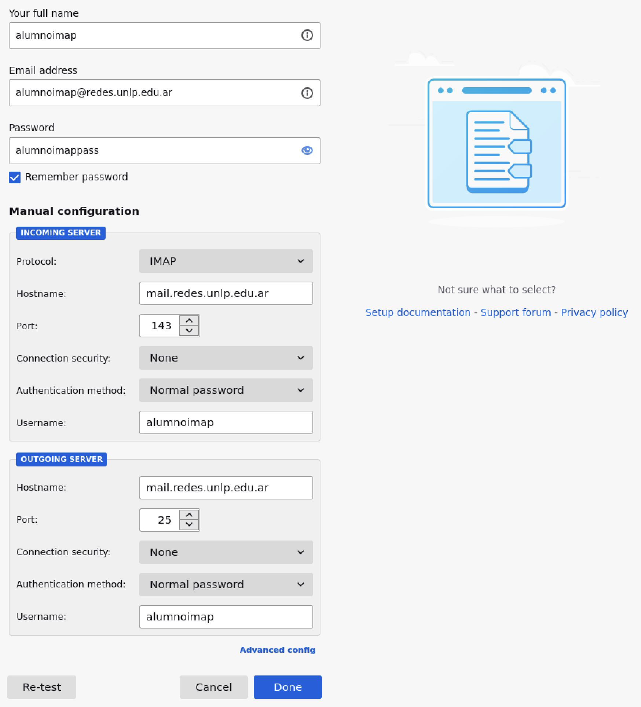
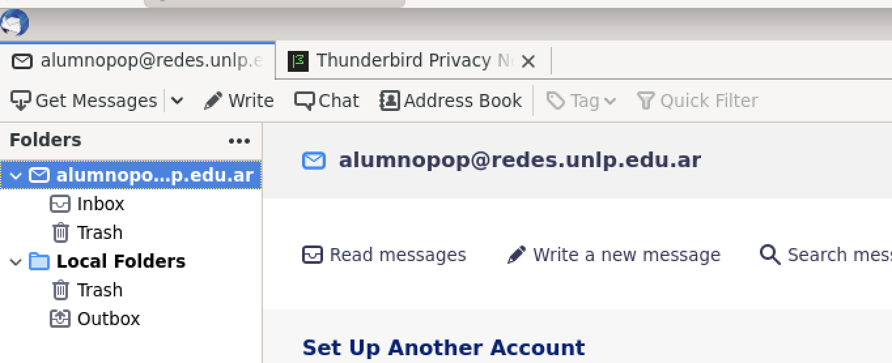
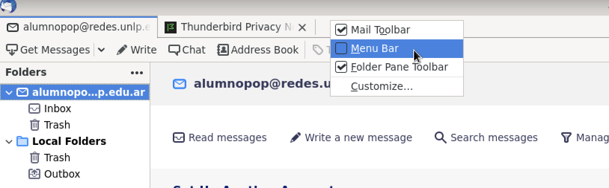
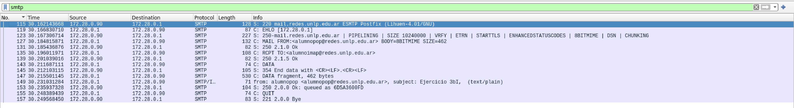
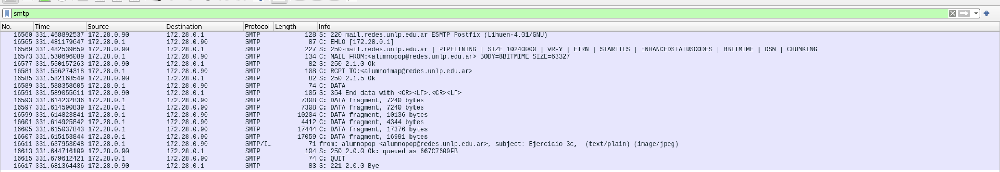
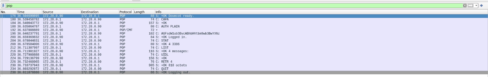
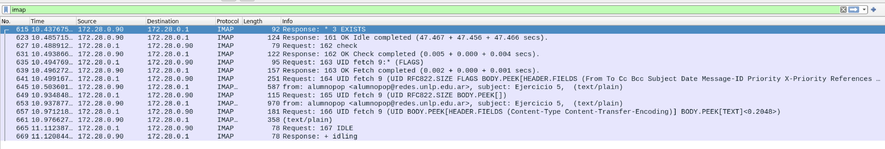
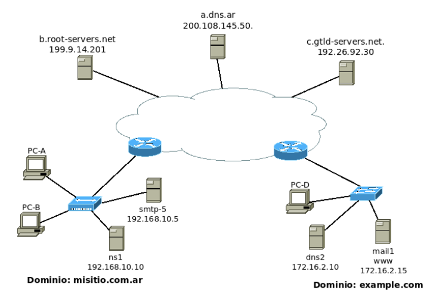

# Práctica 4 - Capa de Aplicación: Correo Electrónico

## 1. ¿Qué protocolos se utilizan para el envío de mails entre el cliente y su servidor de correo? ¿Y entre servidores de correo?

**Para el envío de mails se utiliza exclusivamente SMTP (Simple Mail Transfer Protocol) en ambos casos:**

**Entre cliente y servidor de correo (MUA → MSA):**

- **SMTP** - Puerto 25 (tradicional) o 587 (submission)
- **ESMTP** (Extended SMTP) - Versión moderna que agrega extensiones como autenticación, cifrado y soporte para archivos adjuntos
- El cliente (MUA - Mail User Agent) se conecta al servidor de envío (MSA - Mail Submission Agent) de su proveedor

**Entre servidores de correo (MTA → MTA):**

- **SMTP** - Puerto 25 estándar para comunicación inter-servidor
- Los servidores de correo (MTA - Mail Transfer Agent) utilizan SMTP para retransmitir mensajes entre diferentes dominios
- El proceso incluye consultas DNS para registros MX para determinar el servidor de destino

**Características importantes:**

- SMTP es un protocolo de "push" (empuja mensajes hacia el destino)
- Basado en texto ASCII, utiliza comandos como HELO, MAIL FROM, RCPT TO, DATA
- No maneja la recepción de correos por parte del usuario final (para eso están POP e IMAP)

**¿Por qué existen dos puertos (25 y 587)?**

Originalmente, el puerto 25 se utilizaba para todo el tráfico SMTP, tanto para clientes enviando correos como para servidores comunicándose entre sí. Sin embargo, esto generó problemas de seguridad y spam.

**Puerto 25 (tradicional):**

- Diseñado para comunicación entre servidores (MTA-MTA)
- No requiere autenticación por defecto
- Muchos ISPs lo bloquean para usuarios domésticos para prevenir spam masivo
- Sigue siendo el estándar para relay entre servidores de correo

**Puerto 587 (submission - RFC 4409):**

- Específicamente diseñado para que clientes (MUA) envíen correos a su servidor (MSA)
- Requiere autenticación obligatoria del usuario
- Soporta cifrado TLS/SSL por defecto
- No es bloqueado por ISPs ya que implica autenticación
- Separa claramente el rol de "envío de usuarios" del "relay entre servidores"

Esta separación mejora la seguridad, permite mejor control anti-spam y clarifica los roles en la arquitectura de correo electrónico.

**Nota sobre MUA y MSA:**

- **MUA (Mail User Agent):** Es el cliente de correo que utiliza el usuario final (Thunderbird en este caso). Su función es permitir al usuario redactar, enviar y recibir correos. Actúa en la capa de aplicación, proporcionando una interfaz amigable.
- **MSA (Mail Submission Agent):** Es el servidor de envío de correos (mail.redes.unlp.edu.ar en puerto 25). Recibe los mensajes del MUA, los valida y los entrega a los MTAs (servidores de correo intermedios) para que lleguen a su destino. El MSA requiere autenticación para aceptar correos del usuario.

## 2. ¿Qué protocolos se utilizan para la recepción de mails? Enumere y explique características y diferencias entre las alternativas posibles.

**Los protocolos para recepción de mails son POP e IMAP, cada uno con filosofías diferentes:**

**Modelo de operación "pull" (recuperación activa):**

A diferencia de SMTP que funciona con modelo "push" (el emisor empuja mensajes hacia el destino), POP e IMAP utilizan modelo **"pull"**:

- **El cliente inicia la conexión** y solicita activamente los correos al servidor
- **El servidor responde** entregando los mensajes solicitados
- Los correos permanecen almacenados en el servidor hasta que el cliente los recupera
- No hay envío proactivo del servidor hacia el cliente, solo respuestas a solicitudes

### **POP (Post Office Protocol) - Versión actual POP3**

**Características:**

- **Modelo "descargar y borrar"**: Los mensajes se transfieren del servidor al cliente y se eliminan del servidor por defecto
- **Acceso offline**: Una vez descargados, los mails están disponibles sin conexión a Internet
- **Un solo dispositivo**: Diseñado para acceder desde un único cliente de correo
- **Bajo consumo de recursos del servidor**: Mínimo almacenamiento y procesamiento
- **Puerto 110** (sin cifrado) o **995** (con SSL/TLS)

**Ventajas:** Simplicidad, rapidez, independencia de conectividad, bajo uso del servidor **Desventajas:** No sincronización entre dispositivos, pérdida de mails si falla el cliente, no gestión de carpetas en servidor

### **IMAP (Internet Message Access Protocol) - Versión actual IMAP4**

**Características:**

- **Modelo "sincronizado"**: Los mensajes permanecen en el servidor, el cliente trabaja con copias locales
- **Acceso multidispositivo**: Sincronización completa entre todos los clientes conectados
- **Gestión avanzada**: Carpetas, etiquetas, búsquedas, estados de lectura se mantienen en el servidor
- **Acceso parcial**: Puede descargar solo headers o partes específicas de mensajes
- **Puerto 143** (sin cifrado) o **993** (con SSL/TLS)

**Ventajas:** Sincronización total, acceso desde múltiples dispositivos, búsquedas en servidor, gestión de carpetas **Desventajas:** Requiere conexión constante, mayor uso de ancho de banda y recursos del servidor

### **Comparación directa:**

| Aspecto                    | POP3               | IMAP4                      |
| -------------------------- | ------------------ | -------------------------- |
| **Almacenamiento**         | Local (cliente)    | Servidor                   |
| **Sincronización**         | No                 | Completa                   |
| **Dispositivos múltiples** | Problemático       | Nativo                     |
| **Conexión requerida**     | Solo para descarga | Para todas las operaciones |
| **Recursos del servidor**  | Mínimos            | Significativos             |
| **Gestión de carpetas**    | Solo local         | En servidor                |
| **Búsquedas**              | Solo local         | En servidor y local        |

**Versiones seguras:** Ambos protocolos soportan cifrado mediante **SSL/TLS** para proteger credenciales y contenido durante la transmisión.

## 3. Utilizando la VM y teniendo en cuenta los siguientes datos, abra el cliente de correo (Thunderbird) y configure dos cuentas de correo. Una de las cuentas utilizará POP para solicitar al servidor los mails recibidos para la misma mientras que la otra utilizará IMAP. Al crear cada una de las cuentas, seleccionar Manual config y luego de configurar las mismas según lo indicado, ignorar advertencias por uso de conexión sin cifrado.

### Datos para POP

```bash
Cuenta de correo: alumnopop@redes.unlp.edu.ar
Nombre de usuario: alumnopop
Contraseña: alumnopoppass
Puerto: 110
```

### Datos para IMAP

```bash
Cuenta de correo: alumnoimap@redes.unlp.edu.ar
Nombre de usuario: alumnoimap
Contraseña: alumnoimappass
Puerto: 143
```

### Datos comunes para ambas cuentas

#### Servidor de correo entrante (POP/IMAP):

```bash
Nombre: mail.redes.unlp.edu.ar
SSL: None
Autenticación: Normal password
```

#### Servidor de correo saliente (SMTP):

```bash
Nombre: mail.redes.unlp.edu.ar
Puerto: 25
SSL: None
Autenticación: Normal password
```

### Capturas de la configuración de cuentas:

**Alumno POP:**


**Alumno IMAP:**



**NOTA IMPORTANTE**

**Te puede pasar que cuando crees la primera cuenta de email no te muestre el menú para crear una nueva cuenta como en la siguiente imagen:**



**Simplemente hacé click derecho y habilitá a `Menu Bar`:**



### a. Verificar el correcto funcionamiento enviando un email desde el cliente de una cuenta a la otra y luego desde la otra responder el mail hacia la primera.

### b. Análisis del protocolo SMTP

#### I. Utilizando Wireshark, capture el tráfico de red contra el servidor de correo mientras desde la cuenta `alumnopop@redes.unlp.edu.ar` envía un correo a `alumnoimap@redes.unlp.edu.ar`.

#### II. Utilice el filtro `smtp` para observar los paquetes del protocolo `SMTP` en la captura generada y analice el intercambio de dicho protocolo entre el cliente y el servidor para observar los distintos comandos utilizados y su correspondiente respuesta.

Captura:



**Análisis del intercambio SMTP (Follow TCP Stream):**

**Resumen del flujo SMTP:**

El intercambio demuestra el modelo **"push"** de SMTP donde el cliente activamente empuja el mensaje hacia el servidor. La comunicación comienza cuando el servidor envía una bienvenida (220), el cliente se identifica con EHLO y negocia capacidades, especifica remitente y destinatario, transmite el contenido del mensaje, y finalmente cierra la conexión ordenadamente. Todo basado en respuestas numéricas (códigos 2xx = éxito, 3xx = espera más datos, 4xx/5xx = error).

**Los 6 comandos principales del protocolo SMTP:**

1. **EHLO [172.28.0.1]** (Cliente → Servidor)
    - Comando: Extensión HELO que identifica al cliente
    - Respuesta: 250-mail.redes.unlp.edu.ar ESMTP Postfix
    - El servidor responde con sus capacidades: PIPELINING, SIZE 102408998, VRFY, ETRN, STARTTLS, ENHANCEDSTATUSCODES, 8BITMIME, DSN, CHUNKING

2. **MAIL FROM:<alumnopop@redes.unlp.edu.ar>** (Cliente → Servidor)
    - Especifica el remitente del correo
    - Respuesta: 250 2.1.0 OK (aceptado)

3. **RCPT TO:<alumnoimap@redes.unlp.edu.ar>** (Cliente → Servidor)
    - Especifica el destinatario del correo
    - Respuesta: 250 2.1.5 OK (aceptado)

4. **DATA** (Cliente → Servidor)
    - Comando para iniciar transmisión del contenido del mensaje
    - Respuesta: 354 End data with <CR><LF>.<CR><LF> (servidor listo para recibir datos)

5. **Contenido del mensaje** (Cliente → Servidor)
    - Encabezados: from: alumnopop@redes.unlp.edu.ar, subject: Ejercicio 3bI
    - Cuerpo: (text/plain)
    - Finalización: <CR><LF>.<CR><LF> (punto en línea sola)
    - Respuesta: 250 2.0.0 OK (mensaje aceptado con ID: 0DA336D9FD)

6. **QUIT** (Cliente → Servidor)
    - Comando para cerrar la conexión
    - Respuesta: 221 2.0.0 Bye

---

**Desglose detallado de las 14 líneas capturadas:**

**Línea 115 - Respuesta inicial del servidor (S→C)**

- Código: 220
- Contenido: "mail.redes.unlp.edu.ar ESMTP Postfix"
- Acción: El servidor anuncia que está listo para recibir conexiones
- Propósito: Confirmación de conexión exitosa y presentación del servidor
- Tamaño: Respuesta de bienvenida

**Línea 119 - Comando EHLO del cliente (C→S)**

- Comando: EHLO [172.28.0.1]
- Acción: Cliente se identifica y solicita que el servidor liste sus capacidades extendidas
- Propósito: Negociación de características ESMTP disponibles
- Tamaño: 87 bytes

**Línea 123 - Respuesta con capacidades del servidor (S→C)**

- Código: 250-
- Contenido: PIPELINING, SIZE 102408998, VRFY, ETRN, STARTTLS, ENHANCEDSTATUSCODES, 8BITMIME, DSN, CHUNKING
- Acción: Servidor lista todas sus capacidades extendidas
- Propósito: Informar qué funcionalidades soporta el servidor
- Tamaño: 227 bytes

**Línea 127 - Comando MAIL FROM (C→S)**

- Comando: MAIL FROM:<alumnopop@redes.unlp.edu.ar>
- Acción: Cliente especifica la dirección del remitente del correo
- Propósito: Establecer la dirección de origen para el mensaje
- Tamaño: 132 bytes

**Línea 131 - Confirmación de remitente (S→C)**

- Código: 250
- Respuesta: "2.1.0 OK"
- Acción: Servidor acepta la dirección del remitente
- Propósito: Confirmación de que el MAIL FROM fue validado
- Tamaño: 88 bytes

**Línea 135 - Comando RCPT TO (C→S)**

- Comando: RCPT TO:<alumnoimap@redes.unlp.edu.ar>
- Acción: Cliente especifica la dirección del destinatario
- Propósito: Establecer la dirección de destino del mensaje
- Tamaño: 108 bytes

**Línea 139 - Confirmación de destinatario (S→C)**

- Código: 250
- Respuesta: "2.1.5 Ok"
- Acción: Servidor acepta la dirección del destinatario
- Propósito: Confirmación de que el RCPT TO fue validado
- Tamaño: 82 bytes

**Línea 143 - Comando DATA (C→S)**

- Comando: DATA
- Acción: Cliente anuncia que comenzará a enviar el contenido del mensaje
- Propósito: Transición a la fase de transmisión del cuerpo del correo
- Tamaño: 74 bytes

**Línea 145 - Confirmación para enviar datos (S→C)**

- Código: 354
- Respuesta: "End data with <CR><LF>.<CR><LF>"
- Acción: Servidor confirma que está listo y espera el contenido del mensaje
- Propósito: Señalar el inicio de la fase de transmisión de datos e indicar cómo finalizarla
- Tamaño: 105 bytes

**Línea 147 - Fragment de datos (C→S)**

- Comando: DATA fragment
- Acción: Cliente transmite los primeros 462 bytes del contenido del correo
- Contenido: Headers del email y comienzo del cuerpo
- Propósito: Inicio de la transferencia del contenido completo del mensaje
- Tamaño: 533 bytes totales

**Línea 149 - Continuación de datos (C→S)**

- Acción: Continuación de la transmisión del contenido
- Contenido visible: "from: alumnopop@alumnopop@redes.unlp.edu.ar, subject: Ejercicio 3bI, (text/plain)"
- Propósito: Headers específicos del correo (From, Subject, tipo de contenido)
- Tamaño: 71 bytes

**Línea 151 - Confirmación de aceptación del mensaje (S→C)**

- Código: 250
- Respuesta: "2.1.0 Ok (queued as 0DA336D9FD)"
- Acción: Servidor confirma recepción completa y almacenamiento del correo en la cola
- Propósito: El mensaje fue aceptado exitosamente y se le asignó un ID único (0DA336D9FD) en la cola de envío
- Tamaño: 73 bytes

**Línea 155 - Comando QUIT (C→S)**

- Comando: QUIT
- Acción: Cliente solicita cerrar la conexión SMTP de forma ordenada
- Propósito: Finalización controlada de la sesión
- Tamaño: 74 bytes

**Línea 157 - Confirmación de cierre (S→C)**

- Código: 221
- Respuesta: "2.0.0 Bye"
- Acción: Servidor confirma el cierre de la conexión
- Propósito: Despedida del servidor y cierre definitivo de la comunicación
- Tamaño: 83 bytes

**Flujo completo de la transacción SMTP:**

1. Servidor anuncia disponibilidad (línea 115)
2. Cliente se identifica y solicita capacidades (líneas 119, 123)
3. Cliente especifica remitente y recibe aceptación (líneas 127, 131)
4. Cliente especifica destinatario y recibe aceptación (líneas 135, 139)
5. Cliente inicia transmisión de datos (líneas 143, 145)
6. Cliente envía contenido del correo (líneas 147, 149)
7. Servidor acepta el mensaje y lo coloca en la cola (línea 151)
8. Cliente solicita cierre de conexión (línea 155)
9. Servidor confirma cierre (línea 157)

**Características observadas:**

- **Protocolo: ESMTP** (Extended SMTP con capacidades adicionales)
- **Servidor: Postfix** (software de correo de código abierto)
- **Dirección IP cliente:** 172.28.0.1 (máquina virtual)
- **Dirección IP servidor:** 172.28.0.1 (mail.redes.unlp.edu.ar)
- **Puerto:** 25 (SMTP estándar para comunicación MUA-MSA)
- **Modelo: Basado en comandos de texto ASCII** completamente legible y auditable en la red
- **Autenticación:** No requerida en este caso (conexión desde la red local institucional)
- **Códigos de respuesta:** Sistema de códigos numéricos (2xx = éxito, 3xx = espera más datos, 4xx/5xx = error)

**Conclusión del análisis:**

El intercambio demuestra el modelo **"push"** de SMTP donde el cliente activamente empuja el mensaje hacia el servidor. La comunicación es completamente textual, lo que permite auditoría y debugging. El servidor Postfix soporta múltiples extensiones ESMTP que mejoran la confiabilidad y funcionalidad del protocolo.

### c. Usando el cliente de correo Thunderbird del usuario `alumnopop@redes.unlp.edu.ar` envíe un correo electrónico `alumnoimap@redes.unlp.edu.ar` el cual debe tener: un asunto, datos en el body y una imagen adjunta.

Captura:



#### I. Verifique las fuentes del correo recibido para entender cómo se utiliza el header "Content-Type: multipart/mixed" para poder realizar el envío de distintos archivos adjuntos.

**Análisis de la estructura multipart/mixed:**

**1. Header Content-Type: multipart/mixed**

El header principal define:

```
Content-Type: multipart/mixed; boundary="------------zxAlVokBrmuMlB32dRHnWPwM"
```

- **multipart/mixed**: Indica que el mensaje contiene múltiples partes (body de texto + archivos adjuntos)
- **boundary**: Define el delimitador que separa cada parte del mensaje
    - Es una cadena única que NO aparece en el contenido real
    - Se usa `--` al inicio de cada límite y `--` al final del último

**2. Primera parte - Cuerpo de texto (7bit)**

```
--------------zxAlVokBrmuMlB32dRHnWPwM
Content-Type: text/plain; charset=UTF-8; format=flowed
Content-Transfer-Encoding: 7bit

Hola,

Cuerpo del mensaje del ejercicio 3c.
```

- **Content-Type: text/plain**: Define que es texto sin formato
- **Content-Transfer-Encoding: 7bit**: El texto ASCII no necesita codificación
- **El contenido**: Es directamente legible (no codificado)

**3. Segunda parte - Archivo adjunto (base64)**

```
--------------zxAlVokBrmuMlB32dRHnWPwM
Content-Type: image/jpeg; name="imagen-email.jpg"
Content-Disposition: attachment; filename="imagen-email.jpg"
Content-Transfer-Encoding: base64

----------IMAGEN EN BASE64----------
```

- **Content-Type: image/jpeg**: Define que es una imagen JPEG
- **Content-Disposition: attachment**: Indica que es un adjunto (no parte del cuerpo)
- **filename**: Nombre que tendrá el archivo cuando se descargue
- **Content-Transfer-Encoding: base64**: La imagen está codificada en base64
    - Base64 convierte datos binarios a texto ASCII (necesario para SMTP que solo transporta texto)
    - Los 4 caracteres base64 = 3 bytes de datos originales

**4. Fin del mensaje multipart**

```
--------------zxAlVokBrmuMlB32dRHnWPwM--
```

El boundary final termina con `--` indicando el fin de todas las partes

**¿Por qué multipart/mixed?**

- **multipart/alternative**: Para versiones alternativas del mismo contenido (HTML + plain text)
- **multipart/related**: Para contenido relacionado (HTML + imágenes incrustadas)
- **multipart/mixed**: Para mezclar CUALQUIER tipo de contenido (texto + cualquier adjunto)

**¿Por qué base64 para archivos binarios?**

SMTP (y el correo electrónico en general) es un protocolo basado en **texto ASCII de 7 bits**:

- Las imágenes, PDFs, ejecutables son datos **binarios** (pueden tener cualquier valor 0-255)
- Base64 convierte esos datos binarios a caracteres ASCII seguros (A-Z, a-z, 0-9, +, /, =)
- El cliente receptor descodifica automáticamente base64 para recuperar el archivo original

**Cadena de encoding del archivo:**

```bash
Archivo JPEG binario → Encoding base64 → Texto ASCII puro → Transmisión SMTP → Decodificación base64 → Archivo original

Return-Path: <alumnopop@redes.unlp.edu.ar>
X-Original-To: alumnoimap@redes.unlp.edu.ar
Delivered-To: alumnoimap@redes.unlp.edu.ar
Received: from [172.28.0.1] (unknown [172.28.0.1])
	by mail.redes.unlp.edu.ar (Postfix) with ESMTP id 667C7600FB
	for <alumnoimap@redes.unlp.edu.ar>; Sat,  6 Dec 2025 16:05:32 +0000 (UTC)
Content-Type: multipart/mixed; boundary="------------zxAlVokBrmuMlB32dRHnWPwM"
Message-ID: <17275730-5fd3-336f-06ef-1b7f0901d45e@redes.unlp.edu.ar>
Date: Sat, 6 Dec 2025 13:05:26 -0300
MIME-Version: 1.0
User-Agent: Mozilla/5.0 (X11; Linux x86_64; rv:91.0) Gecko/20100101
 Thunderbird/91.12.0
Content-Language: en-US
To: alumnoimap@redes.unlp.edu.ar
From: alumnopop <alumnopop@redes.unlp.edu.ar>
Subject: Ejercicio 3c

This is a multi-part message in MIME format.
--------------zxAlVokBrmuMlB32dRHnWPwM
Content-Type: text/plain; charset=UTF-8; format=flowed
Content-Transfer-Encoding: 7bit

Hola,


Cuerpo del mensaje del ejercicio 3c.

--------------zxAlVokBrmuMlB32dRHnWPwM
Content-Type: image/jpeg; name="imagen-email.jpg"
Content-Disposition: attachment; filename="imagen-email.jpg"
Content-Transfer-Encoding: base64

---------- acá estaría la imagen codificada en base64 ----------
```

#### II. Extraiga la imagen adjunta del mismo modo que lo hace el cliente de correo a partir de los fuentes del mensaje.

El cliente de correo extrae automáticamente la imagen detectando el header `Content-Disposition: attachment` y decodificando la cadena base64 a su formato binario original. Manualmente, se copia el contenido en base64 a un archivo de texto y se decodifica usando herramientas como `base64 -d` en Linux, almacenando el resultado binario como archivo `.jpg`.

## 4. Análisis del protocolo POP

### a. Utilizando Wireshark, capture el tráfico de red contra el servidor de correo mientras desde la cuenta `alumnoimap@redes.unlp.edu.ar` le envía una correo a `alumnopop@redes.unlp.edu.ar` y mientras `alumnopop@redes.unlp.edu.ar` recepciona dicho correo.

### b. Utilice el filtro `pop` para observar los paquetes del protocolo `POP` en la captura generada y analice el intercambio de dicho protocolo entre el cliente y el servidor para observar los distintos comandos utilizados y su correspondiente respuesta.

Captura:



**Contexto - Diferencia entre POP e IMAP:**

En la captura anterior (4.a), el mensaje fue almacenado en el servidor. Sin embargo, **a diferencia de IMAP (que sincroniza automáticamente), POP requiere una acción explícita del cliente para descargar los mensajes**. El usuario `alumnopop` debe ejecutar manualmente "Get Messages" en Thunderbird, lo que dispara una conexión POP3 al puerto 110. El correo no llega automáticamente al cliente POP; debe "tirarse" activamente desde el servidor mediante la conexión POP3.

**Análisis detallado del protocolo POP3:**

El flujo capturado (líneas 176 hasta 238) muestra la secuencia completa de una sesión POP3 cuando el cliente solicita "Get Messages":

**1. Conexión y autenticación (líneas 170-200)**

- **Línea 170 - CAPA (C→S):** Comando `CAPA` que solicita las capacidades del servidor
    - Respuesta: `+OK Dovecot ready.` indicando que el servidor está listo
    - El servidor POP3 (Dovecot) anuncia disponibilidad en puerto 110

- **Línea 180 - AUTH PLAIN (C→S):** Cliente envía credenciales de autenticación
    - Formato: `AUTH PLAIN` seguido de las credenciales codificadas en base64
    - Respuesta: `+OK` con identificación del usuario `alumnopop@redes.unlp.edu.ar`

**2. Obtención de estado del buzón (línea 184)**

- **STAT (C→S):** Solicita estadísticas del buzón
    - Respuesta: `+OK 4 3386` indicando 4 mensajes en el buzón con 3386 bytes totales
    - Este comando permite al cliente conocer cuántos mensajes hay sin descargarlos

**3. Autenticación confirmada (línea 188)**

- **+OK Logged in.:** Confirmación de login exitoso
- El cliente está autenticado y puede proceder a descargar mensajes

**4. Listado de mensajes (líneas 192-212)**

- **STAT (C→S):** Reconfirma el estado (4 mensajes en el servidor)
- **LIST (C→S):** Solicita listado de todos los mensajes con sus tamaños
    - Respuesta: `+OK 4 messages:`
        - Mensaje 1: 3386 bytes
        - Mensaje 2: (no visible en captura pero marcado en línea 216)
        - Y así sucesivamente...
    - Cada línea muestra: `[número] [tamaño en bytes]`

**5. Descarga de mensajes (líneas 220-224)**

- **RETR 4 (C→S):** Comando `RETR` para descargar el mensaje #4 (retrieve)
    - Respuesta: `+OK 818 octets` indicando que el mensaje tiene 818 bytes
    - El servidor transmite el contenido completo del mensaje

- **UIDL (C→S):** Comando para obtener identificadores únicos de los mensajes
    - Permite al cliente identificar qué mensajes ya ha descargado
    - Respuesta: `+OK` seguida de pares `[número] [UID]`

**6. Finalización de sesión (línea 236)**

- **QUIT (C→S):** Cliente solicita cerrar la sesión ordenadamente
    - Respuesta: `+OK Logging out.` - confirmación del cierre

**Características clave observadas:**

- **Protocolo:** POP3 (versión 3 de Post Office Protocol)
- **Servidor:** Dovecot (sistema de gestión de correo de código abierto)
- **Puerto:** 110 (sin cifrado SSL/TLS)
- **Autenticación:** PLAIN (credenciales en texto plano)
- **Modelo:** Pull - el cliente descarga bajo demanda
- **Descarga obligatoria:** Para recibir mensajes en POP, el usuario debe ejecutar manualmente "Get Messages"
- **Comandos principales:** CAPA, AUTH, STAT, LIST, RETR, UIDL, QUIT

**Diferencia con SMTP (ejercicio 3.b):**

- **SMTP (envío):** Cliente → Servidor de envío (MSA) en puerto 25, modelo PUSH
- **POP3 (descarga):** Cliente → Servidor de correo en puerto 110, modelo PULL

El cliente POP debe conectarse periódicamente para descargar nuevos mensajes, mientras que IMAP mantiene sincronización automática (como veremos en el ejercicio 5).

## 5. Análisis del protocolo IMAP

### a. Utilizando Wireshark, capture el tráfico de red contra el servidor de correo mientras desde la cuenta `alumnopop@redes.unlp.edu.ar` le envía un correo a `alumnoimap@redes.unlp.edu.ar` y mientras `alumnoimap@redes.unlp.edu.ar` recepciona dicho correo.

### b. Utilice el filtro `imap` para observar los paquetes del protocolo `IMAP` en la captura generada y analice el intercambio de dicho protocolo entre el cliente y el servidor para observar los distintos comandos utilizados y su correspondiente respuesta.

Captura:



**Contexto - Sincronización automática de IMAP:**

A diferencia de POP3 que requiere acción manual del usuario ("Get Messages"), **IMAP sincroniza automáticamente** cuando Thunderbird está abierto. El cliente mantiene una conexión persistente con el servidor y recibe notificaciones inmediatas cuando llegan nuevos mensajes. Esto permite que el correo aparezca automáticamente en el cliente sin intervención del usuario.

**Análisis detallado del protocolo IMAP4:**

La captura muestra 13 líneas de tráfico IMAP (desde la línea 615 hasta la 669) con comandos más complejos que POP3, reflejando las capacidades avanzadas de gestión de correo:

**1. Verificación de existencia de carpetas (línea 615)**

- **Request: 161 EXISTS (C→S):** El cliente consulta si existen cambios en la estructura de carpetas
    - Respuesta: `* 3 EXISTS` - El servidor confirma que hay 3 elementos
    - IMAP mantiene sincronización de la estructura completa de carpetas en el servidor

**2. Confirmación de operación IDLE (línea 623)**

- **Response: 161 OK Idle completed (S→C):** Confirma finalización del modo IDLE
    - Tiempo de espera: 47.467 + 47.456 + 47.466 segundos
    - **IDLE**: Modo de espera que permite al servidor notificar al cliente cuando llegan nuevos mensajes sin que el cliente tenga que hacer polling constante

**3. Verificación de estado de mensajes (línea 627)**

- **Request: 162 check (C→S):** Solicita verificación del estado del buzón
    - Respuesta: `162 OK Check completed`
    - Sincroniza cambios de estado (leído/no leído, eliminado, etc.)

**4. Descarga selectiva de mensaje (líneas 631, 635, 639, 641)**

- **Request: 163 UID fetch 9:** Solicita datos del mensaje con UID 9 usando FLAGS
    - Respuesta: `163 OK Fetch completed`
- **Request: 164 UID fetch 9:** Descarga SIZE, FLAGS, BODY.PEEK (header y campos específicos)
    - Información solicitada: RFC822.SIZE, FLAGS, BODY.PEEK[HEADER.FIELDS (From To Cc Bcc Subject Date Message-ID Priority X-Priority References)]
    - **UID (Unique ID)**: Identificador único permanente del mensaje (diferente del número secuencial)
    - **BODY.PEEK**: Descarga contenido SIN marcar el mensaje como leído (vs BODY que sí lo marca)

**5. Descarga de partes específicas del mensaje (líneas 649, 657, 661)**

- **Request: 165 UID fetch 9 (UID RFC822.SIZE BODY.PEEK[]):**
    - Descarga el cuerpo completo del mensaje manteniendo el estado de "no leído"
- **Request: 166 UID fetch 9 (UID BODY.PEEK[HEADER.FIELDS (Content-Type Content-Transfer-Encoding)] BODY.PEEK[TEXT]):**
    - Descarga selectiva: solo headers de Content-Type y Content-Transfer-Encoding
    - También descarga el cuerpo de texto (TEXT)
    - Contenido visible: `from: alumnopop <alumnopop@redes.unlp.edu.ar>, subject: Ejercicio 5, (text/plain)`

**6. Operación IDLE para espera de nuevos mensajes (líneas 665, 669)**

- **Request: 167 IDLE (C→S):** Cliente entra en modo de espera
    - Respuesta: `+ idling`
    - El servidor mantendrá la conexión abierta y notificará proactivamente al cliente si llegan nuevos mensajes
    - Esto elimina la necesidad de polling constante, reduciendo tráfico de red

**Características clave observadas:**

- **Protocolo:** IMAP4 (versión 4 de Internet Message Access Protocol)
- **Servidor:** Dovecot (mismo servidor que POP3)
- **Puerto:** 143 (sin cifrado SSL/TLS)
- **Modelo:** Sincronización bidireccional servidor-cliente
- **Descarga selectiva:** Puede descargar solo headers, partes específicas o mensajes completos
- **Comandos principales:** EXISTS, IDLE, check, UID fetch, BODY.PEEK
- **Gestión de estado:** Los mensajes permanecen en el servidor con estados sincronizados

**Comandos IMAP avanzados:**

- **UID (Unique ID):** Identificador permanente que no cambia aunque se eliminen otros mensajes
- **BODY.PEEK[]:** Descarga sin modificar el flag de "leído" (vs BODY que sí lo marca)
- **IDLE:** Modo push - el servidor notifica al cliente de cambios inmediatamente
- **FLAGS:** Estados del mensaje (leído, respondido, eliminado, importante, etc.)
- **EXISTS:** Verificación de cambios en la estructura de carpetas

**Diferencias clave con POP3 (ejercicio 4.b):**

| Aspecto                | POP3                           | IMAP4                                      |
| ---------------------- | ------------------------------ | ------------------------------------------ |
| **Conexión**           | Por sesión (descarga y cierra) | Persistente con IDLE                       |
| **Sincronización**     | Manual ("Get Messages")        | Automática en tiempo real                  |
| **Descarga**           | Mensaje completo obligatorio   | Selectiva (headers, partes, completo)      |
| **Estado en servidor** | No gestiona estados            | Sincroniza flags (leído, respondido, etc.) |
| **Identificadores**    | Números secuenciales           | UID permanentes                            |
| **Carpetas**           | Solo descarga                  | Gestión completa en servidor               |
| **Modo IDLE**          | No soportado                   | Push notification nativo                   |

**Conclusión del análisis:**

IMAP demuestra ser un protocolo mucho más sofisticado que POP3. Permite sincronización automática mediante IDLE, descarga selectiva de partes del mensaje con BODY.PEEK (sin marcar como leído), gestión de estados en servidor, y uso de UIDs permanentes. Esto lo hace ideal para acceso multidispositivo y gestión avanzada de correo, a costa de mayor complejidad y uso de recursos del servidor.

## 6. IMAP vs POP

### a. Marque como leídos todos los correos que tenga en el buzón de entrada de alumnopop y de alumnoimap. Luego, cree una carpeta llamada `POP` en la cuenta de alumnopop y una llamada IMAP en la cuenta de alumnoimap. Asegúrese que tiene mails en el inbox y en la carpeta recientemente creada en cada una de las cuentas.

### b. Cierre la sesión de la máquina virtual del usuario redes e ingrese nuevamente identificándose como usuario root y password packer, ejecute el cliente de correos. De esta forma, iniciará el cliente de correo con el perfil del superusuario (diferente del usuario con el que ya configuró las cuentas antes mencionadas). Luego configure las cuentas `POP` e `IMAP` de los usuarios alumnopop y alumnoimap como se describió anteriormente pero desde el cliente de correos ejecutado con el usuario root. Responda:

#### I. ¿Qué correos ve en el buzón de entrada de ambas cuentas? ¿Están marcados como leídos o como no leídos? ¿Por qué?

Al acceder a la cuenta POP desde el perfil de usuario root, el buzón de entrada aparece completamente vacío. No se visualiza ningún correo electrónico ni tampoco la carpeta `POP` que habíamos creado anteriormente con el usuario redes. Esto ocurre porque POP descarga los mensajes al dispositivo local y los elimina del servidor por defecto. Como consecuencia, toda la información (correos y carpetas) queda almacenada únicamente en el cliente de correo del usuario redes, sin sincronización con el servidor.

En contraste, la cuenta IMAP muestra todos los correos electrónicos recibidos durante los ejercicios anteriores, mantiene la carpeta `IMAP` que habíamos creado, y conserva la misma organización exacta. Esto sucede porque IMAP mantiene toda la estructura de carpetas y mensajes en el servidor. Cuando accedemos desde un cliente diferente (root en este caso), el protocolo sincroniza automáticamente con el servidor y muestra la información completa, independientemente del dispositivo o perfil de usuario utilizado.

#### II. ¿Qué pasó con las carpetas POP e IMAP que creó en el paso anterior?

La carpeta POP no existe cuando accedemos desde el usuario root porque fue creada localmente en el cliente de correo del usuario redes. Al tratarse de almacenamiento local sin sincronización con el servidor, esta carpeta solo es accesible desde el perfil original donde fue creada. No hay manera de recuperarla desde otro usuario o dispositivo.

Por el contrario, la carpeta IMAP se mantuvo intacta y es completamente accesible desde el perfil root. Esta persistencia se debe a que IMAP almacena la estructura de carpetas directamente en el servidor de correo. Al crear la carpeta desde el usuario redes, esta quedó registrada en mail.redes.unlp.edu.ar, lo que permite accederla desde cualquier cliente, usuario o dispositivo que se conecte a la cuenta alumnoimap@redes.unlp.edu.ar.

### c. En base a lo observado. ¿Qué protocolo le parece mejor? ¿POP o IMAP? ¿Por qué? ¿Qué protocolo considera que utiliza más recursos del servidor? ¿Por qué?

IMAP resulta claramente superior para la gestión moderna de correo electrónico. Su principal ventaja radica en la capacidad de organizar mensajes de forma centralizada en el servidor, lo que garantiza accesibilidad universal desde cualquier cliente de correo, dispositivo o ubicación. Esta arquitectura elimina la dependencia de un único dispositivo específico y permite mantener la misma vista organizada del correo independientemente de dónde o cómo se acceda. La sincronización automática de estados (leído/no leído, carpetas, etiquetas) entre todos los dispositivos conectados convierte a IMAP en la opción ideal para usuarios que trabajan con múltiples equipos o que necesitan acceso móvil frecuente.

Sin embargo, IMAP utiliza significativamente más recursos del servidor que POP. Al mantener todos los mensajes almacenados permanentemente en el servidor, requiere mayor capacidad de almacenamiento. Además, la sincronización constante de estados, la gestión de carpetas en servidor, y las operaciones de búsqueda ejecutadas server-side demandan más procesamiento y memoria. Las conexiones persistentes con modo IDLE consumen ancho de banda y recursos de red de forma continua. POP, en cambio, minimiza la carga del servidor al descargar los mensajes y eliminarlos, requiriendo recursos solo durante las breves sesiones de descarga.

**Nota sobre el modo IDLE:** El modo IDLE es una característica exclusiva de IMAP que permite al cliente mantener una conexión abierta con el servidor en estado de espera. En lugar de que el cliente consulte periódicamente si hay nuevos mensajes (polling), el servidor notifica proactivamente al cliente cuando llega un nuevo correo. Esto permite sincronización en tiempo real sin generar tráfico constante de consultas, optimizando el uso del ancho de banda mientras mantiene la experiencia de actualización instantánea.

## 7. ¿En algún caso es posible enviar más de un correo durante una misma conexión TCP? Considere:

- Destinatarios múltiples del mismo dominio entre MUA-MSA y entre MTA-MTA
- Destinatarios múltiples de diferentes dominios entre MUA-MSA y entre MTA-MTA

**Sí, es posible enviar múltiples correos durante una misma conexión TCP SMTP.** El protocolo SMTP fue diseñado específicamente para soportar el reuso de conexiones, lo que optimiza el uso de recursos de red y reduce la latencia. Sin embargo, las posibilidades varían según el escenario:

**Recordemos que:**

- **MUA (Mail User Agent):** Cliente de correo del usuario final (ej. Thunderbird, Outlook).
- **MSA (Mail Submission Agent):** Servidor que recibe correos del MUA y los procesa para envío.
- **MTA (Mail Transfer Agent):** Servidor que retransmite correos entre diferentes dominios/organizaciones.

### **Caso 1: Destinatarios múltiples del mismo dominio**

**Entre MUA-MSA (Cliente → Servidor de envío):**

Es posible enviar múltiples correos en una sola conexión TCP. El cliente puede:

1. **Múltiples destinatarios en un mismo mensaje:** Usar varios comandos `RCPT TO` dentro de una transacción `DATA`, enviando un solo mensaje a múltiples usuarios del mismo dominio.

```bash
MAIL FROM:<juan@ejemplo.com>
RCPT TO:<maria@ejemplo.com>
RCPT TO:<pedro@ejemplo.com>
RCPT TO:<ana@ejemplo.com>
DATA
...contenido del mensaje...
.
```

2. **Múltiples mensajes independientes:** Después de completar una transacción (después del `DATA` y antes del `QUIT`), el cliente puede iniciar un nuevo ciclo `MAIL FROM` → `RCPT TO` → `DATA` sin cerrar la conexión TCP.

```bash
MAIL FROM:<juan@ejemplo.com>
RCPT TO:<maria@ejemplo.com>
DATA
...mensaje 1...
.
MAIL FROM:<juan@ejemplo.com>
RCPT TO:<pedro@ejemplo.com>
DATA
...mensaje 2...
.
QUIT
```

**Entre MTA-MTA (Servidor → Servidor):**

Funciona exactamente igual. Un MTA puede enviar múltiples correos al mismo dominio destino reutilizando la conexión TCP. Esto es muy común cuando un servidor tiene varios mensajes en cola para el mismo dominio.

```bash
MAIL FROM:<usuario1@dominio1.com>
RCPT TO:<destino1@dominio2.com>
DATA
...mensaje 1...
.
MAIL FROM:<usuario2@dominio1.com>
RCPT TO:<destino2@dominio2.com>
DATA
...mensaje 2...
.
QUIT
```

### **Caso 2: Destinatarios múltiples de diferentes dominios**

**Entre MUA-MSA (Cliente → Servidor de envío):**

**Sí es posible.** El cliente puede enviar correos a destinatarios de diferentes dominios en la misma conexión TCP porque se está comunicando con su propio MSA (servidor de envío), no con los servidores de destino finales.

```bash
MAIL FROM:<juan@midominio.com>
RCPT TO:<maria@ejemplo.com>
RCPT TO:<pedro@otrodominio.net>
DATA
...mensaje...
.
MAIL FROM:<juan@midominio.com>
RCPT TO:<ana@tercerdominio.org>
DATA
...otro mensaje...
.
QUIT
```

El MSA recibirá todos los mensajes y luego él se encargará de distribuirlos a los diferentes dominios de destino mediante conexiones MTA-MTA separadas.

**Entre MTA-MTA (Servidor → Servidor):**

**NO es posible.** Un MTA establece conexión TCP con el MTA de un dominio específico. La conexión es punto a punto entre servidores de dominios diferentes, por lo que solo puede enviar correos destinados a ese dominio específico.

Si el MTA tiene mensajes para `@gmail.com` y `@yahoo.com`, deberá:

1. Abrir conexión TCP con el MTA de Gmail → enviar todos los mensajes para Gmail → cerrar
2. Abrir conexión TCP con el MTA de Yahoo → enviar todos los mensajes para Yahoo → cerrar

No puede mezclar dominios en la misma conexión porque cada conexión MTA-MTA se establece con el servidor autoritativo de un dominio específico (identificado mediante consultas DNS a registros MX).

### **Resumen:**

| Escenario     | Mismo dominio                        | Diferentes dominios                          |
| ------------- | ------------------------------------ | -------------------------------------------- |
| **MUA → MSA** | ✅ Múltiples correos en una conexión | ✅ Múltiples correos en una conexión         |
| **MTA → MTA** | ✅ Múltiples correos en una conexión | ❌ Requiere conexiones separadas por dominio |

**Ventajas del reuso de conexiones:**

- Reduce overhead de establecimiento de conexión TCP (handshake de 3 vías)
- Disminuye latencia total al evitar múltiples negociaciones
- Optimiza uso de recursos del servidor (menos sockets abiertos)
- Mejora throughput en escenarios de alto volumen de correo

**Característica SMTP involucrada:**

El comando `RSET` (reset) permite reiniciar la transacción actual sin cerrar la conexión, facilitando el envío de múltiples mensajes. La extensión **PIPELINING** (vista en el ejercicio 3.b.II) permite incluso enviar múltiples comandos sin esperar respuesta de cada uno, acelerando aún más el proceso.

## 8. Indique sí es posible que el MSA escuche en un puerto TCP diferente a los convencionales y qué implicancias tendría.

**Sí, es técnicamente posible que el MSA (Mail Submission Agent) escuche en un puerto TCP diferente a los convencionales (25 o 587).** Los puertos son configurables en el software del servidor de correo (Postfix, Sendmail, etc.), pero esta decisión tiene implicancias significativas:

### **Puertos convencionales del MSA:**

- **Puerto 587:** Estándar RFC 4409 para submission (envío de clientes autenticados)
- **Puerto 465:** Históricamente usado para SMTPS (SMTP sobre SSL), ahora obsoleto pero aún en uso
- **Puerto 25:** Originalmente para todo SMTP, ahora principalmente MTA-MTA

### **Implicancias de usar un puerto no convencional:**

**1. Configuración manual obligatoria en clientes:**

- Los clientes de correo (Thunderbird, Outlook, etc.) vienen configurados con puertos estándar por defecto
- Los usuarios deberán configurar manualmente el puerto personalizado en cada dispositivo
- Aumenta la complejidad y probabilidad de errores de configuración
- Dificulta la autoconfiguración (protocolos como Autoconfig/Autodiscover esperan puertos estándar)

**2. Problemas con firewalls corporativos:**

- Los firewalls empresariales típicamente permiten tráfico saliente en puertos conocidos (587, 25, 465)
- Un puerto no estándar (ej. 2525, 8587) podría estar bloqueado por políticas de seguridad
- Los usuarios en redes corporativas/institucionales no podrían enviar correos
- Requiere apertura explícita del puerto en cada firewall/proxy

**3. Bypass de bloqueos de ISP (ventaja potencial):**

- Algunos ISPs bloquean el puerto 25 para prevenir spam desde usuarios domésticos
- Usar un puerto alternativo (ej. 2525) podría evitar este bloqueo
- Sin embargo, esto va contra el espíritu de la medida anti-spam
- El puerto 587 ya existe precisamente para este propósito

### **Casos de uso legítimos:**

Existen escenarios donde usar un puerto alternativo tiene sentido:

**Puerto 2525:** Algunos proveedores de hosting lo ofrecen cuando el 25 está bloqueado por el ISP **Entornos de desarrollo/testing:** Para evitar conflictos con servicios en producción **Redes con restricciones específicas:** Donde políticas de red requieren segregación de servicios

### **Recomendación:**

**Usar puertos estándar siempre que sea posible:**

- **Puerto 587 con STARTTLS:** Recomendación RFC para submission moderna
- **Puerto 465 con SSL implícito:** Aceptable si se requiere compatibilidad legacy
- **Puerto 25:** Evitar para MSA, reservar para MTA-MTA

**Solo usar puertos no convencionales cuando:**

- Exista una necesidad técnica específica (bloqueos de ISP, políticas de red)
- Se documente claramente y se comunique a todos los usuarios
- Se implemente junto con medidas de seguridad reales (autenticación, TLS)

### **Conclusión:**

Aunque es posible configurar el MSA en cualquier puerto TCP, hacerlo genera más problemas que beneficios en la mayoría de los casos. Los estándares existen por buenas razones: interoperabilidad, facilidad de uso y soporte universal. Desviarse de ellos debe justificarse con necesidades técnicas concretas, no como medida de seguridad cosmética.

## 9. Indique sí es posible que el MTA escuche en un puerto TCP diferente a los convencionales y qué implicancias tendría.

Sí, es técnicamente posible que el **MTA** (Mail Transfer Agent) escuche en un puerto TCP diferente a los convencionales (puerto 25). Los puertos son configurables en el software del servidor de correo (Postfix, Sendmail, Exim, etc.), pero esta decisión conlleva implicancias significativas que la hacen poco aconsejable en la mayoría de los escenarios.

Puertos convencionales del MTA:

- Puerto 25: Estándar **SMTP** original (RFC 5321) para comunicación MTA-a-MTA
- Puerto 587: Estándar para submission de clientes autenticados (RFC 4409)
- Puerto 465: SMTPS (SMTP sobre SSL), históricamente usado pero ahora menos común

Implicancias de usar un puerto no convencional:

**Impacto en la entrega de correos:**

La implicancia más crítica es que otros **MTAs en Internet no podrán encontrar tu servidor de correo**. Cuando un servidor MTA desea enviar un correo a tu dominio, realiza una consulta DNS a registros **MX** para obtener el hostname del servidor de correo. Luego intenta conectarse al servidor de correo en el puerto 25 (el puerto predeterminado para comunicación MTA-a-MTA según SMTP). Si tu MTA escucha en un puerto no estándar (por ejemplo, 2525 o 8025), el servidor remoto intentará conectarse al puerto 25, la conexión fallará, y el correo será rechazado o retenido en la cola del servidor remoto.

En la práctica, esto significa que tu servidor **no recibiría correos desde Internet**, resultando en una infraestructura de correo completamente no funcional.

**Diferencia con MSA (Mail Submission Agent):**

Esta limitación no afecta al **MSA** (puerto 587 o 465), que es el servidor donde los clientes de correo envían sus mensajes. Los MSA sí pueden escuchar en puertos alternativos porque los clientes lo configuran explícitamente. Sin embargo, el **MTA que comunica dominio-a-dominio debe estar en el puerto 25 por estándar**.

**Problemas adicionales:**

1. Bloqueos de firewall: Los firewalls corporativos e ISPs suelen bloquear puertos no estándar para prevenir spam y anomalías. Un puerto no convencional sería bloqueado automáticamente en muchos segmentos de red.

2. Configuración de DNS: El registro MX en DNS contiene solo el hostname del servidor de correo, no especifica puerto. No hay mecanismo estándar en DNS para indicar un puerto alternativo para conexiones MTA-a-MTA.

3. Violación de estándares: El RFC 5321 (SMTP) especifica que la conexión debe establecerse en el puerto 25. Desviarse de esto viola el estándar y crea incompatibilidad.

Casos donde podría considerarse:

En contextos muy específicos y controlados (ambientes de laboratorio, testing, redes internas completamente privadas) podría usarse un puerto alternativo para pruebas. Sin embargo, en producción conectada a Internet, hacerlo haría que el servicio de correo fuese inaceptable.

Conclusión:

A diferencia del **MSA** (que puede usar puertos alternativos porque los clientes se configuran manualmente), el **MTA debe escuchar en el puerto 25** para recibir correos desde otros servidores de correo en Internet. Intentar cambiar este puerto resultaría en un fallo total de recepción de correos desde dominios externos, quedando el servidor de correo efectivamente invisible a Internet.

## 10. Ejercicio integrador HTTP, DNS y MAIL Suponga que registró bajo su propiedad el dominio redes2024.com.ar y dispone de 4 servidores:

- Un servidor DNS instalado configurado como primario de la zona redes2024.com.ar. (hostname: ns1 - IP: 203.0.113.65).
- Un servidor DNS instalado configurado como secundario de la zona redes2024.com.ar. (hostname: ns2 - IP: 203.0.113.66).
- Un servidor de correo electrónico (hostname: mail - IP: 203.0.113.111). Permitirá a los usuarios envíar y recibir correos a cualquier dominio de Internet.
- Un servidor WEB para el acceso a un webmail (hostname: correo - IP: 203.0.113.8). Permitirá a los usuarios gestionar vía web sus correos electrónicos a través de la URL https://webmail.redes2024.com.ar

### a. ¿Qué información debería informar al momento del registro para hacer visible a Internet el dominio registrado?

Al registrar el dominio redes2024.com.ar ante el registrar (NIC Argentina), se debe informar:

- Nombre del dominio: redes2024.com.ar
- Servidores de nombres autoritativos: ns1.redes2024.com.ar y ns2.redes2024.com.ar
- Direcciones IP de los name servers: ns1 (203.0.113.65) y ns2 (203.0.113.66)
- Datos del registrante: información de contacto administrativo, técnico y de facturación

Los servidores de nombres autoritativos son fundamentales porque indican **dónde está alojada la zona DNS del dominio**. El registrar creará **glue records** en la zona .ar apuntando a las IPs 203.0.113.65 y 203.0.113.66, permitiendo que el resto de Internet pueda consultar estos servidores para resolver cualquier nombre dentro de redes2024.com.ar. Sin esta información, el dominio no sería visible en Internet ya que nadie sabría a qué servidores consultar para obtener los registros DNS del dominio.

### b. ¿Qué registros sería necesario configurar en el servidor de nombres? Indique toda la información necesaria del archivo de zona. Puede utilizar la siguiente tabla de referencia (evalúe la necesidad de usar cada caso los siguientes campos): Nombre del registro, Tipo de registro, Prioridad, TTL, Valor del registro.

| Nombre del registro       | Tipo      | Prioridad | TTL (s) | Valor del registro                            |
| ------------------------- | --------- | --------- | ------- | --------------------------------------------- |
| redes2024.com.ar.         | **SOA**   | –         | 86400   | ns1.redes2024.com.ar. admin.redes2024.com.ar. |
| redes2024.com.ar.         | **NS**    | –         | 86400   | ns1.redes2024.com.ar.                         |
| redes2024.com.ar.         | **NS**    | –         | 86400   | ns2.redes2024.com.ar.                         |
| ns1.redes2024.com.ar.     | **A**     | –         | 86400   | 203.0.113.65                                  |
| ns2.redes2024.com.ar.     | **A**     | –         | 86400   | 203.0.113.66                                  |
| mail.redes2024.com.ar.    | **A**     | –         | 86400   | 203.0.113.111                                 |
| correo.redes2024.com.ar.  | **A**     | –         | 86400   | 203.0.113.8                                   |
| redes2024.com.ar.         | **MX**    | 10        | 86400   | mail.redes2024.com.ar.                        |
| webmail.redes2024.com.ar. | **CNAME** | –         | 86400   | correo.redes2024.com.ar.                      |
| redes2024.com.ar.         | **TXT**   | –         | 86400   | "v=spf1 ip4:203.0.113.111 -all"               |

Archivo de zona para redes2024.com.ar:

```bash
; Registros SOA y NS
@           IN  SOA     ns1.redes2024.com.ar. admin.redes2024.com.ar. (
                        2024120601  ; Serial
                        3600        ; Refresh
                        1800        ; Retry
                        604800      ; Expire
                        86400 )     ; Negative Cache TTL

@           IN  NS      ns1.redes2024.com.ar.
@           IN  NS      ns2.redes2024.com.ar.

; Registros A para los servidores
ns1         IN  A       203.0.113.65
ns2         IN  A       203.0.113.66
mail        IN  A       203.0.113.111
correo      IN  A       203.0.113.8

; Registro MX para correo
@           IN  MX  10  mail.redes2024.com.ar.

; Registro A para webmail
webmail     IN  A       203.0.113.8

; Registro SPF (opcional pero recomendado)
@           IN  TXT     "v=spf1 ip4:203.0.113.111 -all"
```

### c. ¿Es necesario que el servidor de DNS acepte consultas recursivas? Justifique.

**No es necesario** que el servidor DNS autoritativo acepte consultas recursivas. Los servidores **autoritativos** (ns1 y ns2) solo deben responder consultas sobre su propia zona (redes2024.com.ar). Las consultas recursivas son función de los **resolvers** (servidores DNS de ISPs o resolvers públicos como 8.8.8.8). Habilitar recursión en servidores autoritativos es una mala práctica de seguridad que puede exponerlos a ataques de amplificación DNS.

### d. ¿Qué servicios/protocolos de capa de aplicación configuraría en cada servidor?

**ns1 (203.0.113.65):**

- DNS (servidor autoritativo primario)

**ns2 (203.0.113.66):**

- DNS (servidor autoritativo secundario)

**mail (203.0.113.111):**

- SMTP (MTA para recepción de correos desde Internet, puerto 25)
- SMTP Submission (MSA para envío desde clientes, puerto 587)
- IMAP (acceso a buzones, puerto 143 o 993 con TLS)
- POP3 (opcional, puerto 110 o 995 con TLS)

**correo (203.0.113.8):**

- HTTPS (webmail, puerto 443)
- HTTP (puerto 80, idealmente redirigiendo a HTTPS)

### e. Para cada servidor, ¿qué puertos considera necesarios dejar abiertos a Internet?. A modo de referencia, para cada puerto indique: servidor, protocolo de transporte y número de puerto.

**ns1 y ns2:**

- DNS: UDP/53 y TCP/53

**mail:**

- SMTP (MTA): TCP/25
- Submission (MSA): TCP/587
- IMAPS: TCP/993 (o IMAP sin TLS: TCP/143)
- POP3S: TCP/995 (o POP3 sin TLS: TCP/110)

**correo:**

- HTTPS: TCP/443
- HTTP: TCP/80

### f. ¿Cómo cree que se conectaría el webmail del servidor web con el servidor de correo? ¿Qué protocolos usaría y para qué?

El servidor webmail (correo) actuaría como cliente del servidor de correo (mail) utilizando:

- **SMTP (puerto 587):** Para enviar correos cuando el usuario compose y envía mensajes desde la interfaz web
- **IMAP (puerto 143/993):** Para leer, organizar y gestionar los buzones de correo de los usuarios
- **Autenticación:** El webmail se autenticaría con las credenciales del usuario contra el servidor mail

El webmail funciona como intermediario entre el navegador del usuario (HTTPS) y el servidor de correo (SMTP/IMAP).

### g. ¿Cómo se podría hacer para que cualquier MTA reconozca como válidos los mails provenientes del dominio redes2024.com.ar solamente a los que llegan de la dirección 203.0.113.111? ¿Afectaría esto a los mails enviados desde el Webmail? Justifique.

Se debe configurar un **registro SPF** (Sender Policy Framework) en DNS:

```
redes2024.com.ar.  IN  TXT  "v=spf1 ip4:203.0.113.111 -all"
```

Esto indica que solo la IP 203.0.113.111 está autorizada para enviar correos del dominio. El flag `-all` rechaza cualquier otra IP.

**Impacto en webmail:** No afecta los mails enviados desde el webmail porque el webmail (servidor correo 203.0.113.8) no envía directamente a Internet. El webmail se conecta al servidor mail (203.0.113.111) vía SMTP submission, y es el servidor mail quien envía el correo a Internet con la IP autorizada (203.0.113.111).

### h. ¿Qué característica propia de SMTP, IMAP y POP hace que al adjuntar una imagen o un ejecutable sea necesario aplicar un encoding (ej. base64)?

SMTP, IMAP y POP son protocolos basados en **texto ASCII de 7 bits**. Los archivos binarios (imágenes, ejecutables, PDFs) contienen bytes con valores 0-255 que no son representables en ASCII de 7 bits. **Base64** codifica datos binarios en caracteres ASCII seguros (A-Z, a-z, 0-9, +, /, =), permitiendo su transmisión a través de estos protocolos de texto plano. El cliente receptor decodifica automáticamente base64 para recuperar el archivo original.

### i. ¿Se podría enviar un mail a un usuario de modo que el receptor vea que el remitente es un usuario distinto? En caso afirmativo, ¿Cómo? ¿Es una indicación de una estafa? Justifique

**Sí, es posible.** El protocolo SMTP no valida la autenticidad del campo `From:` en el header del mensaje. Un atacante puede usar el comando `MAIL FROM` con cualquier dirección y agregar un header `From:` falso en el cuerpo del mensaje.

**¿Es indicación de estafa?** Sí, esta técnica se llama **email spoofing** y es muy común en phishing. Los mecanismos de autenticación como **SPF**, **DKIM** y **DMARC** ayudan a detectar y bloquear estos correos, verificando que el servidor que envía el mensaje está realmente autorizado para el dominio del remitente.

### j. ¿Se podría enviar un mail a un usuario de modo que el receptor vea que el destinatario es un usuario distinto? En caso afirmativo, ¿Cómo? ¿Por qué no le llegaría al destinatario que el receptor ve? ¿Es esto una indicación de una estafa? Justifique

**Sí, es posible.** Se puede usar **BCC** (Blind Carbon Copy) o manipular el campo `To:` del header mientras se especifica otro destinatario en el comando `RCPT TO` de SMTP. El envelope (comandos SMTP) determina el destinatario real, mientras que el header `To:` es solo informativo.

**¿Por qué no le llega al destinatario visible?** Porque el routing de correo se basa en el **envelope** (comando `RCPT TO`), no en el header `To:`. El MTA ignora el header y entrega según el envelope.

**¿Es indicación de estafa?** Puede serlo. Esta técnica se usa en spam y phishing para ocultar destinatarios reales o confundir al receptor. Sin embargo, el uso legítimo de BCC también genera este comportamiento.

### k. ¿Qué protocolo usará nuestro MUA para enviar un correo con remitente redes@info.unlp.edu.ar? ¿Con quién se conectará? ¿Qué información será necesaria y cómo la obtendría?

El MUA usará **SMTP** (puerto 587 con autenticación) para conectarse al **MSA del dominio info.unlp.edu.ar**.

**Información necesaria:**

- Servidor SMTP del dominio info.unlp.edu.ar (configurado manualmente en el cliente o descubierto vía Autoconfig)
- Credenciales de autenticación (usuario y contraseña de redes@info.unlp.edu.ar)
- Puerto (587 con STARTTLS o 465 con SSL implícito)

El MUA **no** consulta registros MX para envío; los MX solo se usan para recepción. Para envío, el usuario debe configurar manualmente el servidor SMTP de su proveedor de correo.

### l. Dado que solo disponemos de un servidor de correo, ¿qué sucederá con los mails que intenten ingresar durante un reinicio del servidor?

Los MTAs remotos que intenten enviar correos encontrarán el servidor inaccesible y **guardarán el mensaje en cola** (queue). Intentarán reenviar periódicamente según su política de reintentos (típicamente cada 15-30 minutos durante 4-5 días). Si el servidor vuelve antes de que expire el tiempo máximo de reintentos, los mensajes se entregarán exitosamente. Si el servidor permanece caído por más tiempo, los MTAs remotos devolverán un **bounce message** al remitente indicando fallo de entrega.

### m. Suponga que contratamos un servidor de correo electrónico en la nube para integrarlo con nuestra arquitectura de servicios.

#### i. ¿Cómo configuraría el DNS para que ambos servidores de correo se comporten de manera de dar un servicio de correo tolerante a fallos?

Se deben configurar **múltiples registros MX** con diferentes prioridades:

```
redes2024.com.ar.  IN  MX  10  mail.redes2024.com.ar.
redes2024.com.ar.  IN  MX  20  mail-cloud.proveedornube.com.
```

**Funcionamiento:** Los MTAs remotos intentarán entregar primero al servidor con menor prioridad (10 = mail). Si falla, intentarán automáticamente con el siguiente (20 = mail-cloud). Esto proporciona redundancia y tolerancia a fallos. Ambos servidores deben sincronizar buzones o usar almacenamiento compartido para que los usuarios accedan a los mismos mensajes independientemente de qué servidor los recibió.

## 11. Utilizando la herramienta Swaks envíe un correo electrónico con las siguientes características:

- Dirección destino: Dirección de correo de alumnoimap@redes.unlp.edu.ar
- Dirección origen: redesycomunicaciones@redes.unlp.edu.ar
- Asunto: SMTP-Práctica4
- Archivo adjunto: PDF del enunciado de la práctica
- Cuerpo del mensaje: Esto es una prueba del protocolo SMTP

**Comando:**

```bash
swaks --to alumnoimap@redes.unlp.edu.ar \
      --from redesycomunicaciones@redes.unlp.edu.ar \
      --server mail.redes.unlp.edu.ar \
      --port 25 \
      --header "Subject: SMTP-Práctica4" \
      --body "Esto es una prueba del protocolo SMTP" \
      --attach /ruta/al/enunciado.pdf \
      --attach-type application/pdf
```

**Salida:**

```bash
<-  220 mail.redes.unlp.edu.ar ESMTP Postfix (Lihuen-4.01/GNU)
 -> EHLO debian
<-  250-mail.redes.unlp.edu.ar
<-  250-PIPELINING
<-  250-SIZE 10240000
<-  250-VRFY
<-  250-ETRN
<-  250-STARTTLS
<-  250-ENHANCEDSTATUSCODES
<-  250-8BITMIME
<-  250-DSN
<-  250 CHUNKING
 -> MAIL FROM:<redesycomunicaciones@redes.unlp.edu.ar>
<-  250 2.1.0 Ok
 -> RCPT TO:<alumnoimap@redes.unlp.edu.ar>
<-  250 2.1.5 Ok
 -> DATA
<-  354 End data with <CR><LF>.<CR><LF>
 -> Date: Sat, 06 Dec 2025 22:48:45 -0300
 -> To: alumnoimap@redes.unlp.edu.ar
 -> From: redesycomunicaciones@redes.unlp.edu.ar
 -> Subject: SMTP-Práctica4
 -> Message-Id: <20251206224845.018892@debian>
 -> X-Mailer: swaks v20201014.0 jetmore.org/john/code/swaks/
 -> MIME-Version: 1.0
 -> Content-Type: multipart/mixed; boundary="----=_MIME_BOUNDARY_000_18892"
 ->
 -> ------=_MIME_BOUNDARY_000_18892
 -> Content-Type: text/plain
 ->
 -> Esto es una prueba del protocolo SMTP
 -> ------=_MIME_BOUNDARY_000_18892
 -> Content-Type: application/octet-stream
 -> Content-Disposition: attachment
 -> Content-Transfer-Encoding: BASE64
 ->
 -> L3J1dGEvYWwvZW51bmNpYWRvLnBkZg==
 ->
 -> ------=_MIME_BOUNDARY_000_18892--
 ->
 ->
 -> .
<-  250 2.0.0 Ok: queued as 57DF060100
 -> QUIT
<-  221 2.0.0 Bye
=== Connection closed with remote host.
```

### a. Analice tanto la salida del comando swaks como los fuentes del mensaje recibido para responder las siguientes preguntas:

#### I. ¿A qué corresponde la información enviada por el servidor destino como respuesta al comando EHLO? Elija dos de las opciones del listado e investigue la funcionalidad de la misma.

La respuesta al comando EHLO corresponde a las **capacidades extendidas (extensions) que soporta el servidor SMTP**. El servidor mail.redes.unlp.edu.ar respondió con 10 extensiones ESMTP (Extended SMTP):

```
250-mail.redes.unlp.edu.ar
250-PIPELINING
250-SIZE 10240000
250-VRFY
250-ETRN
250-STARTTLS
250-ENHANCEDSTATUSCODES
250-8BITMIME
250-DSN
250 CHUNKING
```

**Análisis de dos extensiones:**

**1. PIPELINING (RFC 2920):**

Permite al cliente enviar múltiples comandos SMTP sin esperar la respuesta de cada uno. Mejora significativamente el rendimiento al reducir la latencia en redes con alto RTT (Round Trip Time).

**Funcionamiento:** Sin PIPELINING, el cliente debe esperar confirmación después de cada comando (MAIL FROM, RCPT TO, DATA). Con PIPELINING activado, el cliente puede enviar todos estos comandos en un solo bloque y recibir las respuestas en lote.

**Ventaja:** Reduce el número de intercambios cliente-servidor, acelerando la transmisión especialmente cuando hay múltiples destinatarios o mensajes en cola.

**2. STARTTLS (RFC 3207):**

Permite actualizar una conexión SMTP sin cifrar (puerto 25) a una conexión cifrada mediante TLS/SSL. A diferencia del puerto 465 que usa cifrado implícito desde el inicio, STARTTLS usa cifrado oportunista.

**Funcionamiento:** El cliente inicia conexión sin cifrar, el servidor anuncia soporte STARTTLS en EHLO, el cliente envía comando STARTTLS, ambos negocian cifrado TLS y continúan la sesión de forma segura.

**Ventaja:** Protege credenciales de autenticación y contenido del mensaje contra interceptación (ataques man-in-the-middle), manteniendo compatibilidad con clientes que no soportan cifrado.

**Otras extensiones relevantes:**

- **SIZE 10240000:** Indica tamaño máximo de mensaje aceptado (10 MB)
- **8BITMIME:** Permite transmitir datos de 8 bits (necesario para caracteres especiales y adjuntos)
- **DSN (Delivery Status Notification):** Permite solicitar notificaciones de entrega/fallo

#### II. Indicar cuáles cabeceras fueron agregadas por la herramienta swaks.

Swaks agregó las siguientes cabeceras al mensaje (identificables en la salida después del comando DATA):

**Cabeceras generadas por swaks:**

1. **Date:** Sat, 06 Dec 2025 22:48:45 -0300
    - Timestamp de envío del mensaje

2. **To:** alumnoimap@redes.unlp.edu.ar
    - Destinatario visible en el header (puede diferir del envelope RCPT TO)

3. **From:** redesycomunicaciones@redes.unlp.edu.ar
    - Remitente visible en el header (puede diferir del envelope MAIL FROM)

4. **Subject:** SMTP-Práctica4
    - Asunto del mensaje (especificado con --header)

5. **Message-Id:** <20251206224845.018892@debian>
    - Identificador único del mensaje generado por swaks

6. **X-Mailer:** swaks v20201014.0 jetmore.org/john/code/swaks/
    - Identifica el software cliente utilizado (header personalizado X-)

7. **MIME-Version:** 1.0
    - Indica compatibilidad con estándar MIME para adjuntos

8. **Content-Type:** multipart/mixed; boundary="----=\_MIME_BOUNDARY_000_18892"
    - Define estructura multipart para separar cuerpo y adjunto

**Nota importante:** Las cabeceras Date, To, From, Subject, Message-Id y X-Mailer fueron explícitamente agregadas por swaks. El servidor Postfix no agregó cabeceras adicionales en este intercambio porque swaks proporcionó todos los headers básicos requeridos.

#### III. ¿Cuál es el message-id del correo enviado? ¿Quién asigna dicho valor?

**Message-ID:** <20251206224845.018892@debian>

**¿Quién lo asigna?** Lo asigna **swaks** (el cliente de correo), no el servidor.

**Estructura del Message-ID:**

- **20251206224845:** Timestamp (año mes día hora minuto segundo)
- **018892:** Número de proceso o identificador único
- **@debian:** Hostname de la máquina donde se ejecutó swaks

**Propósito del Message-ID:**

El Message-ID es un identificador único y permanente del mensaje que permite:

- **Rastreo:** Seguir el mensaje a través de múltiples servidores
- **Threading:** Agrupar conversaciones (respuestas con header In-Reply-To)
- **Deduplicación:** Detectar mensajes duplicados
- **Referencias:** Relacionar mensajes en hilos de conversación

**¿Por qué lo genera el cliente?** Según RFC 5322, el cliente MUA debe generar el Message-ID porque es quien origina el mensaje. Debe ser globalmente único combinando timestamp, información del proceso y hostname. Si el cliente no lo genera, algunos servidores MTA lo agregan automáticamente.

#### IV. ¿Cuál es el software utilizado como servidor de correo electrónico?

**Software:** Postfix

**Evidencia:** La línea inicial de la salida muestra:

```
220 mail.redes.unlp.edu.ar ESMTP Postfix (Lihuen-4.01/GNU)
```

**Desglose:**

- **220:** Código SMTP de servicio listo
- **mail.redes.unlp.edu.ar:** Hostname del servidor
- **ESMTP:** Protocolo (Extended SMTP)
- **Postfix:** Software del servidor de correo
- **(Lihuen-4.01/GNU):** Distribución específica (Lihuen es una distro Linux argentina basada en Debian)

**Sobre Postfix:**

Postfix es un MTA (Mail Transfer Agent) de código abierto desarrollado por Wietse Venema como alternativa moderna y segura a Sendmail. Sus características principales son:

- **Seguridad:** Diseño modular con privilegios mínimos
- **Performance:** Alta velocidad y bajo consumo de recursos
- **Compatibilidad:** Interfaz compatible con Sendmail pero arquitectura interna completamente diferente
- **Facilidad de configuración:** Archivos de configuración más claros que Sendmail

Postfix es ampliamente utilizado en servidores Unix/Linux por su robustez y facilidad de administración.

#### V. Adjunte la salida del comando swaks y los fuentes del correo electrónico.

**Salida del comando swaks:** Ya incluida arriba en la sección "Salida" del ejercicio 11.

**Fuentes del correo electrónico recibido:**

Para obtener los fuentes completos del mensaje, el usuario debe:

1. Acceder a Thunderbird con la cuenta alumnoimap@redes.unlp.edu.ar
2. Abrir el correo con asunto "SMTP-Práctica4"
3. Click derecho → "View Source" o Ctrl+U

Los fuentes incluirán headers adicionales agregados por el servidor durante el procesamiento:

- **Return-Path:** Dirección para bounces
- **Delivered-To:** Confirmación de entrega al buzón
- **Received:** Cadena de servidores por los que pasó el mensaje
- **X-Original-To:** Destinatario original antes de alias/rewriting

Estos headers adicionales no aparecen en la salida de swaks porque son agregados por el servidor MTA durante el procesamiento y entrega, no durante la sesión SMTP de envío.

### b. Descargue de la plataforma la captura de tráfico smtp.pcap y la salida del comando swaks smtp.swaks para responder y justificar los siguientes ejercicios.

#### I. ¿Por qué el contenido del mail no puede ser leído en la captura de tráfico?

El contenido del mail no puede ser leído en la captura de tráfico porque **la comunicación está cifrada mediante TLS/SSL**.

**Explicación técnica:**

Cuando el cliente utiliza la extensión **STARTTLS** (visible en la respuesta EHLO del ejercicio 11.a), la conexión SMTP se actualiza de texto plano a cifrada:

**Flujo de cifrado:**

1. **Conexión inicial:** Cliente conecta al servidor en puerto 25 (o 587) sin cifrar
2. **Negociación EHLO:** Servidor anuncia capacidad STARTTLS
3. **Comando STARTTLS:** Cliente solicita iniciar cifrado
4. **Handshake TLS:** Ambos negocian algoritmos de cifrado e intercambian certificados
5. **Comunicación cifrada:** Todo el tráfico posterior (MAIL FROM, RCPT TO, DATA, contenido) viaja cifrado

**Por qué no se puede leer:**

- **Antes de STARTTLS:** Los comandos EHLO, capacidades del servidor y comando STARTTLS son visibles en texto plano
- **Después de STARTTLS:** Todo el contenido (headers, cuerpo del mensaje, adjuntos) está cifrado con el algoritmo negociado (típicamente AES-256)
- **En Wireshark:** Solo se ven paquetes TLS/SSL marcados como "Application Data" sin contenido legible

**Diferencia con SMTP sin cifrado:**

En el ejercicio 3.b de esta misma práctica, donde se capturó tráfico SMTP sin STARTTLS (conexión en texto plano), el contenido completo era visible en Wireshark porque la comunicación no estaba protegida.

**Implicaciones de seguridad:**

El uso de STARTTLS es fundamental para proteger:

- **Credenciales:** Usuario y contraseña de autenticación
- **Contenido:** Cuerpo del mensaje y adjuntos
- **Metadatos sensibles:** Asuntos, remitentes, destinatarios

Sin cifrado, cualquier nodo intermedio en la red (ISP, routers, switches con port mirroring) puede interceptar y leer completamente el contenido del correo electrónico.

### c. Realice una consulta de DNS por registros TXT al dominio info.unlp.edu.ar y entre dichos registros evalúe la información del registro SPF. ¿Por qué cree que aparecen muchos servidores autorizados?

**Comando:**

```bash
dig info.unlp.edu.ar TXT
```

**Salida:**

```bash

; <<>> DiG 9.16.27-Debian <<>> info.unlp.edu.ar TXT
;; global options: +cmd
;; Got answer:
;; ->>HEADER<<- opcode: QUERY, status: NOERROR, id: 41565
;; flags: qr rd ra; QUERY: 1, ANSWER: 5, AUTHORITY: 0, ADDITIONAL: 1

;; OPT PSEUDOSECTION:
; EDNS: version: 0, flags:; udp: 1232
; COOKIE: 2afe70ba8f50510c010000006934de3ed681a8ae9999d10f (good)
;; QUESTION SECTION:
;info.unlp.edu.ar.		IN	TXT

;; ANSWER SECTION:
info.unlp.edu.ar.	300	IN	TXT	"google-site-verification=S5DXBH0Y_JiAEZ0VYUsukCNH35qBwL7KV1jwzZawRsE"
info.unlp.edu.ar.	300	IN	TXT	"v=spf1 mx a:smtp.info.unlp.edu.ar a:mailsecure.info.unlp.edu.ar a:mail3.info.unlp.edu.ar a:listas.extension.info.unlp.edu.ar a:mail-app.info.unlp.edu.ar a:biblioteca.info.unlp.edu.ar a:catedras.info.unlp.edu.ar a:moodle.linti.unlp.edu.ar ~all"
info.unlp.edu.ar.	300	IN	TXT	"google-site-verification=_KuE_Fg0H37zv4e7OVJVyl_qGpamol5t_pMisXadMRU"
info.unlp.edu.ar.	300	IN	TXT	"google-site-verification=GQLud3qGeuqjRPOn-2INvgU0D-dkJUjvGrXICDqACgQ"
info.unlp.edu.ar.	300	IN	TXT	"MS=ms66506008"

;; Query time: 1095 msec
;; SERVER: 172.28.0.29#53(172.28.0.29)
;; WHEN: Sat Dec 06 22:54:06 -03 2025
;; MSG SIZE  rcvd: 597

```

**Análisis del registro SPF de info.unlp.edu.ar:**

**Registro SPF identificado:**

```
"v=spf1 mx a:smtp.info.unlp.edu.ar a:mailsecure.info.unlp.edu.ar a:mail3.info.unlp.edu.ar a:listas.extension.info.unlp.edu.ar a:mail-app.info.unlp.edu.ar a:biblioteca.info.unlp.edu.ar a:catedras.info.unlp.edu.ar a:moodle.linti.unlp.edu.ar ~all"
```

**Desglose de mecanismos autorizados:**

**1. mx** - Servidores MX del dominio:

- Autoriza a los servidores listados en registros MX de info.unlp.edu.ar
- Típicamente el servidor principal de correo entrante

**2. a:smtp.info.unlp.edu.ar** - Servidor SMTP principal:

- Servidor de envío estándar de la facultad

**3. a:mailsecure.info.unlp.edu.ar** - Servidor seguro:

- Probablemente servidor con configuración específica de seguridad o para correo administrativo

**4. a:mail3.info.unlp.edu.ar** - Servidor adicional:

- Servidor de respaldo o para segmentación de carga

**5. a:listas.extension.info.unlp.edu.ar** - Listas de correo:

- Servidor dedicado a mailing lists de extensión universitaria

**6. a:mail-app.info.unlp.edu.ar** - Servidor de aplicaciones:

- Probablemente para notificaciones automatizadas de sistemas (SIU, sistemas académicos)

**7. a:biblioteca.info.unlp.edu.ar** - Servidor de biblioteca:

- Sistema de notificaciones de la biblioteca (préstamos, reservas, vencimientos)

**8. a:catedras.info.unlp.edu.ar** - Servidor de cátedras:

- Notificaciones automáticas de sistemas de cátedras

**9. a:moodle.linti.unlp.edu.ar** - Moodle del LINTI:

- Plataforma educativa que envía notificaciones (tareas, mensajes, foros)

**10. ~all** - SoftFail:

- Acepta pero marca como sospechoso mensajes de otros orígenes

**¿Por qué aparecen muchos servidores autorizados?**

**1. Infraestructura distribuida por función:**

La Facultad de Informática tiene servidores especializados para diferentes servicios (biblioteca, cátedras, listas, aplicaciones). Cada uno necesita enviar correos con dominio @info.unlp.edu.ar, por lo que deben estar autorizados en el SPF.

**2. Sistemas automatizados independientes:**

- **Moodle:** Envía notificaciones de cursos, tareas, mensajes
- **Biblioteca:** Sistema de gestión bibliotecaria con notificaciones
- **Cátedras:** Sistemas de inscripción, publicación de notas
- **Listas de correo:** Servidor dedicado para mailing lists institucionales

**3. Evolución tecnológica:**

La presencia de mail3, mailsecure y smtp sugiere servidores de diferentes generaciones coexistiendo durante transiciones tecnológicas o para redundancia.

**4. Separación de responsabilidades:**

Tener servidores dedicados por función mejora:

- **Seguridad:** Aislamiento de servicios críticos
- **Performance:** Distribución de carga
- **Administración:** Responsables específicos por servicio
- **Troubleshooting:** Identificación clara del origen de problemas

**5. Política ~all (SoftFail):**

El uso de ~all en lugar de -all indica que la facultad prefiere no rechazar correos de servidores no autorizados, probablemente porque:

- Existen servidores temporales durante migraciones
- Algunos sistemas legacy aún no migrados
- Preferencia por evitar pérdida de correos legítimos durante cambios de infraestructura

### d. Realice una consulta de DNS por registros TXT al dominio outlook.com y analice el registro correspondiente a SPF. ¿Cuáles son los bloques de red autorizados para enviar mails?. Investigue para qué se utiliza la directiva "~all"

**Comando:**

```bash
dig outlook.com TXT
```

**Salida:**

```bash

; <<>> DiG 9.16.27-Debian <<>> outlook.com TXT
;; global options: +cmd
;; Got answer:
;; ->>HEADER<<- opcode: QUERY, status: NOERROR, id: 58084
;; flags: qr rd ra; QUERY: 1, ANSWER: 5, AUTHORITY: 0, ADDITIONAL: 1

;; OPT PSEUDOSECTION:
; EDNS: version: 0, flags:; udp: 1232
; COOKIE: 534e1102de0b7614010000006934de6d88ed4ca90fd4b452 (good)
;; QUESTION SECTION:
;outlook.com.			IN	TXT

;; ANSWER SECTION:
outlook.com.		300	IN	TXT	"google-site-verification=u61khn2j2qt8IdrjskRMSZ0p_HaFURXKrSsu-uXKyNA"
outlook.com.		300	IN	TXT	"google-site-verification=0iLWhIMhXEkeWwWfFU4ursTn-_OvoOjaA0Lr7Pg1sEM"
outlook.com.		300	IN	TXT	"v=spf1 ip4:157.55.9.128/25 include:spf-a.outlook.com include:spf-b.outlook.com include:spf2.outlook.com include:_spf-ssg-b.microsoft.com include:_spf-ssg-c.microsoft.com ~all"
outlook.com.		300	IN	TXT	"_ofl74f250a84g188pro5arwqa23zle2"
outlook.com.		300	IN	TXT	"google-site-verification=DC2uC-T8kD33lINhNzfo0bNBrw-vrCXs5BPF5BXY56g"

;; Query time: 1727 msec
;; SERVER: 172.28.0.29#53(172.28.0.29)
;; WHEN: Sat Dec 06 22:54:53 -03 2025
;; MSG SIZE  rcvd: 543

```

**Análisis del registro SPF de outlook.com:**

**Registro SPF identificado:**

```
"v=spf1 ip4:157.55.9.128/25 include:spf-a.outlook.com include:spf-b.outlook.com include:spf2.outlook.com include:_spf-ssg-b.microsoft.com include:_spf-ssg-c.microsoft.com ~all"
```

**Bloques de red autorizados para enviar mails:**

**1. Bloque IP directo:**

- **ip4:157.55.9.128/25**
    - Rango: 157.55.9.128 a 157.55.9.255 (128 direcciones IP)
    - Máscara /25: 255.255.255.128
    - Probablemente servidores legacy o infraestructura específica de Microsoft

**2. Delegaciones mediante include:**

El registro delega la autorización a 5 dominios adicionales que contienen sus propios registros SPF:

- **include:spf-a.outlook.com** - Cluster A de servidores de Outlook
- **include:spf-b.outlook.com** - Cluster B de servidores de Outlook
- **include:spf2.outlook.com** - Servidores adicionales de Outlook
- **include:\_spf-ssg-b.microsoft.com** - Infraestructura Microsoft SSG (Secure Server Gateway) cluster B
- **include:\_spf-ssg-c.microsoft.com** - Infraestructura Microsoft SSG cluster C

**Nota sobre include:** Cada uno de estos dominios tiene su propio registro SPF con múltiples rangos IP. Para ver todos los bloques autorizados, habría que consultar recursivamente cada include:

```bash
dig spf-a.outlook.com TXT
dig spf-b.outlook.com TXT
# etc.
```

Cada include puede contener cientos de rangos IP distribuidos globalmente en datacenters de Microsoft.

**Estimación de infraestructura:**

Microsoft Outlook.com tiene miles de servidores de correo distribuidos en múltiples regiones (América, Europa, Asia, Oceanía). Los includes permiten gestionar dinámicamente esta infraestructura masiva sin modificar el registro SPF principal de outlook.com cada vez que se agregan o remueven servidores.

**Análisis de la directiva "~all" (SoftFail):**

**Directivas SPF de política final:**

Las políticas SPF terminan con un calificador que indica qué hacer con mensajes que no coinciden con los mecanismos autorizados:

**1. -all (HardFail - Rechazar):**

```
v=spf1 ip4:203.0.113.111 -all
```

- **Significado:** Rechazar definitivamente cualquier mensaje que NO venga de 203.0.113.111
- **Acción del receptor:** Rechazar el mensaje (bounce/550 error)
- **Uso:** Dominios con infraestructura de correo estrictamente controlada

**2. ~all (SoftFail - Marcar sospechoso):**

```
v=spf1 ip4:203.0.113.111 ~all
```

- **Significado:** Aceptar pero marcar como sospechoso mensajes que NO vengan de 203.0.113.111
- **Acción del receptor:** Aceptar el mensaje pero marcarlo (flag "softfail" en headers)
- **Uso:** Dominios en transición, con infraestructura compleja o que no quieren romper compatibilidad

**3. ?all (Neutral - No opinar):**

- **Significado:** No hacer ninguna afirmación sobre mensajes no autorizados
- **Uso:** Dominios que publican SPF solo informativo sin enforcement

**4. +all (Pass - Permitir todo):**

- **Significado:** Permitir cualquier servidor (anula completamente SPF)
- **Uso:** Nunca recomendado, invalida el propósito de SPF

**¿Por qué Outlook.com usa ~all en lugar de -all?**

Microsoft utiliza ~all (SoftFail) en lugar de -all (HardFail) por razones estratégicas:

**1. Infraestructura masiva y dinámica:**

- Outlook.com tiene miles de servidores distribuidos globalmente
- Cambios frecuentes en la topología de red y datacenters
- Nuevos servidores se agregan/remueven constantemente
- Durante actualizaciones de infraestructura, un -all estricto podría causar rechazo de correos legítimos

**2. Evitar falsos positivos durante transiciones:**

- Migraciones de servidores entre regiones
- Adquisiciones de empresas (Hotmail, Live.com, etc.) que se integran gradualmente
- Servicios de terceros autorizados que aún no están en los includes
- Configuraciones temporales durante mantenimientos planificados

**3. Compatibilidad con servicios corporativos:**

- Microsoft 365 / Office 365 tienen configuraciones complejas
- Clientes empresariales pueden tener servidores on-premise que envían a través de Outlook.com
- Algunas configuraciones híbridas requieren flexibilidad temporal

**4. Delegación de decisión al receptor:**

- Microsoft publica que ciertos servidores son sospechosos (~all)
- El servidor receptor decide la política final (rechazar, cuarentena, marcar)
- Permite que administradores del receptor apliquen sus propias reglas
- Reduce riesgo de pérdida de correos críticos para clientes empresariales

**5. Estrategia de autenticación múltiple:**

Microsoft no depende solo de SPF para autenticación. Combina:

- **SPF:** Validación de IP de origen (~all como primera barrera)
- **DKIM:** Firma criptográfica del mensaje (más confiable que SPF)
- **DMARC:** Política que combina SPF + DKIM para decisión final

Esta estrategia de defensa en profundidad permite que ~all sea suficiente en SPF porque DKIM y DMARC proporcionan validación adicional más robusta.

**Conclusión sobre ~all:**

La directiva ~all es un balance entre seguridad y disponibilidad. Marca mensajes sospechosos sin rechazarlos definitivamente, permitiendo que sistemas anti-spam del receptor tomen la decisión final basándose en múltiples factores (reputación del remitente, contenido, DKIM, DMARC). Para proveedores masivos como Microsoft, -all sería demasiado rígido y podría causar pérdida de correos legítimos durante cambios de infraestructura.

- **Significado:** Permitir cualquier servidor (anula completamente SPF)
- **Uso:** Nunca recomendado, invalida el propósito de SPF

**¿Por qué Outlook.com usa ~all?**

Microsoft utiliza ~all en lugar de -all por razones prácticas:

**1. Infraestructura masiva y distribuida:**

- Miles de servidores de correo en diferentes regiones
- Cambios frecuentes en la topología de red
- Adquisiciones de empresas que se integran gradualmente

**2. Evitar falsos positivos:**

- Un -all estricto podría rechazar correos legítimos durante migraciones
- Servicios de terceros autorizados que aún no están en el SPF
- Configuraciones temporales durante mantenimientos

**3. Compatibilidad:**

- Algunos sistemas de correo antiguos no manejan bien HardFail
- Permite que administradores del receptor decidan la política final
- Reduce riesgo de pérdida de correos críticos

**4. Delegación de responsabilidad:**

- Microsoft publica que ciertos servidores son sospechosos
- El receptor decide si aplicar filtros agresivos o no
- Combina con DKIM y DMARC para autenticación completa

**Ejemplo de análisis de SPF de Outlook.com:**

Después de ejecutar el comando, buscar líneas como:

```
outlook.com. IN TXT "v=spf1 include:spf-a.outlook.com include:spf-b.outlook.com ~all"
```

Los "include:" delegan a otros registros SPF que contienen los bloques de red autorizados. Cada include puede tener múltiples rangos IP y a su vez incluir otros dominios.

**Ejecutá el comando y compartí la salida para análisis detallado de los bloques de red específicos autorizados.**

## 12. Observar el gráfico a continuación y teniendo en cuenta lo siguiente , responder:



- El usuario juan@misitio.com.ar en PC-A desea enviar un mail al usuario alicia@example.com
- Cada organización tiene su propios servidores de DNS y Mail
- El servidor ns1 de misitio.com.ar no tiene la recursión habilitada
- Los hosts del dominio misi

### a. El servidor de mail, mail1, y de HTTP, www, de example.com tienen la misma IP, ¿es posible esto? Si lo es, ¿cómo lo resolvería?

**Sí, es posible.** Varios servicios pueden compartir la misma dirección IP diferenciándose por el puerto de escucha.

**Resolución técnica:**

Los servicios se distinguen mediante el número de puerto en la capa de transporte:

- **HTTP (www):** Puerto 80 (HTTP) o 443 (HTTPS)
- **SMTP (mail1):** Puerto 25 (SMTP) o 587 (submission)
- **IMAP/POP3 (mail1):** Puerto 143 (IMAP) o 110 (POP3)

**Configuración DNS:**

```
www.example.com.    IN  A     172.16.2.15
mail1.example.com.  IN  A     172.16.2.15
example.com.        IN  MX 10 mail1.example.com.
```

Ambos nombres apuntan a la misma IP (172.16.2.15 según el diagrama). El servidor físico ejecuta múltiples servicios (Apache/Nginx para HTTP, Postfix/Sendmail para SMTP, Dovecot para IMAP) escuchando en diferentes puertos.

**Ventaja:** Ahorro de direcciones IP públicas, especialmente importante en IPv4 donde son escasas y costosas.

### b. Al enviar el mail, ¿por cuál registro de DNS consultará el MUA?

El MUA (Mail User Agent) **NO consultará por ningún registro de DNS directamente** al enviar el mail.

**Explicación:**

Cuando Juan configura su cliente de correo (Thunderbird, Outlook), debe especificar manualmente el servidor SMTP de salida de su dominio. El MUA se conecta directamente a **smtp-5.misitio.com.ar** (configurado previamente) usando la IP que obtiene mediante consulta de registro **A** por smtp-5.misitio.com.ar.

**Proceso:**

1. Juan redacta el mail para alicia@example.com
2. El MUA se conecta al MSA/MTA de misitio.com.ar (smtp-5) vía SMTP puerto 587
3. El MUA consulta registro **A** de smtp-5.misitio.com.ar para obtener su IP
4. El MUA NO consulta registros MX del destinatario (esa es responsabilidad del servidor smtp-5)

**Importante:** Los registros MX solo son consultados por servidores MTA (como smtp-5), nunca por clientes MUA. El cliente solo necesita conocer el servidor SMTP de su propio dominio.

### c. Una vez que el mail fue recibido por el servidor smtp-5, ¿por qué registro de DNS consultará?

El servidor smtp-5 consultará por el registro **MX (Mail eXchange)** del dominio example.com.

**Proceso:**

1. smtp-5 recibe el mensaje de Juan con destino alicia@example.com
2. smtp-5 extrae el dominio del destinatario: example.com
3. smtp-5 consulta al DNS: "¿Cuáles son los servidores de mail de example.com?"
4. El DNS responde con registros MX:

```
example.com.  IN  MX  10  mail1.example.com.
```

El número 10 es la prioridad (menor valor = mayor prioridad). Si hubiera múltiples registros MX, smtp-5 intentaría primero con el de menor prioridad.

**Propósito:** Los registros MX permiten que cada dominio especifique qué servidores están autorizados y disponibles para recibir correo, permitiendo redundancia y balanceo de carga.

### d. Si en el punto anterior smtp-5 recibiese un listado de nombres de servidores de correo, ¿será necesario realizar una consulta de DNS adicional? Si es afirmativo, ¿por qué tipo de registro y de cuál servidor preguntaría?

**Sí, será necesario realizar una consulta adicional.**

**Razón:**

Los registros MX devuelven **nombres de servidores** (mail1.example.com), no direcciones IP. Para establecer la conexión SMTP, smtp-5 necesita la dirección IP del servidor de destino.

**Tipo de registro:**

smtp-5 consultará por el registro **A** (Address) de mail1.example.com.

**Servidor consultado:**

smtp-5 preguntará al servidor **dns2.example.com** (o al servidor DNS que tenga autoridad sobre el dominio example.com).

**Proceso completo:**

1. Consulta MX: "¿Servidores de mail de example.com?" → Respuesta: mail1.example.com (prioridad 10)
2. Consulta A: "¿IP de mail1.example.com?" → Respuesta: 172.16.2.15
3. smtp-5 se conecta vía SMTP a 172.16.2.15:25 para entregar el mensaje

**Nota:** Este proceso de dos consultas (MX → A) es estándar en el protocolo SMTP. Los servidores DNS pueden optimizarlo incluyendo registros A adicionales en la sección "Additional" de la respuesta MX.

### e. Indicar todo el proceso que deberá realizar el servidor ns1 de misitio.com.ar para obtener los servidores de mail de example.com.

El servidor ns1 de misitio.com.ar **NO tiene recursión habilitada**, por lo que **no puede realizar este proceso**. Un cliente que consulte a ns1 deberá realizar las consultas iterativas por sí mismo.

**Si ns1 tuviera recursión habilitada, el proceso sería:**

**1. Consulta al servidor raíz (.)**

ns1 pregunta: "¿Quién tiene autoridad sobre example.com?"

Servidor raíz responde: "Los servidores TLD de .com están en a.gtld-servers.net, b.gtld-servers.net, etc."

**2. Consulta al servidor TLD (.com)**

ns1 pregunta a a.gtld-servers.net: "¿Quién tiene autoridad sobre example.com?"

Servidor TLD responde: "El servidor autoritativo de example.com es dns2.example.com (IP: 10.0.0.20)"

**3. Consulta al servidor autoritativo (dns2.example.com)**

ns1 pregunta a dns2.example.com: "¿Cuáles son los registros MX de example.com?"

dns2 responde: "example.com. IN MX 10 mail1.example.com."

**4. Consulta adicional por registro A (si es necesario)**

Si la respuesta no incluye la IP de mail1.example.com en la sección "Additional", ns1 pregunta:

ns1 pregunta a dns2.example.com: "¿Cuál es la IP de mail1.example.com?"

dns2 responde: "mail1.example.com. IN A 172.16.2.15"

**5. Respuesta al cliente**

ns1 devuelve al cliente los registros MX y A obtenidos.

**En este caso particular:** Como ns1 NO tiene recursión, el cliente (PC-A o smtp-5) debe usar otro resolver recursivo (probablemente un servidor DNS del ISP o el resolver configurado en la red de misitio.com.ar) para obtener los servidores de mail de example.com.

### f. Teniendo en cuenta el proceso de encapsulación/desencapsulación y definición de protocolos, responder V o F y justificar:

**Los datos de la cabecera de SMTP deben ser analizados por el servidor DNS para responder a la consulta de los registros MX**

**FALSO.** Los protocolos de capa de aplicación son completamente independientes. DNS y SMTP operan en sesiones diferentes con sus propias conexiones TCP/UDP.

Cuando smtp-5 consulta registros MX, establece una conexión UDP:53 al servidor DNS enviando una consulta DNS (no SMTP). El servidor DNS analiza únicamente headers DNS, nunca headers SMTP. La consulta DNS contiene solo el nombre del dominio (example.com), sin información SMTP.

**Al ser recibidos por el servidor smtp-5 los datos agregados por el protocolo SMTP serán analizados por cada una de las capas inferiores**

**FALSO.** Las capas inferiores (transporte, red, enlace) no interpretan ni analizan los datos de capa de aplicación.

Proceso de desencapsulación en smtp-5:

- **Capa de Enlace (Ethernet):** Remueve header Ethernet, entrega a capa de Red
- **Capa de Red (IP):** Remueve header IP, verifica checksum IP, entrega a capa de Transporte
- **Capa de Transporte (TCP):** Remueve header TCP, maneja control de flujo/errores, entrega datos a capa de Aplicación
- **Capa de Aplicación (SMTP):** Interpreta comandos y datos SMTP

Solo la capa de aplicación (proceso SMTP en smtp-5) analiza y comprende el contenido SMTP. Las capas inferiores solo procesan sus propios headers para ruteo, entrega y control de errores.

**Cada protocolo de la capa de aplicación agrega una cabecera con información propia de ese protocolo**

**VERDADERO.** Cada protocolo de aplicación define su propio formato de mensaje con headers específicos.

Ejemplos:

- **HTTP:** Headers como GET, Host:, User-Agent:, Content-Type:
- **SMTP:** Comandos como EHLO, MAIL FROM, RCPT TO, DATA
- **DNS:** Header con ID de consulta, flags (recursion desired, authoritative answer), secciones Question/Answer/Authority
- **IMAP/POP3:** Comandos como LOGIN, SELECT, RETR

Cada protocolo encapsula sus headers y datos en el payload de TCP o UDP, independientemente de otros protocolos de aplicación.

**Como son todos protocolos de la capa de aplicación, las cabeceras agregadas por el protocolo de DNS puede ser analizadas y comprendidas por el protocolo SMTP o HTTP**

**FALSO.** Los protocolos de aplicación son completamente independientes y mutuamente incomprensibles.

Cada protocolo tiene:

- **Sintaxis propia:** Formato de comandos y respuestas específico
- **Semántica propia:** Significado de campos y operaciones único
- **Puerto diferente:** SMTP (25/587), DNS (53), HTTP (80/443)
- **Sesiones separadas:** Conexiones TCP/UDP independientes

Un servidor HTTP no puede interpretar mensajes DNS, ni un servidor SMTP puede procesar queries DNS. Si un cliente enviara un query DNS al puerto 25 (SMTP), el servidor SMTP lo rechazaría porque no coincide con la sintaxis SMTP esperada.

La independencia de protocolos permite evolución y especialización sin afectar otros servicios.

**Para que los cliente en misitio.com.ar puedan acceder el servidor HTTP www.example.com y mostrar correctamente su contenido deben tener el mismo sistema operativo.**

**FALSO.** Los protocolos de Internet son **independientes del sistema operativo** gracias a la estandarización.

HTTP es un protocolo estándar (RFC 2616, RFC 7230-7235) que define:

- Formato de requests (GET, POST, etc.)
- Formato de responses (200 OK, 404 Not Found, etc.)
- Headers estándar (Content-Type, Content-Length, etc.)
- Codificación de datos (HTML, JSON, imágenes, etc.)

Un cliente en PC-A puede ejecutar:

- **Windows** con Chrome
- **Linux** con Firefox
- **macOS** con Safari
- **Android/iOS** con navegador móvil

Todos pueden acceder a www.example.com (que puede ejecutar Linux, Windows Server, etc.) porque todos implementan el mismo protocolo HTTP estándar.

**Importancia de estándares:** RFCs garantizan interoperabilidad independientemente de fabricante, sistema operativo o implementación específica.

### g. Un cliente web que desea acceder al servidor www.example.com y que no pertenece a ninguno de estos dos dominios puede usar a ns1 de misitio.com.ar como servidor de DNS para resolver la consulta.

**FALSO.** El servidor ns1 de misitio.com.ar **NO tiene la recursión habilitada**.

**Explicación:**

Para que un cliente externo use ns1 como resolver, ns1 debe:

1. **Aceptar consultas recursivas:** Resolver la consulta completa preguntando a otros servidores
2. **Tener recursión habilitada:** Configuración que permite este comportamiento

**Situación de ns1:**

- ns1 es un servidor **autoritativo** para misitio.com.ar
- **No tiene recursión habilitada** (dato del enunciado)
- Solo responde consultas sobre dominios de los que tiene autoridad (\*.misitio.com.ar)

**Comportamiento esperado:**

Si un cliente externo pregunta a ns1: "¿Cuál es la IP de www.example.com?", ns1 responderá:

- **Código de error:** REFUSED o respuesta vacía con flag "Recursion Not Available"
- **Razón:** ns1 no tiene autoridad sobre example.com y no puede hacer recursión

**Solución para el cliente:**

El cliente debe usar:

- Resolver recursivo del ISP
- Resolvers públicos (8.8.8.8 Google DNS, 1.1.1.1 Cloudflare, etc.)
- Servidor DNS configurado en su red local con recursión habilitada

**Seguridad:** Deshabilitar recursión en servidores autoritativos públicos previene ataques de amplificación DNS y reduce carga innecesaria.

### h. Cuando Alicia quiera ver sus mails desde PC-D, ¿qué registro de DNS deberá consultarse?

Cuando Alicia use su cliente de correo (MUA) para ver mails desde PC-D, el cliente consultará el registro **A** del servidor de correo configurado.

**Proceso:**

1. Alicia configura su MUA (Thunderbird, Outlook) con servidor IMAP o POP3
2. El MUA consulta: "¿Cuál es la IP de mail1.example.com?" (registro **A**)
3. DNS responde: "172.16.2.15"
4. El MUA se conecta a 172.16.2.15:143 (IMAP) o 172.16.2.15:110 (POP3)
5. Alicia se autentica y descarga/visualiza sus mensajes

**Importante:** No se consultan registros MX porque:

- Los MX solo se usan para **recepción de correo** (servidor a servidor)
- Para **lectura de correo** (cliente a servidor) se usan protocolos IMAP/POP3
- El cliente debe tener configurado manualmente el servidor IMAP/POP3 (mail1.example.com)
- Solo se necesita resolver la IP del servidor configurado (registro A)

**Alternativa:** Si el dominio example.com tiene registros SRV (Service) configurados, algunos clientes modernos pueden descubrir automáticamente el servidor IMAP/POP3, pero esto no es estándar y la mayoría requiere configuración manual.

### i. Indicar todos los protocolos de mail involucrados, puerto y si usan TCP o UDP, en el envío y recepción de dicho mail

**Envío del mail (Juan → Alicia):**

**1. PC-A (MUA de Juan) → smtp-5.misitio.com.ar (MSA/MTA):**

- **Protocolo:** SMTP (Simple Mail Transfer Protocol)
- **Puerto:** 587 (submission con autenticación) o 25 (sin autenticación, menos común)
- **Transporte:** TCP
- **Función:** Juan envía el mensaje desde su cliente al servidor de correo de misitio.com.ar

**2. smtp-5.misitio.com.ar (MTA) → mail1.example.com (MTA):**

- **Protocolo:** SMTP
- **Puerto:** 25 (SMTP estándar para transferencia servidor-a-servidor)
- **Transporte:** TCP
- **Función:** El servidor de misitio.com.ar entrega el mensaje al servidor de example.com

**Recepción del mail (Alicia lee el correo):**

**3. PC-D (MUA de Alicia) → mail1.example.com (MDA/Mail Server):**

**Opción A - IMAP (Internet Message Access Protocol):**

- **Protocolo:** IMAP
- **Puerto:** 143 (sin cifrar) o 993 (IMAPS con TLS/SSL)
- **Transporte:** TCP
- **Función:** Alicia accede a sus mensajes dejándolos en el servidor (sincronización)

**Opción B - POP3 (Post Office Protocol versión 3):**

- **Protocolo:** POP3
- **Puerto:** 110 (sin cifrar) o 995 (POP3S con TLS/SSL)
- **Transporte:** TCP
- **Función:** Alicia descarga mensajes del servidor (típicamente los borra del servidor)

**Consultas DNS involucradas (todas usan UDP):**

**4. Consultas DNS durante el proceso:**

- **Protocolo:** DNS
- **Puerto:** 53
- **Transporte:** UDP (TCP si la respuesta excede 512 bytes)
- **Función:** Resolver nombres a IPs (MX de example.com, A de mail1.example.com, A de smtp-5.misitio.com.ar)

**Resumen completo:**

| Etapa                | Origen    | Destino     | Protocolo | Puerto  | Transporte |
| -------------------- | --------- | ----------- | --------- | ------- | ---------- |
| Envío MUA→MSA        | PC-A      | smtp-5      | SMTP      | 587     | TCP        |
| Envío MTA→MTA        | smtp-5    | mail1       | SMTP      | 25      | TCP        |
| Recepción (opción 1) | PC-D      | mail1       | IMAP      | 143/993 | TCP        |
| Recepción (opción 2) | PC-D      | mail1       | POP3      | 110/995 | TCP        |
| Resolución DNS       | Cualquier | DNS servers | DNS       | 53      | UDP        |

**Nota sobre TCP:** Todos los protocolos de mail (SMTP, IMAP, POP3) usan TCP porque requieren entrega confiable, ordenada y sin pérdida de datos. DNS usa UDP por ser consultas cortas que toleran reintentos.
