# Práctica 5 - Capa de Transporte - Parte 1

## 1. ¿Cuál es la función de la capa de transporte?

La capa de transporte proporciona **comunicación lógica entre procesos de aplicación** ejecutándose en hosts diferentes. Sus funciones principales son:

**Multiplexación y demultiplexación:**

Permite que múltiples aplicaciones usen la red simultáneamente en un mismo host. La multiplexación agrega identificadores (puertos) para distinguir procesos, mientras que la demultiplexación entrega los datos al proceso correcto según el puerto destino.

**Entrega proceso-a-proceso:**

Extiende la entrega host-a-host de la capa de red (IP) a entrega proceso-a-proceso mediante puertos. Mientras IP entrega paquetes entre hosts, la capa de transporte entrega datos entre aplicaciones específicas.

**Servicios adicionales según protocolo:**

- **TCP:** Transferencia confiable de datos, control de flujo, control de congestión, orientado a conexión.
- **UDP:** Transferencia simple sin garantías, mínimo overhead, ideal para aplicaciones sensibles a latencia.

**Detección de errores:**

Ambos protocolos (TCP y UDP) incluyen checksum (valor calculado mediante un algoritmo matemático) para detectar errores en headers y datos transmitidos.

La capa de transporte actúa como interfaz entre las aplicaciones (capa superior) y la red (capa inferior), abstrayendo la complejidad de la red y proporcionando servicios adaptados a las necesidades de cada aplicación.

## 2. Describa la estructura del segmento TCP y UDP.

**Estructura del segmento UDP:**

UDP tiene un header simple de solo **8 bytes** (4 campos de 16 bits cada uno):

1. **Puerto origen** (16 bits): Puerto del proceso emisor
2. **Puerto destino** (16 bits): Puerto del proceso receptor
3. **Longitud** (16 bits): Tamaño total del segmento UDP (header + datos)
4. **Checksum** (16 bits): Detección de errores en header y datos (opcional en IPv4, obligatorio en IPv6)

La simplicidad de UDP minimiza overhead y latencia, ideal para DNS, streaming, VoIP y aplicaciones donde velocidad es prioritaria sobre confiabilidad.

**Estructura del segmento TCP:**

TCP tiene un header más complejo de **20 bytes mínimo** (sin opciones), con campos para control de conexión, flujo y congestión:

1. **Puerto origen** (16 bits): Puerto del proceso emisor
2. **Puerto destino** (16 bits): Puerto del proceso receptor
3. **Número de secuencia** (32 bits): Posición del primer byte de datos en el flujo de bytes
4. **Número de acknowledgment** (32 bits): Siguiente byte esperado (ACK acumulativo)
5. **Longitud de cabecera** (4 bits): Tamaño del header TCP en palabras de 32 bits (mínimo 5, máximo 15)
6. **Reservado** (6 bits): Para uso futuro (actualmente en 0)
7. **Flags** (6 bits): Control de conexión
    - **SYN:** Sincronizar números de secuencia (inicio de conexión)
    - **ACK:** Acknowledgment válido (confirmar recepción de datos)
    - **FIN:** Finalizar conexión (cierre ordenado)
    - **RST:** Reset conexión (cierre abrupto por error)
    - **PSH:** Push (entregar datos inmediatamente sin esperar buffer)
    - **URG:** Datos urgentes (procesar datos antes que otros)
8. **Ventana de recepción** (16 bits): Bytes disponibles en buffer del receptor (control de flujo)
9. **Checksum** (16 bits): Detección de errores obligatoria
10. **Puntero urgente** (16 bits): Offset de datos urgentes (si URG=1)
11. **Opciones** (variable, múltiplo de 32 bits): MSS, Window Scale, SACK, timestamps, etc.
12. **Datos** (variable): Payload de aplicación

La complejidad del header TCP soporta confiabilidad, ordenamiento, control de flujo y congestión, esenciales para aplicaciones como HTTP, SMTP, FTP.

## 3. ¿Cuál es el objetivo del uso de puertos en el modelo TCP/IP?

Los puertos permiten **identificar procesos específicos** dentro de un host, extendiendo el direccionamiento de la capa de red (que solo identifica hosts mediante IP) a la **identificación proceso-a-proceso**.

**Objetivos principales:**

**1. Multiplexación/Demultiplexación:**

Permiten que múltiples aplicaciones usen la red simultáneamente en un mismo host. La dirección IP identifica el host, el puerto identifica el proceso dentro del host.

Ejemplo: Un navegador web (puerto efímero 52341) y cliente de correo (puerto efímero 52342) pueden comunicarse simultáneamente desde la misma IP.

**2. Identificación de servicios:**

Los puertos well-known (0-1023) identifican servicios estándar:

- HTTP: 80
- HTTPS: 443
- SMTP: 25
- DNS: 53
- SSH: 22

Esto permite que clientes sepan a qué puerto conectarse para acceder a servicios específicos.

**3. Diferenciación de conexiones:**

La tupla (IP origen, puerto origen, IP destino, puerto destino) identifica **unívocamente** cada conexión, permitiendo múltiples conexiones simultáneas entre los mismos hosts.

**Rangos de puertos:**

- **Well-known (0-1023):** Servicios estándar, requieren privilegios de administrador
- **Registered (1024-49151):** Aplicaciones específicas registradas en IANA
- **Ephemeral/Dynamic (49152-65535):** Asignados dinámicamente a clientes

Sin puertos, un host solo podría ejecutar una aplicación de red a la vez, limitando severamente la funcionalidad de Internet.

## 4. Compare TCP y UDP en cuanto a:

### a. Confiabilidad

**TCP:** Proporciona transferencia **confiable** mediante:

- **Números de secuencia:** Ordenan bytes y detectan pérdidas
- **Acknowledgments (ACK):** Confirman recepción de datos
- **Retransmisiones:** Reenvía segmentos perdidos usando timers
- **Checksum obligatorio:** Detecta errores en header y datos

**UDP:** **No confiable (best-effort)**:

- No garantiza entrega, orden ni integridad de datagramas
- Checksum opcional en IPv4 (obligatorio en IPv6)
- Sin retransmisiones ni confirmaciones
- La aplicación debe implementar confiabilidad si la necesita

### b. Multiplexación.

**UDP:** Multiplexación simple por **tupla de 2 elementos** (IP destino, puerto destino):

- Un socket UDP puede recibir datagramas de múltiples orígenes en un solo puerto. (Nota: Un socket es un punto final (endpoint) de comunicación en una red que representa la interfaz entre una aplicación y el protocolo de transporte (TCP o UDP)).
- No distingue conexiones individuales.
- Ideal para servidores que manejan muchos clientes sin estado (DNS).

**TCP:** Multiplexación por **tupla de 4 elementos** (IP origen, puerto origen, IP destino, puerto destino):

- Cada conexión TCP es única e independiente.
- Permite múltiples conexiones simultáneas entre los mismos hosts (diferentes puertos origen).
- Requiere socket por conexión.

### c. Orientado a la conexión.

**TCP:** **Orientado a conexión**:

- Establece conexión mediante handshake de 3 vías (SYN, SYN-ACK, ACK)
- Mantiene estado de conexión en ambos extremos
- Cierra conexión ordenadamente (FIN, ACK)
- Overhead inicial pero garantiza sincronización

**UDP:** **Sin conexión**:

- Envía datagramas directamente sin establecimiento previo
- No mantiene estado de conexión
- Sin overhead de establecimiento/cierre
- Menor latencia para transmisiones cortas

### d. Controles de congestión.

**TCP:** **Implementa control de flujo y congestión**:

- **Control de flujo:** Campo ventana de recepción ajusta tasa de envío según capacidad del receptor
- **Control de congestión:** Algoritmos AIMD (Additive Increase Multiplicative Decrease), Slow Start, Fast Retransmit/Recovery
- Previene saturación de receptores y red
- Fairness entre conexiones TCP

**UDP:** **Sin control de flujo ni congestión**:

- Envía a tasa determinada por la aplicación
- No reacciona a pérdidas ni congestión de red
- Puede saturar red o receptor si la aplicación envía muy rápido
- Responsabilidad de la aplicación limitar tasa de envío

### e. Utilización de puertos.

**TCP:**

- Servidor escucha en puerto well-known (ej: 80 para HTTP)
- Cada conexión aceptada crea un nuevo socket con puerto origen del cliente
- Puerto del servidor permanece ocupado durante toda la conexión
- Múltiples conexiones se distinguen por tupla de 4 elementos

**UDP:**

- Servidor escucha en un único puerto
- Mismo socket recibe datagramas de múltiples clientes
- Puerto se libera inmediatamente tras procesar datagrama
- No hay concepto de "conexión ocupando puerto"
- Más eficiente en recursos para servicios stateless

### Resumen comparativo:

| Característica     | TCP                                | UDP                                      |
| ------------------ | ---------------------------------- | ---------------------------------------- |
| Confiabilidad      | Garantizada (ACK, retransmisiones) | Best-effort (sin garantías)              |
| Multiplexación     | Tupla 4 elementos (por conexión)   | Tupla 2 elementos (por puerto)           |
| Conexión           | Orientado a conexión (handshake)   | Sin conexión (stateless)                 |
| Control congestión | Sí (AIMD, Slow Start)              | No (responsabilidad aplicación)          |
| Uso de puertos     | Puerto ocupado por conexión        | Puerto compartido por múltiples clientes |
| Overhead           | Alto (20+ bytes header, estado)    | Bajo (8 bytes header, sin estado)        |
| Casos de uso       | HTTP, SMTP, FTP, SSH               | DNS, streaming, VoIP, juegos online      |

## 5. La PDU de la capa de transporte es el segmento. Sin embargo, en algunos contextos suele utilizarse el término datagrama. Indique cuando.

La terminología de PDU en capa de transporte depende del protocolo utilizado:

Una **PDU (Protocol Data Unit)** es la unidad de datos que intercambian dos entidades de la misma capa en sistemas distintos. La PDU incluye la carga útil (los datos de la capa superior) y la información de control que la capa añade (cabeceras y, a veces, trailers). Cada capa del modelo tiene su propia PDU: por ejemplo, en la capa de enlace se habla de tramas (frames), en la capa de red de paquetes o datagramas IP, y en la capa de transporte de segmentos (TCP) o datagramas (UDP). Las PDUs se construyen mediante encapsulación: la capa superior entrega datos, la capa añade su cabecera y pasa la PDU a la capa inferior.

**Segmento TCP:**

Se usa el término **segmento** para las PDUs de TCP porque TCP **segmenta el flujo continuo de bytes** de la aplicación en unidades más pequeñas para transmisión. Cada segmento:

- Forma parte de un flujo ordenado de datos
- Tiene números de secuencia que indican su posición en el flujo
- Se retransmite si se pierde
- Pertenece a una conexión específica

El concepto de "segmentación" refleja que TCP divide un stream de bytes en partes manejables.

**Datagrama UDP:**

Se usa el término **datagrama** para las PDUs de UDP porque cada unidad es **independiente y autónoma**. Cada datagrama:

- Es completamente independiente de otros datagramas
- No tiene relación de orden con otros datagramas
- Se procesa individualmente sin contexto de conexión
- No pertenece a ningún flujo de datos

El término "datagrama" enfatiza la naturaleza sin conexión y stateless de UDP, similar a los datagramas de la capa de red (IP).

**Uso general:**

En contextos informales o cuando se habla genéricamente de la capa de transporte sin especificar protocolo, "segmento" suele ser el término preferido. Sin embargo, técnicamente:

- **TCP:** Siempre segmento
- **UDP:** Siempre datagrama
- **Genérico (ambos protocolos):** PDU de transporte o TPDU (Transport Protocol Data Unit)

## 6. Describa el saludo de tres vías de TCP. ¿UDP tiene esta característica?

El **three-way handshake** es el mecanismo de TCP para establecer una conexión confiable antes de transmitir datos. Sincroniza números de secuencia iniciales y negocia parámetros de conexión.

**Proceso del handshake de tres vías:**

**1. Cliente → Servidor: SYN**

El cliente envía un segmento con:

- **Flag SYN = 1:** Solicita sincronización (inicio de conexión)
- **Sequence number = ISN_cliente:** Número de secuencia inicial aleatorio del cliente
- **No lleva datos de aplicación**

Estado: Cliente pasa a **SYN-SENT**

**2. Servidor → Cliente: SYN-ACK**

El servidor responde con:

- **Flag SYN = 1:** Acepta conexión y sincroniza su propio número de secuencia
- **Flag ACK = 1:** Confirma recepción del SYN del cliente
- **Sequence number = ISN_servidor:** Número de secuencia inicial aleatorio del servidor
- **Acknowledgment number = ISN_cliente + 1:** Próximo byte esperado del cliente
- **Opciones TCP:** MSS, Window Scale, SACK permitido, etc.

Estado: Servidor pasa a **SYN-RECEIVED**

**3. Cliente → Servidor: ACK**

El cliente confirma con:

- **Flag ACK = 1:** Confirma recepción del SYN del servidor
- **Sequence number = ISN_cliente + 1**
- **Acknowledgment number = ISN_servidor + 1:** Próximo byte esperado del servidor
- **Puede incluir datos de aplicación**

Estado: Ambos pasan a **ESTABLISHED** (conexión lista para transmitir datos)

**Propósito del handshake:**

1. **Sincronización de números de secuencia:** Ambos conocen los ISN del otro para numerar bytes correctamente
2. **Verificación bidireccional:** Confirma que ambas direcciones de comunicación funcionan
3. **Negociación de parámetros:** MSS, Window Scale, SACK, etc.
4. **Detección de duplicados:** Evita confusión con conexiones antiguas

**Ejemplo con valores:**

```bash
Cliente                                  Servidor
   |                                         |
   |  SYN (seq=1000, ack=0)                  |
   |  ------------------------------------>  |  (puerto cerrado → LISTEN)
   |                                         |  (puerto abierto → SYN-RECEIVED)
   |                                         |
   |  SYN-ACK (seq=5000, ack=1001)           |
   |  <------------------------------------  |
   |                                         |
   |  ACK (seq=1001, ack=5001)               |
   |  ------------------------------------>  |
   |                                         |
(ESTABLISHED)                         (ESTABLISHED)
   |                                         |
   |  Datos fluyen bidireccionalmente        |
   |  <----------------------------------->  |
```

**¿UDP tiene esta característica?**

**No, UDP no tiene handshake ni establecimiento de conexión.** UDP es un protocolo sin conexión (connectionless) que:

- Envía datagramas directamente sin negociación previa
- No sincroniza números de secuencia (no los usa)
- No mantiene estado de conexión
- Menor latencia pero sin garantías de entrega

Cuando una aplicación UDP necesita confiabilidad o sincronización, debe implementarlo en la capa de aplicación (ejemplo: QUIC sobre UDP implementa handshake propio).

## 7. Investigue qué es el ISN (Initial Sequence Number). Relaciónelo con el saludo de tres vías.

El **ISN (Initial Sequence Number)** es el número de secuencia inicial aleatorio que cada extremo de una conexión TCP elige para comenzar a numerar los bytes de datos que transmitirá.

**Características del ISN:**

**1. Generación aleatoria:**

El ISN no comienza en 0 sino en un valor **aleatorio de 32 bits** (0 a 4,294,967,295). La aleatoriedad proporciona:

- **Seguridad:** Dificulta ataques de predicción de secuencia (TCP hijacking, spoofing)
- **Diferenciación de conexiones:** Evita confusión entre datos de conexiones antiguas y nuevas que reusan los mismos puertos

**2. Incremento por byte:**

A partir del ISN, cada byte de datos transmitido incrementa en 1 el número de secuencia. Si ISN = 1000 y se envían 500 bytes, el próximo segmento tendrá seq = 1500.

**3. Sincronización bidireccional:**

Cada extremo elige su propio ISN independientemente:

- Cliente elige ISN_cliente
- Servidor elige ISN_servidor

Ambos ISN son comunicados durante el handshake de tres vías.

**Relación con el handshake de tres vías:**

El handshake de tres vías existe precisamente para **sincronizar los ISN** de ambos extremos:

**Paso 1 - Cliente envía SYN:**

```
Cliente → Servidor
SYN = 1
Sequence Number = ISN_cliente (ej: 1000)
```

El cliente comunica su ISN al servidor.

**Paso 2 - Servidor responde SYN-ACK:**

```
Servidor → Cliente
SYN = 1, ACK = 1
Sequence Number = ISN_servidor (ej: 5000)
Acknowledgment Number = ISN_cliente + 1 (1001)
```

El servidor:

- Comunica su propio ISN al cliente
- Confirma haber recibido el ISN del cliente incrementándolo en 1

**Paso 3 - Cliente envía ACK:**

```
Cliente → Servidor
ACK = 1
Sequence Number = ISN_cliente + 1 (1001)
Acknowledgment Number = ISN_servidor + 1 (5001)
```

El cliente confirma haber recibido el ISN del servidor.

**Resultado:**

Ambos extremos conocen:

- Su propio ISN (para numerar bytes salientes)
- El ISN del otro extremo (para validar bytes entrantes)

La conexión está sincronizada y lista para transferir datos.

**Generación moderna del ISN:**

RFC 6528 recomienda generar ISN usando:

```
ISN = M + F(IP_origen, Puerto_origen, IP_destino, Puerto_destino, clave_secreta)
```

Donde:

- **M:** Contador que incrementa cada 4 microsegundos
- **F:** Función hash criptográfica (MD5, SHA-1) con clave secreta

Esto combina impredecibilidad (seguridad) con valores crecientes (evita confusión con conexiones antiguas).

**Importancia de la sincronización:**

Sin sincronizar ISN mediante handshake:

- El receptor no sabría qué número de secuencia esperar
- No podría detectar pérdidas u orden incorrecto de segmentos
- No podría implementar ACKs acumulativos
- La confiabilidad de TCP sería imposible

## 8. Investigue qué es el MSS. ¿Cuándo y cómo se negocia?

El **MSS (Maximum Segment Size)** es el **tamaño máximo de datos** (payload) que un host TCP está dispuesto a recibir en un **único segmento TCP**, excluyendo headers TCP e IP.

**Definición técnica:**

```
MSS = Tamaño máximo del payload de datos en un segmento TCP
MSS ≠ MTU (Maximum Transmission Unit)
```

**Relación con MTU:**

El MSS se calcula típicamente como:

```
MSS = MTU - 40 bytes
```

Donde 40 bytes corresponden a:

- 20 bytes de header IP (sin opciones)
- 20 bytes de header TCP (sin opciones)

**Ejemplo:**

- MTU Ethernet = 1500 bytes
- MSS óptimo = 1500 - 40 = 1460 bytes

**Propósito del MSS:**

1. **Evitar fragmentación IP:** Si el segmento TCP (header + datos) excede el MTU, IP debe fragmentar el datagrama, reduciendo eficiencia y aumentando pérdidas
2. **Optimizar transferencia:** Segmentos más grandes reducen overhead de headers pero aumentan probabilidad de pérdida
3. **Adaptación a la red:** Diferentes enlaces tienen diferentes MTUs (Ethernet 1500, PPPoE 1492, etc.)

**Cuándo se negocia el MSS:**

El MSS se negocia **durante el handshake de tres vías** (establecimiento de conexión TCP), **únicamente en los segmentos SYN y SYN-ACK**.

**Cómo se negocia el MSS:**

**Paso 1 - Cliente envía SYN con opción MSS:**

```
Cliente → Servidor
SYN = 1
Opciones TCP: MSS = 1460 bytes
```

El cliente anuncia el tamaño máximo de segmento que **puede recibir**.

**Paso 2 - Servidor responde SYN-ACK con su MSS:**

```
Servidor → Cliente
SYN = 1, ACK = 1
Opciones TCP: MSS = 1460 bytes
```

El servidor anuncia el tamaño máximo de segmento que **él puede recibir**.

**Paso 3 - Resultado de la negociación:**

Cada extremo usa el **MSS anunciado por el otro** para limitar el tamaño de los segmentos que envía:

- Cliente envía segmentos ≤ MSS_servidor
- Servidor envía segmentos ≤ MSS_cliente

**Importante:** No se usa el menor de los dos MSS para ambas direcciones. Cada dirección usa el MSS anunciado por el receptor correspondiente, permitiendo transferencias asimétricas.

**Valores por defecto:**

- **MSS por defecto (si no se negocia):** 536 bytes (definido en RFC 879)
- **MSS típico en Ethernet:** 1460 bytes (MTU 1500 - 40)
- **MSS mínimo recomendado:** 536 bytes
- **MSS máximo teórico:** 65,495 bytes (MTU máximo IPv4 65,535 - 40)

**Opciones avanzadas:**

**Path MTU Discovery (PMTUD):**

Técnica para descubrir el MTU mínimo en toda la ruta:

1. Enviar datagramas IP con flag DF (Don't Fragment)
2. Si un router necesita fragmentar, responde ICMP "Fragmentation Needed"
3. Reducir MSS dinámicamente según respuestas ICMP

Esto ajusta el MSS al MTU más pequeño en el path, evitando fragmentación en routers intermedios.

**Ejemplo de negociación MSS:**

```bash
 Cliente (MTU local 1500)       Servidor (MTU local 1500)
        |                                    |
        |  SYN, MSS=1460                     |
        | ---------------------------------> |  "Puedo recibir hasta 1460 bytes"
        |                                    |
        |  SYN-ACK, MSS=1460                 |
        | <--------------------------------- |  "Puedo recibir hasta 1460 bytes"
        |                                    |
        |  ACK                               |
        | ---------------------------------> |
        |                                    |
 Envía segmentos                    Envía segmentos
 con datos ≤ 1460                   con datos ≤ 1460
```

**Consideraciones:**

- MSS no incluye headers TCP/IP, solo datos de aplicación
- MSS es unidireccional (cada extremo anuncia su capacidad de recepción)
- MSS no se renegocia durante la conexión (valor fijo establecido en handshake)
- Usar MSS incorrecto puede causar fragmentación IP o subutilización del ancho de banda

## 9. Utilice el comando ss (reemplazo de netstat) para obtener la siguiente información de su PC:

### a. Para listar las comunicaciones TCP establecidas.

```bash
ss -t state established  # `-t` sólo muestra conexiones TCP, y `state established` las conexiones activas.
```

### b. Para listar las comunicaciones UDP establecidas.

```bash
ss -u
```

### c. Obtener sólo los servicios TCP que están esperando comunicaciones

```bash
ss -lt
```

### d. Obtener sólo los servicios UDP que están esperando comunicaciones.

```bash
ss -lu
```

### e. Repetir los anteriores para visualizar el proceso del sistema asociado a la conexión.

```bash
ss -tp state established # `-p` muestra el proceso (PID y nombre)
```

```bash
ss -up
```

```bash
ss -ltp
```

```bash
ss -lup
```

### f. Obtenga la misma información planteada en los items anteriores usando el comando netstat.

```bash
netstat -at
```

```bash
netstat -au
```

```bash
netstat -lt
```

```bash
netstat -lu
```

## 10. ¿Qué sucede si llega un segmento TCP con el flag SYN activo a un host que no tiene ningún proceso esperando en el puerto destino de dicho segmento (es decir, el puerto destino no está en estado LISTEN)?

Concepto: Cuando un host recibe un segmento TCP con el flag SYN activo en un puerto donde ningún proceso está en estado LISTEN, significa que no hay ninguna aplicación esperando conexiones entrantes en ese puerto.

Fundamento: El flag SYN indica el intento de iniciar una nueva conexión TCP. El sistema operativo revisa si existe algún proceso escuchando (LISTEN) en el puerto destino. Si no lo hay, el sistema no puede aceptar la conexión.

Funcionamiento: El host responde automáticamente al segmento SYN recibido con un segmento TCP que tiene el flag RST (Reset) activo. Este segmento RST se envía al origen para indicar que la conexión no puede establecerse porque el puerto destino está cerrado o no tiene ningún proceso escuchando. El segmento RST aborta el intento de conexión de manera inmediata. Técnicamente, el sistema operativo responde con RST-ACK (ambos flags activos) para confirmar que recibió el SYN y rechazarlo simultáneamente.

Ejemplo: Si se intenta conectar por TCP al puerto 40 de un servidor y no hay ningún proceso en LISTEN en ese puerto, el cliente recibirá un segmento con flags RST-ACK (mostrado como `RA` en hping3), lo que normalmente se traduce en un mensaje de "Connection refused" en la aplicación cliente.

Contexto de capas: Este comportamiento corresponde a la capa de transporte (TCP) y es fundamental para la gestión de conexiones y la seguridad del sistema, evitando que conexiones no deseadas permanezcan abiertas.

**Notación comprimida de flags en hping3:**

Los flags TCP se representan de forma comprimida usando letras:

| Letra | Flag | Significado                          |
| ----- | ---- | ------------------------------------ |
| S     | SYN  | Sincronizar (iniciar conexión)       |
| A     | ACK  | Acknowledgment (confirmar recepción) |
| R     | RST  | Reset (abortar conexión)             |
| F     | FIN  | Finish (finalizar conexión)          |
| P     | PSH  | Push (entregar datos inmediatamente) |
| U     | URG  | Urgent (datos urgentes)              |

Ejemplos:

- `SA` = SYN-ACK (ambos flags S y A activos)
- `RA` = RST-ACK (ambos flags R y A activos)
- `FA` = FIN-ACK (ambos flags F y A activos)

### a. Utilice hping3 para enviar paquetes TCP al puerto destino 22 de la máquina virtual con el flag SYN activado.

**Comando:**

```bash
sudo hping3 localhost --destport 22 --syn
```

**Salida:**

```bash
HPING localhost (lo 127.0.0.1): S set, 40 headers + 0 data bytes
len=44 ip=127.0.0.1 ttl=64 DF id=0 sport=22 flags=SA seq=0 win=65495 rtt=4.6 ms
len=44 ip=127.0.0.1 ttl=64 DF id=0 sport=22 flags=SA seq=1 win=65495 rtt=9.0 ms
len=44 ip=127.0.0.1 ttl=64 DF id=0 sport=22 flags=SA seq=2 win=65495 rtt=6.5 ms
--- localhost hping statistic ---
3 packets transmitted, 3 packets received, 0% packet loss
round-trip min/avg/max = 4.6/6.7/9.0 ms
```

### b. Utilice hping3 para enviar paquetes TCP al puerto destino 40 de la máquina virtual con el flag SYN activado.

**Comando:**

```bash
sudo hping3 localhost --destport 40 --syn
```

**Salida:**

```bash
HPING localhost (lo 127.0.0.1): S set, 40 headers + 0 data bytes
len=40 ip=127.0.0.1 ttl=64 DF id=0 sport=40 flags=RA seq=0 win=0 rtt=8.3 ms
len=40 ip=127.0.0.1 ttl=64 DF id=0 sport=40 flags=RA seq=1 win=0 rtt=2.6 ms
len=40 ip=127.0.0.1 ttl=64 DF id=0 sport=40 flags=RA seq=2 win=0 rtt=7.7 ms
--- localhost hping statistic ---
3 packets transmitted, 3 packets received, 0% packet loss
round-trip min/avg/max = 2.6/6.2/8.3 ms
```

### c. ¿Qué diferencias nota en las respuestas obtenidas en los dos casos anteriores? ¿Puede explicar a qué se debe? (Ayuda: utilice el comando ss visto anteriormente).

Diferencias observadas:

**Puerto 22 (SSH):** El servidor responde con `flags=SA` (SYN-ACK). Esto indica que el puerto está abierto y hay un proceso escuchando (servicio SSH). La respuesta SYN-ACK es el segundo paso del handshake de tres vías, confirmando que el servidor acepta la conexión.

**Puerto 40:** El servidor responde con `flags=RA` (RST-ACK). Esto indica que el puerto está cerrado y no hay ningún proceso escuchando. Los flags **R** (RST - Reset) y **A** (ACK) están ambos activos: el flag RST aborta inmediatamente el intento de conexión, mientras que ACK confirma que se recibió el SYN. Juntos, RST-ACK informan al cliente que la conexión no puede establecerse porque el puerto destino no tiene ningún proceso escuchando.

**Explicación:**

Según el comando `ss -lt`, el puerto 22 aparece en estado LISTEN con el servicio ssh, mientras que el puerto 40 no aparece en la lista, confirmando que no hay ningún proceso esperando conexiones en ese puerto. Este comportamiento corresponde exactamente a lo explicado en la pregunta teórica del ejercicio 10: cuando llega un SYN a un puerto sin proceso en LISTEN, el sistema operativo responde automáticamente con RST-ACK (`RA` en la salida) para rechazar la conexión.

**Resumen de diferencias:**

| Aspecto            | Puerto 22 (LISTEN)              | Puerto 40 (no LISTEN)            |
| ------------------ | ------------------------------- | -------------------------------- |
| Flags recibidos    | SA (SYN-ACK)                    | RA (RST-ACK)                     |
| Significado        | Puerto abierto, acepta conexión | Puerto cerrado, rechaza conexión |
| Paso del handshake | Paso 2 (servidor responde)      | Rechazo inmediato                |
| Proceso escuchando | Sí (sshd)                       | No                               |
| Siguiente paso     | ACK del cliente → ESTABLISHED   | Conexión abortada                |
| Flag R (RST)       | No activo                       | Abortar conexión                 |
| Flag A (ACK)       | Confirmar SYN                   | Confirmar recepción del SYN      |

**Comando:**

```bash
ss -lt
```

**Salida:**

```bash
State        Recv-Q        Send-Q       Local Address:Port        Peer Address:Port        Process
LISTEN       0             5                127.0.0.1:4038             0.0.0.0:*
LISTEN       0             128                0.0.0.0:ssh              0.0.0.0:*
LISTEN       0             128              127.0.0.1:ipp              0.0.0.0:*
LISTEN       0             4096                 [::1]:50051               [::]:*
LISTEN       0             4096    [::ffff:127.0.0.1]:50051                  *:*
LISTEN       0             128                   [::]:ssh                 [::]:*
LISTEN       0             128                  [::1]:ipp                 [::]:*
```

## 11. ¿Qué sucede si llega un datagrama UDP a un host que no tiene ningún proceso esperando en el puerto destino de dicho datagrama (es decir, que dicho puerto no está en estado LISTEN)?

Concepto: Cuando un host recibe un datagrama UDP en un puerto donde ningún proceso está en estado LISTEN, significa que no hay ninguna aplicación esperando datagramas en ese puerto.

Fundamento: UDP es un protocolo sin conexión que no mantiene estado. A diferencia de TCP, UDP no establece una conexión previa, por lo que el sistema operativo debe determinar qué hacer cuando llega un datagrama a un puerto sin proceso escuchando.

Funcionamiento: El host responde automáticamente al datagrama UDP recibido con un mensaje de error ICMP "Port Unreachable" (Puerto inaccesible). Este mensaje ICMP se envía al origen para indicar que el puerto destino está cerrado o no tiene ningún proceso escuchando. La diferencia con TCP es que no usa RST, sino un mensaje ICMP de la capa de red.

Diferencia con TCP: Mientras que TCP responde con un segmento RST (flag de la capa de transporte), UDP genera una respuesta ICMP (de la capa de red), reflejando la naturaleza sin conexión de UDP.

Ejemplo: Si se envía un datagrama UDP al puerto 40 de un servidor y no hay ningún proceso en LISTEN en ese puerto, el servidor responde con un mensaje ICMP Port Unreachable, informando al cliente que el puerto no está disponible.

Contexto de capas: Este comportamiento involucra tanto la capa de transporte (UDP) como la capa de red (ICMP), demostrando cómo protocolos de diferentes capas trabajan juntos para manejar situaciones de error.

### a. Utilice hping3 para enviar datagramas UDP al puerto destino 5353 de la máquina virtual.

**Comando:**

```bash
sudo hping3 localhost --destport 5353 --udp
```

**Salida:**

```bash
HPING localhost (lo 127.0.0.1): udp mode set, 28 headers + 0 data bytes

--- localhost hping statistic ---
5 packets transmitted, 0 packets received, 100% packet loss
round-trip min/avg/max = 0.0/0.0/0.0 ms
```

### b. Utilice hping3 para enviar datagramas UDP al puerto destino 40 de la máquina virtual.

**Comando:**

```bash
sudo hping3 localhost --destport 40 --udp
```

**Salida:**

```bash
HPING localhost (lo 127.0.0.1): udp mode set, 28 headers + 0 data bytes
ICMP Port Unreachable from ip=127.0.0.1 name=localhost
status=0 port=2577 seq=0
ICMP Port Unreachable from ip=127.0.0.1 name=localhost
status=0 port=2578 seq=1
ICMP Port Unreachable from ip=127.0.0.1 name=localhost
status=0 port=2579 seq=2
ICMP Port Unreachable from ip=127.0.0.1 name=localhost
status=0 port=2580 seq=3
ICMP Port Unreachable from ip=127.0.0.1 name=localhost
status=0 port=2581 seq=4
--- localhost hping statistic ---
5 packets transmitted, 5 packets received, 0% packet loss
round-trip min/avg/max = 3.2/4.8/6.7 ms
```

### c. ¿Qué diferencias nota en las respuestas obtenidas en los dos casos anteriores? ¿Puede explicar a qué se debe? (Ayuda: utilice el comando ss visto anteriormente).

En el primer caso “hay un servicio escuchando en el puerto”, pero no hay forma de saber si los recibió correctamente o se perdieron en el camino.

En el segundo caso, como no hay un servicio escuchando en el puerto, UDP responde con un paquete ICMP Port Unreachable.

## 12. Investigue los distintos tipos de estado que puede tener una conexión TCP.

Ver https://users.cs.northwestern.edu/~agupta/cs340/project2/TCPIP_State_Transition_Diagram.pdf

Una conexión TCP pasa por diferentes estados durante su ciclo de vida, desde el establecimiento hasta el cierre. Estos estados permiten al protocolo TCP mantener la confiabilidad y el control de flujo en ambas direcciones de la comunicación.

**Estados durante el establecimiento de conexión:**

**1. CLOSED:**

- Estado inicial y final de toda conexión TCP
- No hay conexión activa
- El puerto no está en uso o la conexión se ha cerrado completamente
- No se aceptan ni se procesan segmentos entrantes para esta conexión

**2. LISTEN:**

- El servidor está esperando solicitudes de conexión entrantes en un puerto específico
- Socket pasivo que escucha peticiones de clientes
- Transición: Aplicación servidor ejecuta `listen()` → LISTEN
- Al recibir SYN del cliente → SYN-RECEIVED

**3. SYN-SENT:**

- El cliente ha enviado un segmento SYN y está esperando la respuesta SYN-ACK del servidor
- Ocurre durante el primer paso del handshake de tres vías desde el lado del cliente
- Transición: Cliente ejecuta `connect()` → envía SYN → SYN-SENT
- Al recibir SYN-ACK del servidor → envía ACK → ESTABLISHED

**4. SYN-RECEIVED (SYN-RCVD):**

- El servidor ha recibido un SYN del cliente y respondió con SYN-ACK
- Espera el ACK final del cliente para completar el handshake de tres vías
- Transición: Desde LISTEN al recibir SYN → envía SYN-ACK → SYN-RECEIVED
- Al recibir ACK del cliente → ESTABLISHED
- Si recibe RST → LISTEN

**Estados durante la transferencia de datos:**

**5. ESTABLISHED:**

- La conexión TCP está completamente establecida y operativa
- Ambos extremos pueden enviar y recibir datos libremente
- Estado normal de operación para transferencia de información
- Es el estado más duradero en una conexión TCP activa
- Cualquiera de los dos extremos puede iniciar el cierre enviando FIN

**Estados durante el cierre de conexión:**

**6. FIN-WAIT-1:**

- Un extremo (activo) ha decidido cerrar la conexión y envió un segmento FIN
- Espera el ACK del FIN o un FIN simultáneo del otro extremo
- Transición: Desde ESTABLISHED → aplicación ejecuta `close()` → envía FIN → FIN-WAIT-1
- Si recibe ACK del FIN → FIN-WAIT-2
- Si recibe FIN simultáneamente → CLOSING
- Si recibe FIN+ACK → TIME-WAIT

**7. FIN-WAIT-2:**

- El extremo activo recibió ACK de su FIN pero aún no recibió el FIN del otro extremo
- Espera que el otro extremo termine de enviar sus datos y envíe su propio FIN
- Transición: Desde FIN-WAIT-1 al recibir ACK del FIN
- Al recibir FIN del otro extremo → envía ACK → TIME-WAIT

**8. CLOSE-WAIT:**

- El extremo pasivo recibió un FIN del otro extremo (que inició el cierre)
- Envió ACK del FIN pero la aplicación local aún no cerró su lado de la conexión
- Espera que la aplicación local termine y ejecute `close()` para enviar su propio FIN
- Transición: Desde ESTABLISHED al recibir FIN → envía ACK → CLOSE-WAIT
- Cuando la aplicación ejecuta `close()` → envía FIN → LAST-ACK
- Este estado puede durar mucho si la aplicación no cierra activamente

**9. CLOSING:**

- Ambos extremos intentaron cerrar la conexión simultáneamente (cierre simultáneo)
- Cada extremo envió FIN pero recibió el FIN del otro antes de recibir el ACK de su propio FIN
- Situación poco común que ocurre cuando ambos lados ejecutan `close()` al mismo tiempo
- Transición: Desde FIN-WAIT-1 al recibir FIN (sin haber recibido ACK del propio FIN)
- Al recibir ACK del propio FIN → TIME-WAIT

**10. LAST-ACK:**

- El extremo pasivo envió su FIN después de haber recibido y confirmado el FIN del otro extremo
- Espera el ACK final de su FIN para cerrar completamente la conexión
- Transición: Desde CLOSE-WAIT → aplicación ejecuta `close()` → envía FIN → LAST-ACK
- Al recibir ACK del FIN → CLOSED

**11. TIME-WAIT:**

- El extremo que cerró activamente espera un tiempo (2×MSL) antes de cerrar completamente
- **MSL (Maximum Segment Lifetime):** Tiempo máximo que un segmento puede existir en la red (típicamente 30-120 segundos)
- **2×MSL:** Asegura que todos los segmentos de la conexión antigua expiren antes de reusar la tupla (IP:puerto)
- Propósitos:
    - Garantizar que el ACK final llegue al otro extremo
    - Evitar que segmentos retrasados de conexiones antiguas interfieran con nuevas conexiones
    - Permitir retransmisión del ACK final si el FIN del otro extremo se retransmite
- Transición: Después de 2×MSL → CLOSED
- Crítico para la confiabilidad: previene confusión entre conexiones consecutivas con la misma tupla

**Resumen de transiciones de estado:**

```
Establecimiento (Cliente):
CLOSED → SYN-SENT → ESTABLISHED

Establecimiento (Servidor):
CLOSED → LISTEN → SYN-RECEIVED → ESTABLISHED

Cierre normal (Extremo activo):
ESTABLISHED → FIN-WAIT-1 → FIN-WAIT-2 → TIME-WAIT → CLOSED

Cierre normal (Extremo pasivo):
ESTABLISHED → CLOSE-WAIT → LAST-ACK → CLOSED

Cierre simultáneo (Ambos extremos):
ESTABLISHED → FIN-WAIT-1 → CLOSING → TIME-WAIT → CLOSED
```

**Casos especiales y estados de error:**

- **RST (Reset) recibido:** Desde cualquier estado (excepto CLOSED/LISTEN) → inmediatamente a CLOSED
- **Timeout excedido:** Conexiones en ciertos estados pueden retornar a CLOSED si no hay respuesta
- **CLOSE-WAIT prolongado:** Indica que la aplicación local no cerró correctamente su socket (posible leak de recursos)

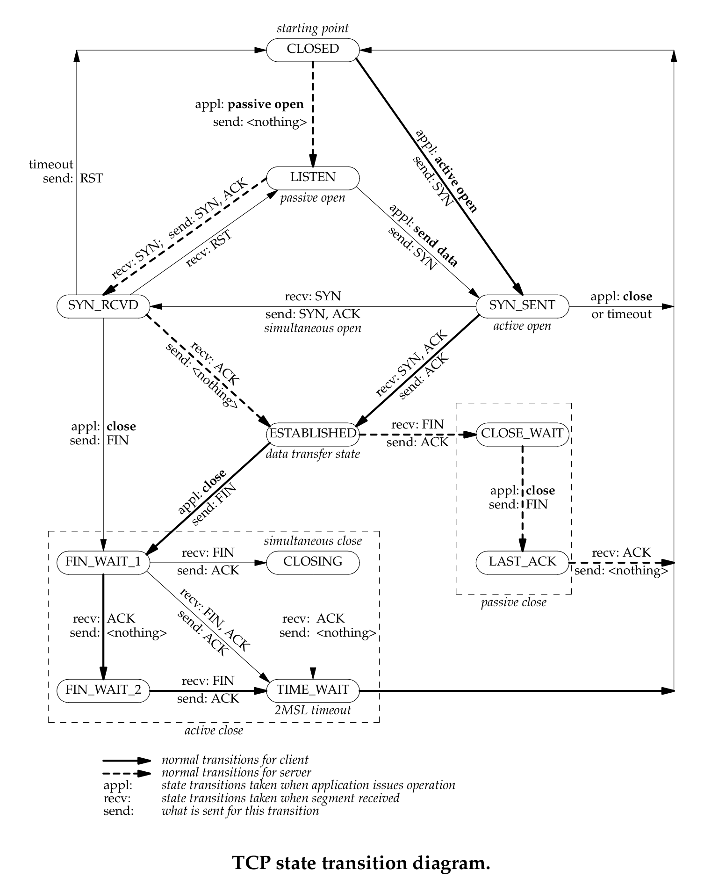

## 13. Dada la siguiente salida del comando ss, responda:

```bash
Netid  State         Recv-Q   Send-Q   Local Address:Port      Peer Address:Port   Process

tcp    LISTEN        0        128                  *:22                   *:*      users:(("sshd",pid=468,fd=29))
tcp    LISTEN        0        128                  *:80                   *:*      users:(("apache2",pid=991,fd=95))
udp    LISTEN        0        128       163.10.5.222:53                   *:*      users:(("named",pid=452,fd=10))
tcp    ESTAB         0        0         163.10.5.222:59736   64.233.163.120:443    users:(("x-www-browser",pid=1079,fd=51))
tcp    CLOSE-WAI T   0        0         163.10.5.222:41654    200.115.89.30:443    users:(("x-www-browser",pid=1079,fd=50))
tcp    ESTAB         0        0         163.10.5.222:59737   64.233.163.120:443    users:(("x-www-browser",pid=1079,fd=55))
tcp    ESTAB         0        0         163.10.5.222:33583    200.115.89.15:443    users:(("x-www-browser",pid=1079,fd=53))
tcp    ESTAB         0        0         163.10.5.222:45293    64.233.190.99:443    users:(("x-www-browser",pid=1079,fd=59))
tcp    LISTEN        0        128                  *:25                   *:*      users:(("postfix",pid=627,fd=3))
tcp    ESTAB         0        0            127.0.0.1:22           127.0.0.1:41220  users:(("sshd",pid=1418,fd=3), ("sshd",pid=1416,fd=3))
tcp    ESTAB         0        0         163.10.5.222:52952    64.233.190.94:443    users:(("x-www-browser",pid=1079,fd=29))
tcp    TIME-WAIT     0        0         163.10.5.222:36676    54.149.207.17:443    users:(("x-www-browser",pid=1079,fd=3))
tcp    ESTAB         0        0         163.10.5.222:52960    64.233.190.94:443    users:(("x-www-browser",pid=1079,fd=67))
tcp    ESTAB         0        0         163.10.5.222:50521    200.115.89.57:443    users:(("x-www-browser",pid=1079,fd=69))
tcp    SYN-SENT      0        0         163.10.5.222:52132       43.232.2.2:9500   users:(("x-www-browser",pid=1079,fd=70))
tcp    ESTAB         0        0            127.0.0.1:41220        127.0.0.1:22     users:(("ssh",pid=1415,fd=3))
udp    LISTEN        0        128          127.0.0.1:53                   *:*      users:(("named",pid=452,fd=9))
```

### a. ¿Cuántas conexiones hay establecidas?

**Respuesta: 9 conexiones TCP en estado ESTABLISHED**

Contando las líneas con estado `ESTAB`:

1. `163.10.5.222:59736 → 64.233.163.120:443` (x-www-browser)
2. `163.10.5.222:59737 → 64.233.163.120:443` (x-www-browser)
3. `163.10.5.222:33583 → 200.115.89.15:443` (x-www-browser)
4. `163.10.5.222:45293 → 64.233.190.99:443` (x-www-browser)
5. `127.0.0.1:22 → 127.0.0.1:41220` (sshd - lado servidor)
6. `163.10.5.222:52952 → 64.233.190.94:443` (x-www-browser)
7. `163.10.5.222:52960 → 64.233.190.94:443` (x-www-browser)
8. `163.10.5.222:50521 → 200.115.89.57:443` (x-www-browser)
9. `127.0.0.1:41220 → 127.0.0.1:22` (ssh - lado cliente)

**Nota:** Las dos últimas (líneas 5 y 9) son la misma conexión SSH vista desde ambos extremos (cliente y servidor en localhost).

### b. ¿Cuántos puertos hay abiertos a la espera de posibles nuevas conexiones?

**Respuesta: 3 puertos TCP en estado LISTEN**

Contando las líneas TCP con estado `LISTEN`:

1. **Puerto 22 (SSH)** - `*:22` - Proceso: `sshd`
2. **Puerto 80 (HTTP)** - `*:80` - Proceso: `apache2`
3. **Puerto 25 (SMTP)** - `*:25` - Proceso: `postfix`

**Nota:** También hay 2 servicios UDP escuchando (puerto 53 - DNS), pero la pregunta se refiere específicamente a conexiones TCP que esperan nuevas conexiones mediante handshake de tres vías.

### c. El cliente y el servidor de las comunicaciones HTTPS (puerto 443), ¿residen en la misma máquina?

**Respuesta: No, residen en máquinas diferentes**

**Análisis:**

Todas las conexiones HTTPS (puerto 443) muestran:

- **Local Address:** `163.10.5.222` (dirección IP de esta máquina)
- **Peer Address:** Direcciones IP remotas diferentes:
    - `64.233.163.120:443`
    - `200.115.89.30:443`
    - `200.115.89.15:443`
    - `64.233.190.99:443`
    - `64.233.190.94:443`
    - `200.115.89.57:443`
    - `54.149.207.17:443`

Todas las conexiones HTTPS son **salientes** (el host local `163.10.5.222` actúa como cliente usando puertos efímeros, y se conecta a servidores remotos en puerto 443). Las direcciones IP `64.233.*` y `200.115.*` pertenecen a redes externas (probablemente Google y otros servicios web).

**Conclusión:** Esta máquina es el **cliente HTTPS**, los servidores HTTPS están en Internet.

### d. El cliente y el servidor de la comunicación SSH (puerto 22), ¿residen en la misma máquina?

**Respuesta: Sí, ambos residen en la misma máquina (localhost)**

**Análisis:**

La conexión SSH muestra:

- `127.0.0.1:22 → 127.0.0.1:41220` (proceso `sshd` - servidor)
- `127.0.0.1:41220 → 127.0.0.1:22` (proceso `ssh` - cliente)

Ambos extremos usan la dirección `127.0.0.1` (loopback/localhost), lo que indica que:

- El **servidor SSH** (`sshd`) escucha en puerto 22
- El **cliente SSH** (`ssh`) se conectó desde puerto efímero 41220
- Ambos procesos corren en la misma máquina, comunicándose localmente

**Escenario típico:** Un usuario local ejecutó `ssh localhost` o `ssh 127.0.0.1` para conectarse al servidor SSH en su propia máquina (útil para pruebas o túneles locales).

### e. Liste los nombres de todos los procesos asociados con cada comunicación. Indique para cada uno si se trata de un proceso cliente o uno servidor.

**Procesos servidores (LISTEN):**

| Puerto | Proceso | Tipo     | Descripción                 |
| ------ | ------- | -------- | --------------------------- |
| 22     | sshd    | Servidor | SSH daemon (OpenSSH server) |
| 80     | apache2 | Servidor | Servidor web HTTP           |
| 25     | postfix | Servidor | Servidor de correo SMTP     |
| 53     | named   | Servidor | Servidor DNS (BIND)         |

**Procesos clientes (conexiones activas):**

| Proceso       | Puerto Local → Remoto          | Tipo     | Estado     | Descripción                              |
| ------------- | ------------------------------ | -------- | ---------- | ---------------------------------------- |
| x-www-browser | 59736 → 64.233.163.120:443     | Cliente  | ESTAB      | Navegador web conectado a servidor HTTPS |
| x-www-browser | 41654 → 200.115.89.30:443      | Cliente  | CLOSE-WAIT | Navegador en proceso de cierre           |
| x-www-browser | 59737 → 64.233.163.120:443     | Cliente  | ESTAB      | Navegador web conectado a servidor HTTPS |
| x-www-browser | 33583 → 200.115.89.15:443      | Cliente  | ESTAB      | Navegador web conectado a servidor HTTPS |
| x-www-browser | 45293 → 64.233.190.99:443      | Cliente  | ESTAB      | Navegador web conectado a servidor HTTPS |
| sshd          | 127.0.0.1:22 → 127.0.0.1:41220 | Servidor | ESTAB      | Extremo servidor de conexión SSH local   |
| x-www-browser | 52952 → 64.233.190.94:443      | Cliente  | ESTAB      | Navegador web conectado a servidor HTTPS |
| x-www-browser | 36676 → 54.149.207.17:443      | Cliente  | TIME-WAIT  | Navegador esperando cierre completo      |
| x-www-browser | 52960 → 64.233.190.94:443      | Cliente  | ESTAB      | Navegador web conectado a servidor HTTPS |
| x-www-browser | 50521 → 200.115.89.57:443      | Cliente  | ESTAB      | Navegador web conectado a servidor HTTPS |
| x-www-browser | 52132 → 43.232.2.2:9500        | Cliente  | SYN-SENT   | Navegador intentando establecer conexión |
| ssh           | 127.0.0.1:41220 → 127.0.0.1:22 | Cliente  | ESTAB      | Cliente SSH conectado a servidor local   |

**Resumen:**

- **Servidores:** `sshd`, `apache2`, `postfix`, `named`
- **Clientes:** `x-www-browser` (navegador web con múltiples conexiones HTTPS), `ssh` (cliente SSH)

### f. ¿Cuáles conexiones tuvieron el cierre iniciado por el host local y cuáles por el remoto?

**Conexiones con cierre iniciado por el host remoto:**

1. **`163.10.5.222:41654 → 200.115.89.30:443` (CLOSE-WAIT)**
    - Estado `CLOSE-WAIT` indica que el **servidor remoto** envió FIN primero
    - El host local recibió FIN, respondió ACK, pero la aplicación local (`x-www-browser`) aún no cerró su lado
    - **Cierre iniciado por:** Servidor remoto `200.115.89.30`

**Conexiones con cierre iniciado por el host local:**

1. **`163.10.5.222:36676 → 54.149.207.17:443` (TIME-WAIT)**
    - Estado `TIME-WAIT` indica que el **host local** cerró activamente la conexión
    - El host local envió FIN, recibió ACK, recibió FIN del remoto, envió ACK final, y ahora espera 2×MSL
    - **Cierre iniciado por:** Host local `163.10.5.222`

**Explicación de los estados de cierre:**

| Estado     | Quién inició el cierre | Descripción                                                     |
| ---------- | ---------------------- | --------------------------------------------------------------- |
| CLOSE-WAIT | Remoto                 | Extremo pasivo que recibió FIN, esperando que aplicación cierre |
| TIME-WAIT  | Local                  | Extremo activo que inició cierre, esperando 2×MSL               |
| LAST-ACK   | Local (pasivo)         | Esperando ACK final después de enviar FIN como respuesta        |
| FIN-WAIT-1 | Local (activo)         | Envió FIN, esperando ACK o FIN del otro extremo                 |
| FIN-WAIT-2 | Local (activo)         | Recibió ACK del FIN, esperando FIN del remoto                   |

**Resumen:**

- **Cierre iniciado por host local:** 1 conexión (TIME-WAIT)
- **Cierre iniciado por host remoto:** 1 conexión (CLOSE-WAIT)

### g. ¿Cuántas conexiones están aún pendientes por establecerse?

**Respuesta: 1 conexión pendiente**

**Conexión en proceso de establecimiento:**

1. **`163.10.5.222:52132 → 43.232.2.2:9500` (SYN-SENT)**
    - Proceso: `x-www-browser`
    - Estado: `SYN-SENT`
    - **Significado:** El navegador envió un segmento SYN al servidor `43.232.2.2:9500` y está esperando la respuesta SYN-ACK
    - **Fase del handshake:** Paso 1 completado (SYN enviado), esperando paso 2 (SYN-ACK)
    - **Posibles escenarios:**
        - El servidor está ocupado o experimentando latencia alta
        - Hay filtrado de paquetes (firewall) bloqueando la conexión
        - El servidor no existe o el puerto está cerrado (eventualmente recibirá RST o timeout)
        - Problemas de red en la ruta hacia el servidor

**Estados que indican conexión en establecimiento:**

- `SYN-SENT` (cliente esperando SYN-ACK)
- `SYN-RECEIVED` (servidor esperando ACK final)

En este caso, solo hay una conexión en `SYN-SENT`, lo que indica **1 conexión pendiente de establecerse**.

**Nota:** Si el servidor no responde, esta conexión eventualmente expirará (timeout) y la aplicación recibirá un error de conexión.

## 14. Dadas las salidas de los siguientes comandos ejecutados en el cliente y el servidor, responder:

**servidor#**

```bash
ss -natu | grep 110

tcp  LISTEN   0  0            *:110             *:*
tcp  SYN-RECV 0  0    157.0.0.1:110    157.0.11.1:52843
```

**cliente#**

```bash
ss -natu | grep 110

tcp  SYN-SENT 0  1   157.0.11.1:52843   157.0.0.1:110
```

### a. ¿Qué segmentos llegaron y cuáles se están perdiendo en la red?

**Segmentos que llegaron exitosamente:**

1. **Paso 1: Cliente → Servidor (SYN) ✓**
    - El cliente (`157.0.11.1:52843`) envió un segmento SYN al servidor (`157.0.0.1:110`)
    - **Evidencia en servidor:** Estado `SYN-RECV` indica que el servidor recibió el SYN
    - **Evidencia en cliente:** Estado `SYN-SENT` confirma que el cliente envió el SYN

2. **Paso 2: Servidor → Cliente (SYN-ACK) ✓**
    - El servidor respondió con SYN-ACK al cliente
    - **Evidencia en servidor:** Transición de `LISTEN` → `SYN-RECV` indica que envió SYN-ACK
    - **Problema:** Este segmento llegó al servidor pero hay un problema

**Segmentos que se están perdiendo:**

3. **Paso 3: Cliente → Servidor (ACK final) ✗ PERDIDO**
    - El cliente debería haber enviado un ACK final para completar el handshake
    - **Evidencia:**
        - Cliente permanece en `SYN-SENT` (esperando SYN-ACK del servidor)
        - Servidor permanece en `SYN-RECV` (esperando ACK final del cliente)
    - **Conclusión:** El segmento **SYN-ACK del servidor NO llegó al cliente**, por eso el cliente no puede enviar el ACK final

**Problema:**

```bash
Cliente (157.0.11.1)              Red                Servidor (157.0.0.1)
      |                            |                          |
      | ─────── SYN ─────────────> |─────────────────────────>| (LISTEN → SYN-RECV)
      | (Paso 1: ✓ llegó)          |                          |
      |                            |                          |
      |                            |<────── SYN-ACK ──────────| (envía SYN-ACK)
      |                            X (PERDIDO)                |
      | (nunca recibe SYN-ACK)     |                          |
      |                            |                          |
(SYN-SENT: esperando SYN-ACK)                    (SYN-RECV: esperando ACK)
      |                            |                          |
      | (no puede enviar ACK       |                          |
      |  porque no recibió SYN-ACK)|                          |
```

**Resumen:**

- **Segmento que llegó:** SYN del cliente al servidor
- **Segmento perdido:** SYN-ACK del servidor al cliente
- **Segmento que no se puede enviar:** ACK final del cliente (porque nunca recibió el SYN-ACK)

**Posibles causas:**

- Firewall bloqueando tráfico del servidor al cliente
- Problema de ruteo asimétrico
- Filtrado de paquetes en la red
- Pérdida de paquetes por congestión

### b. ¿A qué protocolo de capa de aplicación y de transporte se está intentando conectar el cliente?

**Protocolo de capa de transporte: TCP**

**Evidencia:**

- El comando `ss -natu` muestra conexiones TCP y UDP
- La salida muestra `tcp` en la primera columna
- Los estados `SYN-SENT` y `SYN-RECV` son exclusivos de TCP (handshake de tres vías)
- UDP no tiene establecimiento de conexión ni estados

**Protocolo de capa de aplicación: POP3 (Post Office Protocol version 3)**

**Evidencia:**

- Puerto destino: **110**
- Puerto 110 es el puerto well-known estándar para el protocolo POP3
- POP3 es un protocolo de correo electrónico usado para descargar mensajes del servidor al cliente

**Detalles del protocolo POP3:**

- **Función:** Recuperación de correo electrónico desde un servidor de correo
- **Puerto estándar:** 110 (TCP)
- **Puerto seguro (POP3S):** 995 (TCP con SSL/TLS)
- **Capa de aplicación:** Protocolo cliente-servidor
- **RFC:** RFC 1939
- **Uso típico:** Clientes de correo como Thunderbird, Outlook, o aplicaciones de correo descargan mensajes usando POP3

**Resumen:**

- **Capa de transporte:** TCP
- **Capa de aplicación:** POP3 (Post Office Protocol 3)
- **Puerto:** 110
- **Dirección servidor:** 157.0.0.1:110
- **Dirección cliente:** 157.0.11.1:52843

### c. ¿Qué flags tendría seteado el segmento perdido?

**Respuesta: El segmento perdido tiene los flags SYN y ACK activos**

**Análisis detallado:**

El segmento perdido es el **SYN-ACK** enviado por el servidor en el paso 2 del handshake de tres vías.

**Flags del segmento SYN-ACK:**

| Flag    | Estado         | Propósito                                                                       |
| ------- | -------------- | ------------------------------------------------------------------------------- |
| **SYN** | **1** (activo) | Sincronizar: el servidor comunica su número de secuencia inicial (ISN_servidor) |
| **ACK** | **1** (activo) | Acknowledgment: el servidor confirma haber recibido el SYN del cliente          |
| FIN     | 0              | No se está cerrando la conexión                                                 |
| RST     | 0              | No se está reseteando la conexión                                               |
| PSH     | 0              | No hay datos urgentes para entregar                                             |
| URG     | 0              | No hay datos urgentes                                                           |

**Contenido del segmento SYN-ACK perdido:**

```
Segmento SYN-ACK (Servidor → Cliente)
├─ IP Header:
│  ├─ IP origen: 157.0.0.1
│  └─ IP destino: 157.0.11.1
│
├─ TCP Header:
│  ├─ Puerto origen: 110 (POP3)
│  ├─ Puerto destino: 52843 (puerto efímero del cliente)
│  ├─ Flags: SYN=1, ACK=1 (combinación SYN-ACK)
│  ├─ Sequence number: ISN_servidor (número aleatorio de 32 bits)
│  ├─ Acknowledgment number: ISN_cliente + 1
│  ├─ Window size: Tamaño de ventana de recepción del servidor
│  ├─ Opciones TCP: MSS, Window Scale, timestamps, SACK, etc.
│  └─ Checksum: Verificación de integridad
│
└─ Datos: Sin payload (solo header TCP)
```

**Notación comprimida:**

En herramientas como `hping3` o `tcpdump`, este segmento se mostraría como:

- **Flags: SA** (S=SYN, A=ACK)
- Ejemplo en tcpdump: `Flags [S.]` donde el punto representa ACK

**Por qué estos flags:**

1. **SYN=1:** El servidor debe sincronizar su propio número de secuencia inicial con el cliente
2. **ACK=1:** El servidor confirma haber recibido el SYN del cliente (ack = ISN_cliente + 1)
3. **Combinación SYN-ACK:** Es la respuesta estándar del servidor en el paso 2 del handshake TCP

**Comparación con otros segmentos del handshake:**

| Paso | Dirección          | Flags activos | Notación | Propósito                         |
| ---- | ------------------ | ------------- | -------- | --------------------------------- |
| 1    | Cliente → Servidor | SYN           | S        | Solicitar conexión                |
| 2    | Servidor → Cliente | **SYN, ACK**  | **SA**   | **Aceptar y confirmar** ← PERDIDO |
| 3    | Cliente → Servidor | ACK           | A        | Confirmar recepción               |

**Conclusión:**

El segmento perdido es el **SYN-ACK** con:

- **Flags seteados:** SYN=1, ACK=1
- **Notación:** SA o [S.]
- **Función:** Paso 2 del handshake de tres vías
- **Dirección:** 157.0.0.1:110 → 157.0.11.1:52843

## 15. Use CORE para armar una topología como la siguiente, sobre la cual deberá realizar:

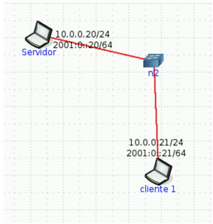

### a. En ambos equipos inspeccionar el estado de las conexiones y mantener abiertas ambas ventanas con el comando corriendo para poder visualizar los cambios a medida que se realiza el ejercicio. Ayuda: watch -n1 ’ss -nat’.

**Paso 1** Iniciar con el botón de play, y abrir (haciendo doble click sobre el ícono de cada dispositivo) un terminal.

**Paso 2** Ejecutar este comando en el terminal de cada dispositivo:

```bash
export TERM=xterm
```

**Paso 3** Ejecutar este comando en el terminal de cada dispositivo:

```bash
watch -n1 ’ss -nat’
```

### b. En Servidor, utilice la herramienta ncat para levantar un servicio que escuche en el puerto 8001/TCP. Utilice la opción -k para que el servicio sea persistente. Verifique el estado de las conexiones.

Sin cerrar las otras dos terminales, abrimos una nueva para el `Servidor` y ejecutamos el siguiente comando:

```bash
ncat -l -k -p 8001
```

Se va a mostrar esto en el terminal del `Servidor` donde se ejecutó `watch -n1 ’ss -nat’`:

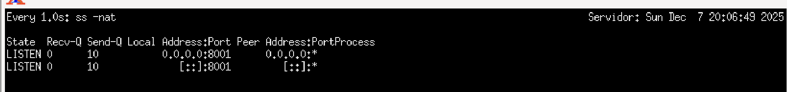

### c. Desde CLIENTE1 conectarse a dicho servicio utilizando también la herramienta ncat. Inspeccione el estado de las conexiones.

Sin cerrar las otras tres terminales, abrimos una nueva para el `Cliente1` y ejecutamos el siguiente comando:

```bash
ncat 10.0.0.20 8001
```

Se va a mostrar esto en el terminal del `Servidor` donde se ejecutó `watch -n1 ’ss -nat’`:

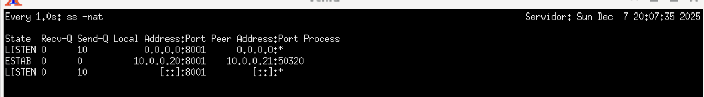

Se va a mostrar esto en el terminal del `Cliente1` donde se ejecutó `watch -n1 ’ss -nat’`:

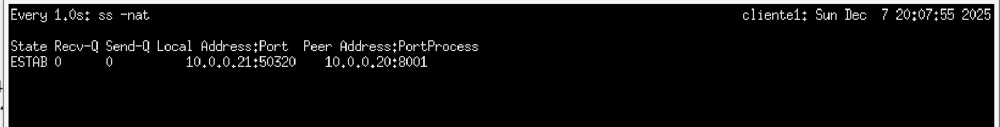

### d. Iniciar otra conexión desde CLIENTE1 de la misma manera que la anterior y verificar el estado de las conexiones. ¿De qué manera puede identificar cada conexión?

Sin cerrar las otras cuatro terminales, abrimos una nueva para el `Cliente1` y ejecutamos el siguiente comando (al igual que en el punto c):

```bash
ncat 10.0.0.20 8001
```

Se va a mostrar esto en el terminal del `Servidor` donde se ejecutó `watch -n1 ’ss -nat’`:

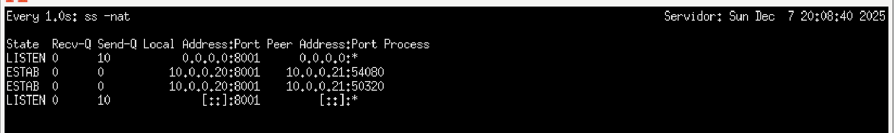

Se va a mostrar esto en el terminal del `Cliente1` donde se ejecutó `watch -n1 ’ss -nat’`:

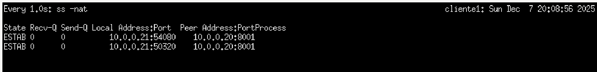

Dado que ambas conexiones pueden existir simultáneamente podemos identificarlas porque **los puertos de origen (efímeros) son diferentes**. La primera conexión utiliza el puerto origen `50632` y la segunda conexión utiliza el puerto origen `53270`, mientras que ambas se conectan al mismo puerto destino `8001`.

**Explicación técnica:**

Cada conexión TCP se identifica de forma **única** mediante la **4-tupla**:

- **(IP_origen, Puerto_origen, IP_destino, Puerto_destino)**

En este caso:

**Primera conexión:**

- 4-tupla: (10.0.0.21, 50632, 10.0.0.20, 8001)
- Estado: ESTABLISHED

**Segunda conexión:**

- 4-tupla: (10.0.0.21, 53270, 10.0.0.20, 8001)
- Estado: ESTABLISHED

Aunque ambas conexiones comparten la misma IP origen, IP destino y puerto destino, **los puertos origen son diferentes**, lo que las hace completamente distintas para el kernel TCP/IP. El sistema operativo mantiene un estado de conexión separado para cada 4-tupla, permitiendo que coexistan simultáneamente sin conflicto.

### e. En base a lo observado en el item anterior, ¿es posible iniciar más de una conexión desde el cliente al servidor en el mismo puerto destino? ¿Por qué? ¿Cómo se garantiza que los datos de una conexión no se mezclarán con los de la otra?

**Respuesta: Sí, es totalmente posible iniciar múltiples conexiones desde el cliente al servidor en el mismo puerto destino.**

**¿Por qué es posible?**

TCP utiliza la **4-tupla** (IP_origen, Puerto_origen, IP_destino, Puerto_destino) para identificar de forma única cada conexión. Esto significa que:

- El puerto **destino (8001)** puede ser el mismo para múltiples conexiones
- El puerto **origen (efímero)** debe ser diferente para cada nueva conexión

Cuando un cliente inicia una nueva conexión, el sistema operativo **asigna automáticamente un nuevo puerto efímero** (diferente al anterior), creando una 4-tupla única que diferencia esta nueva conexión de las existentes.

**Ejemplo con dos conexiones simultáneas:**

```
Conexión 1:  (10.0.0.21:50632  → 10.0.0.20:8001)  → Socket 1
Conexión 2:  (10.0.0.21:53270  → 10.0.0.20:8001)  → Socket 2
```

Aunque el puerto destino (8001) sea idéntico, las 4-tuplas son diferentes, por lo que TCP las trata como dos conexiones completamente independientes.

**¿Cómo se garantiza que los datos no se mezclen?**

La separación de datos se garantiza mediante varios mecanismos:

**1. Identificación única mediante 4-tupla:**

El kernel TCP/IP mantiene una tabla de conexiones donde cada entrada está indexada por su 4-tupla. Cuando llega un segmento TCP, el kernel:

- Extrae los 4 identificadores (IP_src, Puerto_src, IP_dst, Puerto_dst)
- Busca la conexión correspondiente en la tabla
- Entrega el segmento solo al **socket específico** de esa conexión

**2. Buffers de recepción independientes:**

Cada conexión TCP tiene:

- **Su propio buffer de recepción (Recv-Q):** Almacena segmentos recibidos específicamente para esa conexión
- **Su propio buffer de envío (Send-Q):** Almacena segmentos a transmitir
- **Su propia cola de eventos:** Notificaciones de estado específicas de la conexión

Los datos de la conexión 1 nunca entran en el buffer de la conexión 2.

**3. Números de secuencia independientes:**

Cada conexión TCP negocia sus propios números de secuencia:

- **Conexión 1:** ISN_1 (Initial Sequence Number único)
- **Conexión 2:** ISN_2 (completamente diferente)

Los números de secuencia garantizan que los datos se ordenan correctamente **dentro de cada conexión**, y los datos de una conexión no pueden interpretarse como datos de otra.

**4. Demultiplexación en la capa de transporte:**

El proceso de demultiplexación funciona así:

```bash
Segmento TCP recibido
    ↓
Extraer: IP_src, Puerto_src, IP_dst, Puerto_dst
    ↓
Buscar 4-tupla en tabla de conexiones TCP
    ↓
Encontrar Socket específico (Socket 1 o Socket 2)
    ↓
Entregar datos al buffer de recepción del Socket correcto
    ↓
Aplicación lee desde su Socket específico
```

De esta manera, aunque múltiples conexiones compartan el puerto destino, **cada una recibe solo sus propios datos**.

**Ejemplo con capas:**

```bash
Aplicación Cliente 1 ←→ Socket 1 (10.0.0.21:50632)
                                ↓
                            Capa TCP
                         Tabla de conexiones:
                    ┌─────────────────────────┐
                    │ 4-tupla 1 → Socket 1    │
                    │ 4-tupla 2 → Socket 2    │
                    └─────────────────────────┘
                                ↓
                        Capa IP / Red

Aplicación Cliente 2 ←→ Socket 2 (10.0.0.21:53270)
```

Cada aplicación lee exclusivamente desde su Socket específico, sin posibilidad de "cruzamiento" de datos.

**Conclusión:**

La **4-tupla única** es la clave que garantiza que múltiples conexiones simultáneas desde el mismo cliente a un mismo puerto destino no interferan entre sí. TCP es un protocolo **orientado a la conexión** que mantiene estado separado para cada conexión, haciendo que sea imposible que los datos se mezclen, incluso cuando el puerto destino es idéntico.

### f. Analice en el tráfico de red, los flags de los segmentos TCP que ocurren cuando:

#### I. Cierra la última conexión establecida desde CLIENTE1. Evalúe los estados de las conexiones en ambos equipos.

Sin cerrar ninguna de las 5 terminales, vamos a la ultima conexión creada para el `Cliente1` en el `Punto d` y la cerramos con `control+c` (cerramos la conexión, no la ventana de la terminal).

Se va a mostrar esto en el terminal del `Servidor` donde se ejecutó `watch -n1 ’ss -nat’`:

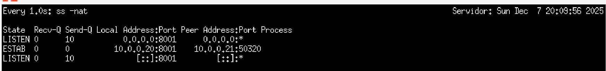

Se va a mostrar esto en el terminal del `Cliente1` donde se ejecutó `watch -n1 ’ss -nat’`:

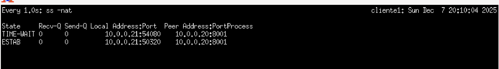

#### II. Corta el servicio de ncat en el servidor (Ctrl+C). Evalúe los estados de las conexiones en ambos equipos.

Sin cerrar ninguna de las 5 terminales, vamos a la terminal del `Servidor` donde ejecutamos `ncat -l -k -p 8001`.

Se va a mostrar esto en el terminal del `Servidor` donde se ejecutó `watch -n1 ’ss -nat’`:

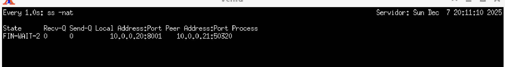

Se va a mostrar esto en el terminal del `Cliente1` donde se ejecutó `watch -n1 ’ss -nat’`:

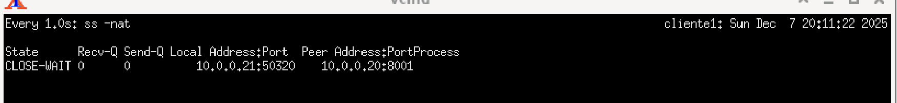

#### II. Cierra la conexión en el cliente. Evalúe nuevamente los estados de las conexiones.

Sin cerrar ninguna de las 5 terminales, vamos a la terminal del `Cliente1` donde ejecutamos `ncat 10.0.0.20 8001` en el `punto c`.

Se va a mostrar esto en el terminal del `Servidor` donde se ejecutó `watch -n1 ’ss -nat’`:

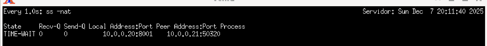

Se va a mostrar esto en el terminal del `Cliente1` donde se ejecutó `watch -n1 ’ss -nat’`:

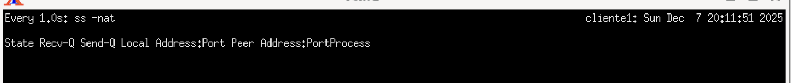
