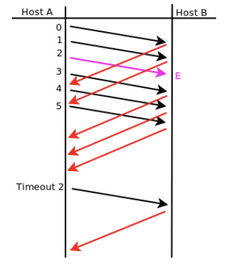
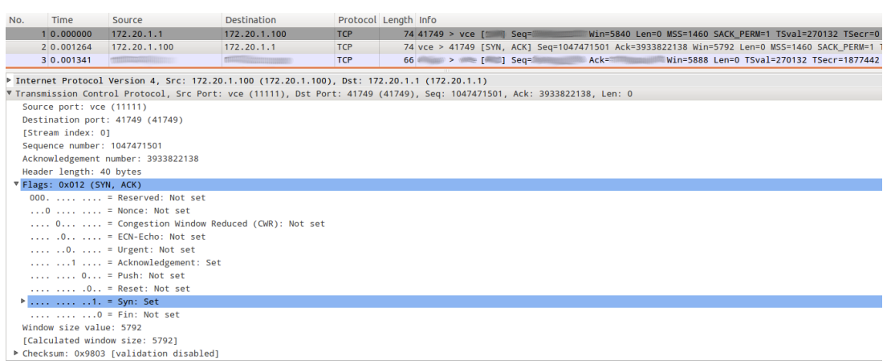
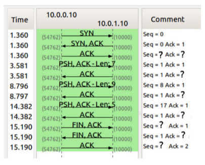

# Práctica 6 - Capa de Transporte - Parte 2

## 1. ¿Cuál es el puerto por defecto que se utiliza en los siguientes servicios?

### Web (HTTP)

Puerto 80 (TCP)

### SSH

Puerto 22 (TCP)

### DNS

Puerto 53 (UDP para consultas, TCP para transferencias de zona)

### Web Seguro (HTTPS)

Puerto 443 (TCP)

### SMTP

Puerto 25 (TCP)

### POP3

Puerto 110 (TCP)

### IMAP

Puerto 143 (TCP)

### Investigue en qué lugar en Linux y en Windows está descrita la asociación utilizada por defecto para cada servicio.

En Linux, la asociación entre servicios y puertos está definida en:

- /etc/services: Archivo de texto que lista protocolos, números de puerto y aliases. Consultar con: cat /etc/services

En Windows, la asociación está en:

- Registro del sistema: HKEY_LOCAL_MACHINE\SYSTEM\CurrentControlSet\Services\
- Archivo: %WINDIR%\System32\drivers\etc\services (equivalente a Linux)

Ejemplo de contenido /etc/services:

```bash
http            80/tcp
ssh             22/tcp
dns             53/udp
https           443/tcp
smtp            25/tcp
```

El archivo services actúa como un diccionario centralizado del sistema operativo. Cuando una aplicación necesita conectarse a un servicio, puede hacer una consulta al sistema: "¿en qué puerto escucha el servicio ssh?" y el SO responde "puerto 22" consultando este archivo.

## 2. Investigue qué es multicast. ¿Sobre cuál de los protocolos de capa de transporte funciona? ¿Se podría adaptar para que funcione sobre el otro protocolo de capa de transporte? ¿Por qué?

Concepto: Multicast es un **modo de transmisión en redes IP** donde un emisor envía un único flujo de datos a múltiples receptores de forma simultánea, dirigido únicamente a aquellos que se han suscrito a un grupo multicast específico.

Funcionamiento: Multicast representa un punto intermedio entre unicast (uno a uno) y broadcast (uno a todos). Los receptores interesados se suscriben a una dirección IP especial de grupo multicast (rango 224.0.0.0/4 en IPv4). El protocolo de capa de transporte utilizado es **UDP**, debido a que UDP es un protocolo simple y eficiente que minimiza latencia y overhead, características ideales para aplicaciones multicast como videoconferencias, streaming de video, actualizaciones de datos en tiempo real y juegos online.

Implementación: Aunque multicast funciona sobre UDP (capa de transporte), el mecanismo de entrega multicast se implementa en la **capa de red (IP)** mediante protocolos como IGMP (Internet Group Management Protocol) que coordina la suscripción de receptores a grupos.

Adaptación a TCP: Su adaptación a TCP sería **no viable** por varias razones fundamentales:

1. **Arquitectura orientada a conexión**: TCP requiere establecer una conexión punto-a-punto con handshake de tres vías. Multicast necesita un modelo sin conexión donde múltiples receptores se suscriben y abandonan dinámicamente sin coordinación individual con el emisor.

2. **ACKs acumulativos**: TCP envía ACKs confirmando cada segmento, lo que generaría un problema de implosión de ACKs si hubiera múltiples receptores. Con N receptores, el emisor recibiría N ACKs por cada segmento enviado.

3. **Control de flujo unicast**: El campo window size de TCP está diseñado para una conexión individual. Con múltiples receptores con capacidades diferentes, no hay forma coherente de aplicar control de flujo.

4. **Propósito incompatible**: TCP está diseñado arquitectónicamente para comunicación unicast (uno a uno). Multicast requiere una estructura de comunicación fundamentalmente diferente.

## 3. Investigue cómo funciona el protocolo de aplicación FTP teniendo en cuenta las diferencias en su funcionamiento cuando se utiliza el modo activo de cuando se utiliza el modo pasivo ¿En qué se diferencian estos tipos de comunicaciones del resto de los protocolos de aplicación vistos?

Concepto: El **FTP** (**File Transfer Protocol**) es un protocolo de la capa de aplicación orientado a conexión para transferir archivos entre cliente y servidor. A diferencia de otros protocolos de aplicación, FTP utiliza **dos conexiones TCP simultáneas y distintas** durante cada transferencia: una para **control** (comandos) y otra para **datos**.

Arquitectura de FTP:

1. **Conexión de control**: Se establece en el puerto 21 (por defecto) entre cliente y servidor, permanece activa durante toda la sesión, y transporta comandos FTP y respuestas.

2. **Conexión de datos**: Se crea y destruye para cada transferencia de archivo, su puerto varía según el modo (activo o pasivo), y transporta exclusivamente datos de archivo.

Modo activo:

En modo activo, el cliente abre la conexión de control al puerto 21 del servidor. Cuando necesita transferir un archivo, el cliente envía el comando PORT indicándole al servidor en **qué puerto efímero local el cliente estará escuchando**. El servidor entonces inicia una **conexión de datos desde su puerto 20 hacia el puerto indicado por el cliente**. Esto crea un problema importante: si el cliente está detrás de un firewall o NAT, el servidor (desde Internet pública) no puede iniciar una conexión de vuelta hacia el cliente, causando el fallo de la transferencia.

Modo pasivo:

En modo pasivo, el cliente abre la conexión de control al puerto 21 del servidor. Cuando necesita datos, envía el comando PASV. El servidor responde abriendo un puerto TCP efímero (típicamente >1024) y comunica su IP y número de puerto al cliente. El cliente entonces **inicia la conexión de datos hacia ese puerto del servidor**. Como todas las conexiones las inicia el cliente, funciona correctamente incluso detrás de firewalls y NAT.

Diferencia con otros protocolos de aplicación:

FTP es **único entre los protocolos de aplicación vistos** (HTTP, HTTPS, SMTP, POP3, IMAP, DNS) porque:

1. **Usa dos conexiones TCP independientes**: Todos los demás protocolos usan una única conexión TCP para toda la comunicación (HTTP, SMTP, SSH) o una única conexión UDP (DNS).

2. **Dinámicamente negocia puertos para datos**: Mientras HTTP/SMTP/IMAP siempre comunican datos en la misma conexión, FTP crea conexiones dinámicas con puertos que varían según el modo de operación.

3. **Separación de control y datos**: HTTP/SMTP/IMAP integran comandos y datos en la misma conexión. FTP aisla lógicamente el control de los datos en canales completamente separados.

4. **Requiere coordinación de puertos**: HTTP no requiere que el cliente o servidor negocien puertos (siempre 80/443). FTP requiere que el cliente comunique dinámicamente en qué puerto espera datos (modo activo) o reciba del servidor dónde conectarse (modo pasivo).

## 4. Suponiendo Selective Repeat; tamaño de ventana 4 y sabiendo que E indica que el mensaje llegó con errores. Indique en el siguiente gráfico, la numeración de los ACK que el host B envía al Host A.



Concepto: En **Selective Repeat**, el receptor envía un ACK **individual por cada segmento recibido correctamente**, incluso si llega fuera de orden, y **descarta aquellos que llegan con error sin enviar ACK**. Los segmentos recibidos correctamente pero fuera de orden se buferizan hasta que llegue el segmento faltante.

Análisis temporal con ventana de tamaño 4:

La ventana de envío tiene tamaño 4, por lo que Host A puede enviar hasta 4 segmentos sin esperar confirmación. La evolución es:

- **Instantes 1-4**: Host A envía segmentos 0, 1, 2 (con error), 3. Todos están dentro de la ventana [0,1,2,3]

- **Instante 5**: Host B recibe segmento 0 (correcto) → envía `ACK 0`. Ventana aún es [0,1,2,3]

- **Instante 6**: Host A recibe `ACK 0`, ventana avanza a [1,2,3,4], envía segmento 4

- **Instante 7**: Host B recibe segmento 1 (correcto) → envía `ACK 1`. Ventana aún es [1,2,3,4]

- **Instante 8**: Host A recibe `ACK 1`, ventana avanza a [2,3,4,5], envía segmento 5

- **Instantes 9-12**: Host B recibe segmentos 3, 4, 5 correctamente (llegaban fuera de orden) → envía `ACK 3`, `ACK 4`, `ACK 5` consecutivamente. Los bufferiza por el segmento 2 faltante

- **Instante 13**: Timeout en Host A (la ventana es de 4 y el segmento 2 nunca fue confirmado) → Host A retransmite segmento 2

- **Instante 14**: Host B recibe segmento 2 retransmitido (ahora correcto) → envía `ACK 2`

Tabla temporal de evolución:

| Instante | ACK recibido | Segmento enviado | Ventana |     |     |     |
| -------- | ------------ | ---------------- | ------- | --- | --- | --- |
| 1        | -            | 0                | 0       | 1   | 2   | 3   |
| 2        | -            | 1                | 0       | 1   | 2   | 3   |
| 3        | -            | 2 (E)            | 0       | 1   | 2   | 3   |
| 4        | -            | 3                | 0       | 1   | 2   | 3   |
| 5        | 0            | -                | 0       | 1   | 2   | 3   |
| 6        | -            | 4                | 1       | 2   | 3   | 4   |
| 7        | 1            | -                | 1       | 2   | 3   | 4   |
| 8        | -            | 5                | 2       | 3   | 4   | 5   |
| 9        | -            | -                | 2       | 3   | 4   | 5   |
| 10       | 3            | -                | 2       | 3   | 4   | 5   |
| 11       | 4            | -                | 2       | 3   | 4   | 5   |
| 12       | 5            | -                | 2       | 3   | 4   | 5   |
| 13       | -            | 2 (retx)         | 2       | 3   | 4   | 5   |
| 14       | 2            | -                | 2       | 3   | 4   | 5   |

Secuencia de ACKs enviados por Host B: `ACK 0`, `ACK 1`, `ACK 3`, `ACK 4`, `ACK 5`, `ACK 2`

Explicaciones conceptuales:

Qué es Selective Repeat y para qué se usa:

Selective Repeat es un protocolo de retransmisión **que solo retransmite los segmentos que llegaron con error o se perdieron**, en lugar de retransmitir toda la ventana de segmentos. Se usa en redes donde es importante evitar retransmitir datos correctamente recibidos, reduciendo ancho de banda desperdiciado. El receptor acepta y bufferiza segmentos fuera de orden, enviando ACKs individuales por cada segmento correcto recibido.

Qué es la ventana y qué significa tamaño 4:

La ventana (window size) es el **máximo número de segmentos que el emisor puede enviar sin esperar confirmación (ACK)** del receptor. Una ventana de tamaño 4 significa que Host A puede enviar hasta 4 segmentos consecutivos antes de detenerse y esperar ACKs. En este caso, Host A envía [0,1,2,3], luego cuando recibe `ACK 0`, la ventana se desplaza a [1,2,3,4] permitiendo enviar el segmento 4. Esto optimiza la utilización de la red evitando esperar ACK para cada segmento individual.

# 5. ¿Qué restricción existe sobre el tamaño de ventanas en el protocolo Selective Repeat?

Restricción fundamental: El tamaño de la ventana de envío **no puede superar la mitad del espacio total de numeración de secuencia**.

Fórmula: Si los números de secuencia van de 0 a N-1 (es decir, N números totales), entonces:

$$W_{max} ≤ \frac{N}{2}$$

Ejemplo: Con números de secuencia de 0 a 7 (N=8), el tamaño máximo de ventana es W ≤ 4.

Razón de la restricción: Selective Repeat **reutiliza los números de secuencia** después de completar un ciclo. Como el protocolo utiliza **ACKs individuales** (no acumulativos como en Go-Back-N), existe el riesgo de ambigüedad:

Supongamos ventana > N/2 (por ejemplo, N=8 y W=5). Si el emisor envía segmentos [0,1,2,3,4] y el receptor confirma los primeros 4 (ACK 0,1,2,3), la ventana se desplaza a [1,2,3,4,5]. Pero si los ACKs se pierden y el receptor recibe nuevamente los segmentos [0,1,2,3,4] en la siguiente vuelta del ciclo de numeración, **no podrá distinguir si son los segmentos nuevos o retransmisiones de los antiguos**.

Conclusión: Limitando W ≤ N/2, se garantiza que los números de secuencia dentro de la ventana activa nunca se superponen con números de ciclos anteriores, evitando confusiones entre paquetes antiguos y nuevos.

# 6. De acuerdo a la captura TCP de la siguiente figura, indique los valores de los campos borroneados.



Tabla de pasos en wireshark:

| No. | Time     | Source       | Destination  | Protocol | Lenght | Info                                                                                       |
| --- | -------- | ------------ | ------------ | -------- | ------ | ------------------------------------------------------------------------------------------ |
| 1   | 0.000000 | 172.20.1.1   | 172.20.1.100 | TPC      | 74     | 41749 > vce [ `??` ] Seq=`??` Win=5840 Len=0 MSS=1460 SACK_PERM=1 TSVal=270132 TScr=0      |
| 2   | 0.001264 | 172.20.1.100 | 172.20.1.1   | TPC      | 74     | vce > 41749 [ SYN, ACK ] Seq=1047471501 Ack=3933822138 Win=5792 Len=0 MSS=1460 SACK_PERM=1 |
| 2   | 0.001341 | `??`         | `??`         | TPC      | 66     | `??` > `??` [ `??` ] Seq=`??` Ack=`??` Win=5888 Len=0 TSVal=270132 TSecr=1877442           |

TCP stream de paso No. 2:

```bash
Source port: vce (11111)
Destination port: 41749 (41749)
[Stream index: 0]
Sequence number: 1047471501
Acknowledgment numnber: 3933822138
Header lenght: 40 bytes
Flags: 0x012 (SYN, ACK)
    000. .... .... = Reserved: Not set
    ...0 .... .... = Nonce: Not set
    .... 0... .... = Congestion window reduced (CWR): Not set
    .... .0.. .... = ECN-ECHO: Not set
    .... ..0. .... = Urgent: Not set
    .... ...1 .... = Acknowledgment: Set
    .... .... 0... = Push: Not set
    .... .... .0.. = Reset: Not set
    .... .... ..1. = Syn: Set
    .... .... ...0 = Fin: Not set
Window size value: 5792
```

La captura representa una petición de conexión en el handshake de 3 pasos del protocolo TCP. Los elementos que faltan son los siguientes:

En el primer paso:

- El cliente manda un al servidor pedido `SYN`.
- El valor de secuencia es `3933822137` (número de secuencia inicial elegido por el cliente, que el servidor confirma con ACK=3933822138).

En el tercer paso el cliente responde con:

- Con un `ACK`, dado que el servidor respondio con SYN-ACK en el paso 2.
- Las ips faltantes son desde la fuente `172.20.1.1` al destino `172.20.1.100`.
- El valor de secuencia es `3933822138`.
- El valor de Ack `1047471502`.
- El puerto origen sería `41749` y el destino vce (`11111`).

| No. | Time     | Source       | Destination    | Protocol | Lenght | Info                                                                                                    |
| --- | -------- | ------------ | -------------- | -------- | ------ | ------------------------------------------------------------------------------------------------------- |
| 1   | 0.000000 | 172.20.1.1   | 172.20.1.100   | TPC      | 74     | 41749 > vce [ `SYN` ] Seq=`3933822137` Win=5840 Len=0 MSS=1460 SACK_PERM=1 TSVal=270132 TScr=0          |
| 2   | 0.001264 | 172.20.1.100 | 172.20.1.1     | TPC      | 74     | vce > 41749 [ SYN, ACK ] Seq=1047471501 Ack=3933822138 Win=5792 Len=0 MSS=1460 SACK_PERM=1              |
| 2   | 0.001341 | `172.20.1.1` | `172.20.1.100` | TPC      | 66     | `41749` > `11111` [ `ACK` ] Seq=`3933822138` Ack=`1047471502` Win=5888 Len=0 TSVal=270132 TSecr=1877442 |

## 7. Dada la sesión TCP de la figura, completar los valores marcados con un signo de interrogación.



```bash
Time        10.0.1.10                  10.0.1.10
1.  1.360       |---------- SYN ---------->| Seq=0
2.  1.360       |<------- SYN-ACK ---------| Seq=1  Ack=1
3.  1.360       |---------- ACK ---------->| Seq=?  Ack=?
4.  3.581       |---- PSH,ACK - Len:7 ---->| Seq=1  Ack=1
5.  3.581       |<---------- ACK ----------| Seq=1  Ack=?
6.  8.796       |---- PSH,ACK - Len:9 ---->| Seq=8  Ack=1
7.  8.796       |<---------- ACK ----------| Seq=1  Ack=?
8.  14.382      |---- PSH,ACK - Len:5 ---->| Seq=17 Ack=1
9.  14.382      |<---------- ACK ----------| Seq=1  Ack=?
10. 15.190      |--------- FIN,ACK ------->| Seq=?  Ack=1
11. 15.190      |<-------- FIN,ACK --------| Seq=1  Ack=?
12. 15.190      |----------- ACK --------->| Seq=?  Ack=2
```

1.  El cliente solicita la conexión y envía su número de secuencia inicial (`0`).
2.  El servidor responde con `Ack = 1` y con su número de secuencia inicial (`0`).
3.  El cliente responde con su `Ack = 1`, poniendo su `Seq` en `1`.
4.  El cliente manda los primeros 7 segmentos marcados con `PSH`, su `Seq = 1` y su `Ack = 1`.
5.  El servidor recibe los 7 segmentos correctamente, manda `Ack` en `8`.
6.  El cliente actualiza su `Seq = 8`, `Ack = 1`. Manda otros 9 segmentos marcados con `PSH`.
7.  El servidor recibe los 9 segmentos, `Ack = 17 -> (1 + 7 + 9 = 17)`.
8.  El cliente actualiza su `Seq = 17`, `Ack` en 1. Manda los últimos 5 segmentos con `PSH`.
9.  El servidor recibe los últimos 5 segmentos, manda `Ack = 22 -> (1 + 7 + 9 + 5 = 22)`.
10. El cliente recibe el `ACK` y actualiza el `Seq = 22`. Pide el fin de la conexión con `FIN`.
11. El servidor recibe el fin de la conexión, responde con `ACK = 23 -> (Seq + 1 = 23)`.
12. El cliente recibe esa petición de fin, actualiza `Seq` en `23` (consume un segmento). Responde con `ACK` en `2`.

```bash
Time        10.0.1.10                  10.0.1.10
1.  1.360       |---------- SYN ---------->| Seq=0
2.  1.360       |<------- SYN-ACK ---------| Seq=1  Ack=1
3.  1.360       |---------- ACK ---------->| Seq=1  Ack=1
4.  3.581       |---- PSH,ACK - Len:7 ---->| Seq=1  Ack=1
5.  3.581       |<---------- ACK ----------| Seq=1  Ack=8
6.  8.796       |---- PSH,ACK - Len:9 ---->| Seq=8  Ack=1
7.  8.796       |<---------- ACK ----------| Seq=1  Ack=17
8.  14.382      |---- PSH,ACK - Len:5 ---->| Seq=17 Ack=1
9.  14.382      |<---------- ACK ----------| Seq=1  Ack=22
10. 15.190      |--------- FIN,ACK ------->| Seq=22 Ack=1
11. 15.190      |<-------- FIN,ACK --------| Seq=1  Ack=23
12. 15.190      |----------- ACK --------->| Seq=23 Ack=2
```

**Nota:** El ACK del cliente cambia de 1 a 2 en el paso 12 porque el servidor envía un FIN en el paso 11. Aunque el FIN no lleva datos, **consume un número de secuencia**, por lo que el cliente debe confirmar: Ack=1+1=2. Este mismo mecanismo aplica a ambas direcciones: tanto datos (bytes) como flags de control (SYN, FIN) consumen números de secuencia y por lo tanto modifican los valores de Seq y Ack en los ACKs subsecuentes.

## 8. ¿Qué es el RTT y cómo se calcula? Investigue la opción TCP timestamp y los campos TSval y TSecr.

Concepto: El **RTT** (**Round Trip Time**) es el tiempo que tarda un segmento TCP en ir desde el emisor hasta el receptor y volver con su ACK. Este valor es crítico para que TCP calcule el **RTO** (**Retransmission Timeout**), que determina cuánto tiempo esperar a un ACK antes de retransmitir un segmento.

Cálculo del RTT:

Cada vez que el emisor envía un segmento y recibe el ACK correspondiente, se muestrea el tiempo transcurrido (SampleRTT). Sin embargo, usar directamente SampleRTT sería inestable porque la red tiene variabilidad, por eso TCP utiliza **estimaciones suavizadas**:

**RTT promedio suavizado (EstimatedRTT):**

$$EstimatedRTT = (1 - α) × EstimatedRTT + α × SampleRTT$$

donde $α$ típicamente es 0.125. Esta fórmula da más peso al histórico que a las mediciones recientes.

**Variación del RTT (DevRTT):**

$$DevRTT = (1 - β) × DevRTT + β × |SampleRTT - EstimatedRTT|$$

donde $β$ típicamente es 0.25. Mide qué tan variable es la red.

**RTO calculado:**

$$RTO = EstimatedRTT + 4 × DevRTT$$

El factor de 4 sobre la desviación garantiza que el timeout sea suficientemente largo incluso en redes variables, reduciendo retransmisiones innecesarias.

Opción TCP Timestamp:

La opción _timestamp_ se utiliza para medir el RTT **con precisión a nivel de segmento individual** y también para proteger contra la reutilización de números de secuencia en conexiones antiguas. Se negocia durante el handshake (SYN/SYN-ACK) y aparece en el encabezado de cada segmento TCP si ambos hosts lo soportan.

Dentro de la opción timestamp, existen dos campos de 32 bits:

- **TSval** (Timestamp Value): Marca de tiempo generada por el host que envía el segmento. Es un contador que aumenta regularmente (típicamente cada milisegundo), pero **no es un reloj absoluto** - es un valor relativo que cada host mantiene internamente.

- **TSecr** (Timestamp Echo Reply): Copia del TSval recibido en el segmento anterior del otro host. El receptor **echo-a** el timestamp que recibió, permitiendo al emisor calcular el RTT exacto.

Funcionamiento del timestamp para medir RTT:

1. **Host A** envía un segmento con `TSval=1000`
2. **Host B** recibe el segmento, anota el valor y cuando responde, envía `TSecr=1000` (el valor que recibió)
3. **Host A** recibe el ACK con `TSecr=1000` y calcula: `RTT_sample = TSval_actual - TSecr_recibido = 1050 - 1000 = 50ms`

Esta medición es mucho más precisa que cronometrar a nivel de conexión completa, porque se mide segmento por segmento. Además, permite que TCP distingas entre un segmento que fue lentamente confirmado versus uno que se perdió y fue retransmitido.

## 9. Para la captura tcp-captura.pcap, responder las siguientes preguntas.

### a. ¿Cuántos intentos de conexiones TCP hay?

Hay 6 intentos de conexiones TCP. Esto se puede ver filtrando por el momento en el que un host envía un segmento con flag SYN para iniciar el handshake de 3 pasos. SYN debería estar en 1 y ACK en 0 (ya que no se espera éste último).

### b. ¿Cuáles son la fuente y el destino (IP:port) para c/u?

Para todos, la fuente es `10.0.2.10` y el destino `10.0.4.10`, pero los puertos varían, sobre todo los de origen (**puertos efímeros**):

1. Desde el puerto `46907` al `5001`
2. Desde el puerto `45670` al `7002`
3. Desde el puerto `45671` al `7002`
4. Desde el puerto `46910` al `5001`
5. Desde el puerto `54424` al `9000`
6. Desde el puerto `54425` al `9000`

### c. ¿Cuántas conexiones TCP exitosas hay en la captura? ¿Cómo diferencia las exitosas de las que no lo son? ¿Cuáles flags encuentra en cada una?

Las conexiones exitosas se ven una vez un host responde al IP que le mandó un ACK en 1. Filtrando así, se ven una cantidad de 4 conexiones exitosas. La diferencia entre una conexión exitosa y una no exitosa, es que las conexiones no exitosas tienen el flag RST en 1, marcando el rechazo de la conexión por parte de un host.

### d. Dada la primera conexión exitosa responder:

#### I. ¿Quién inicia la conexión?

La conexión la inicia la IP `10.0.2.10` desde el puerto `46907`.

#### II. ¿Quién es el servidor y quién el cliente?

El cliente es quien solicita la conexión (`10.0.2.10`) y el servidor es quien la acepta en un principio, recibiendo los segmentos TCP (`10.0.4.10`).

#### III. ¿En qué segmentos se ve el 3-way handshake?

Los segmentos en los que se ve el 3-way handshake es en el `3` (primer paso), `4` (segundo paso) y `5` (tercer y último paso).

#### IV. ¿Cuáles ISNs se intercambian?

Los ISNs que se intercambian son `0` por parte del cliente en el primer paso, y `0` por parte del servidor en el segundo paso.

#### V. ¿Cuál MSS se negoció?

El MSS negociado es `1460` porque ambos hosts anunciaron el mismo valor (`1460`), por lo que cada uno respeta el MSS del otro sin necesidad de ajuste.

#### VI. ¿Cuál de los dos hosts envía la mayor cantidad de datos (IP:port)?

El host que envía la mayor cantidad de datos es `10.0.2.10:46907`

### e. Identificar primer segmento de datos (origen, destino, tiempo, número de fila y número de secuencia TCP).

#### I. ¿Cuántos datos lleva?

El primer segmento de datos enviado (luego del `ACK` por parte del cliente) lleva 24B

#### II. ¿Cuándo es confirmado (tiempo, número de fila y número de secuencia TCP)?

Se confirma inmediatamente después, en la fila `7`, con número de secuencia 1 luego de 0,15 segundos

#### III. La confirmación, ¿qué cantidad de bytes confirma?

La confirmación es de 24B, ya que `ACK=25`

### f. ¿Quién inicia el cierre de la conexión? ¿Qué flags se utilizan? ¿En cuáles segmentos se ve (tiempo, número de fila y número de secuencia TCP)?

El cierre de la conexión lo hace `10.0.2.10:46907` (cliente), utilizando los flags `FIN`, `PSH` y `ACK`. Ésto se ve en la fila `958`, con `SEQ=786289`, 75 segundos después de iniciar la conexión.

## 10. Responda las siguientes preguntas respecto del mecanismo de control de flujo.

### a. ¿Quién lo activa? ¿De qué forma lo hace?

El mecanismo de control de flujo lo activa el receptor, anunciando al emisor el espacio libre disponible en su `Rx` buffer. Se lo manda en el campo `Window size` del encabezado de cada `ACK` que envía.

### b. ¿Qué problema resuelve?

El problema que resuelve es el límite de datos a poder recibir por parte del receptor, para que el emisor no envíe paquetes que luego van a ser perdidos por causa de que el receptor no puede almacenarlos, adaptando el ritmo de la transferencia.

### c. ¿Cuánto tiempo dura activo y qué situación lo desactiva?

Éste mecanismo permanece activo durante toda la conexión TCP, y se actualiza en cada `ACK`. El receptor puede temporalmente desactivarlo mandando una ventana de tamaño `0`, deteniendo el envío de los datos y entrando en el modo de persistencia, en el que el emisor no puede enviar datos pero sí manda probes para preguntar si se reabrió la ventana.

## 11. Responda las siguientes preguntas respecto del mecanismo de control de congestión.

### a. ¿Quién activa el mecanismo de control de congestión? ¿Cuáles son los posibles disparadores?

El mecanismo de control de congestión lo activa el emisor (aunque actúa sobre la red) cuando detecta signos de congestión en la red, que pueden ser pérdida de segmentos, RTT alto (retardos) o el inicio de una conexión (activando el slow start).

### b. ¿Qué problema resuelve?

El problema que resuelve el mecanismo de control de congestión es también la posible pérdida de paquetes por saturación, pero a causa de la inestabilidad de la red y la poca capacidad de los routers de transportar esos paquetes.

### c. Diferencie slow start de congestion-avoidance.

El algoritmo Slow Start empieza la conexión transfiriendo a bajas velocidades, duplicándose hasta que ocurra una pérdida o se alcance un umbral fijado. En caso de una pérdida, volvería a empezar desde 0. Por otro lado, el Congestion Avoidance se activa cuando la congestion window supera el umbral, aumentando de forma lineal por RTT.

## 12. Para la captura udp-captura.pcap, responder las siguientes preguntas.

### a. ¿Cuántas comunicaciones (srcIP,srcPort,dstIP,dstPort) UDP hay en la captura?

Se muestran 9 convesaciones UDP en la captura.

### b. ¿Cómo se podrían identificar las exitosas de las que no lo son?

Como a UDP no le importa que el otro puerto reciba la información que le está enviando, no hay forma de saber si las comunicaciones son exitosas. Lo que sí se puede observar, es si ambos puertos intercambian paquetes, ese sería el único signo de que una conexión fue exitosa.

### c. ¿UDP puede utilizar el modelo cliente/servidor?

UDP puede utilizar el modelo cliente-servidor a pesar de no establecer conexiones. El servidor UDP escucha en un puerto fijo conocido mientras el cliente manda datagramas al mismo. En caso de que el servidor responda, se usa el mismo par `IP:puerto`.

### d. ¿Qué servicios o aplicaciones suelen utilizar este protocolo?¿Qué requerimientos tienen?

Las aplicaciones que usan este protocolo son aquellas que tienen que transferir paquetes a gran velocidad y sin importar las pérdidas, pudiendo ser DNS, DHCP, servicios de streaming, juegos, etc. Los requerimientos suelen ser por la baja latencia y sencillez en las consultas/respuestas.

### e. ¿Qué hace el protocolo UDP en relación al control de errores?

El protocolo UDP mantiene un campo Checksum para controlar los posibles errores en el envío de datagramas. El receptor recalcula su propio Checksum y en caso de que no coincida, se descarta el datagrama, aunque no se retransmite de ninguna manera.

### f. Con respecto a los puertos vistos en las capturas, ¿observa algo particular que lo diferencie de TCP?

Se observa fácilmente que UDP no tiene ningún tipo de flags ni información extra para controlar la recepción de los datagramas o el flujo de paquetes, como sí tiene TCP.

### g. Dada la primera comunicación en la cual se ven datos en ambos sentidos (identificar el primer datagrama):

#### I. ¿Cuál es la dirección IP que envía el primer datagrama?,¿desde cuál puerto?

La dirección IP que envía el datagrama en la primera comunicación que va en ambos sentidos es `10.0.2.10` desde el puerto `9004`.

#### II. ¿Cuántos datos se envían en un sentido y en el otro?

Al principio `10.0.2.10:9004` manda 4B y `10.0.3.10:9045` 7B. Luego `10.0.2.10:9004` manda datagramas de a 5B.

## 13. Dada la salida que se muestra en la imagen, responda los ítems debajo.

```bash
Netid  State          Local Address:Port      Peer Address:Port       Process

udp    UNCONN                     *:68                   *:*          (("dhclient",671,5))
udp    UNCONN                     *:123                  *:*          (("ntpd",2138,16))
udp    UNCONN                    :::123                 :::*          (("ntpd",2138,17))
tcp    LISTEN                     *:80                   *:*          (("nginx",23653,19),("nginx",23652,19))
tcp    LISTEN                     *:22                   *:*          (("sshd",1151,3))
tcp    LISTEN             127.0.0.1:25                   *:*          (("master",11457,12))
tcp    LISTEN                     *:443                  *:*          (("nginx",23653,20),("nginx",23652,20))
tcp    LISTEN                     *:3306                 *:*          (("mysqld",4556,13))
tcp    ESTAB              127.0.0.1:3306         127.0.0.1:34338      (("mysqld",4556,14))
tcp    TIME-WAIT      10.100.25.135:443     43.226.162.110:29148
tcp    ESTAB              127.0.0.1:48717        127.0.0.1:3306       (("ruby",28615,10))
tcp    ESTAB              127.0.0.1:3306         127.0.0.1:48717      (("mysqld",4556,17))
tcp    ESTAB              127.0.0.1:34338        127.0.0.1:3306       (("ruby",28610,9))
tcp    ESTAB          10.100.25.135:22     200.100.120.210:61576      (("sshd",13756,3),("sshd",13654,3))
tcp    LISTEN                    :::22                  :::*          (("sshd",1151,4))
tcp    LISTEN                    :1:25                  :::*          (("master",11457,13))
```

### Suponga que ejecuta los siguientes comandos desde un host con la IP 10.100.25.90. Responda qué devuelve la ejecución de los siguientes comandos y, en caso que corresponda, especifique los flags.

- a. hping3 -p 3306 –udp 10.100.25.135
- b. hping3 -S -p 25 10.100.25.135
- c. hping3 -S -p 22 10.100.25.135
- d. hping3 -S -p 110 10.100.25.135

**Análisis de respuestas:**

**a) hping3 -p 3306 –udp 10.100.25.135**

**Respuesta esperada:** No hay respuesta o ICMP Destination Unreachable

**Justificación:** El netstat muestra que el puerto 3306 (MySQL) escucha en `*:3306`, lo que significa que acepta conexiones TCP. Sin embargo, hping3 con flag `–udp` intenta conectarse con UDP. Como MySQL sólo escucha TCP en ese puerto, no hay ningún servicio UDP en el 3306. El host responderá con un mensaje ICMP "Destination Unreachable (Port Unreachable)" o simplemente no responderá si el firewall lo bloquea.

---

**b) hping3 -S -p 25 10.100.25.135**

**Respuesta esperada:** No hay respuesta o RST (Reset)

**Justificación:** En el netstat se ve que el servicio SMTP escucha en `127.0.0.1:25`, es decir, únicamente en la interfaz localhost (127.0.0.1). Esto significa que SMTP NO está escuchando en la interfaz de red 10.100.25.135. Cuando hping3 envía un SYN desde 10.100.25.90 hacia 10.100.25.135:25, el host responderá con RST (Reset) porque no tiene ningún servicio escuchando en ese puerto en esa interfaz de red.

---

**c) hping3 -S -p 22 10.100.25.135**

**Respuesta esperada:** SYN-ACK (respuesta positiva)

**Justificación:** En el netstat se ve que sshd escucha en `*:22`, lo que significa "escuchar en todos los interfaces disponibles". Por lo tanto, acepta conexiones TCP en el puerto 22 de la IP 10.100.25.135. Cuando hping3 envía un SYN hacia ese puerto, el host responderá con un SYN-ACK, indicando que el puerto está abierto y receptivo. El cliente recibe flags `SYN, ACK`.

---

**d) hping3 -S -p 110 10.100.25.135**

**Respuesta esperada:** RST (Reset)

**Justificación:** En el netstat no aparece ningún servicio escuchando en el puerto 110 (POP3). El puerto está cerrado, por lo que cuando hping3 envía un SYN hacia 10.100.25.135:110, el host responde inmediatamente con RST, indicando explícitamente que el puerto no está abierto o no hay servicio escuchando.

---

### ¿Cuántas conexiones distintas hay establecidas? Justifique.

**Respuesta:** Hay **4 conexiones TCP establecidas** (estado ESTAB).

**Justificación:**

Analizando el netstat filtrado por estado ESTAB (established):

1. `tcp ESTAB 127.0.0.1:3306 → 127.0.0.1:34338` (mysqld como servidor)
2. `tcp ESTAB 127.0.0.1:48717 → 127.0.0.1:3306` (ruby como cliente)
3. `tcp ESTAB 127.0.0.1:3306 → 127.0.0.1:48717` (mysqld como servidor)
4. `tcp ESTAB 127.0.0.1:34338 → 127.0.0.1:3306` (ruby como cliente)
5. `tcp ESTAB 10.100.25.135:22 → 200.100.120.210:61576` (sshd como servidor)

Aunque hay 5 líneas con estado ESTAB en el output, representan **4 conexiones distintas**:

- **Conexión 1:** ruby (PID 28615, puerto 48717) ↔ mysqld (puerto 3306) - líneas 3 y 4 son dos extremos de la MISMA conexión
- **Conexión 2:** ruby (PID 28610, puerto 34338) ↔ mysqld (puerto 3306) - líneas 2 y 5 son dos extremos de la MISMA conexión
- **Conexión 3:** sshd (PID 13756 y 13654) ← cliente externo 200.100.120.210:61576 en puerto 22 - línea 6

Las líneas que parecen duplicadas en realidad representan los dos extremos de una única conexión TCP (observar que los puertos son complementarios: 48717↔3306, 34338↔3306). En el contexto de netstat, cuando se lista una conexión establecida, a veces aparece desde ambas perspectivas (como servidor y como cliente), pero es la misma conexión lógica.

Por lo tanto, contando conexiones distintas (tuplas origen-destino únicas):

- 2 conexiones TCP internas (ruby-localhost ↔ mysql-localhost)
- 1 conexión TCP externa (sshd ← cliente remoto)
- **Total: 3 conexiones TCP establecidas entre diferentes hosts/procesos, o 4 si se cuentan los dos extremos de cada conexión.**

La interpretación más precisa es **4 conexiones TCP activas** contando cada dirección, representando **2 sesiones TCP internas con MySQL y 1 sesión SSH externa**.
